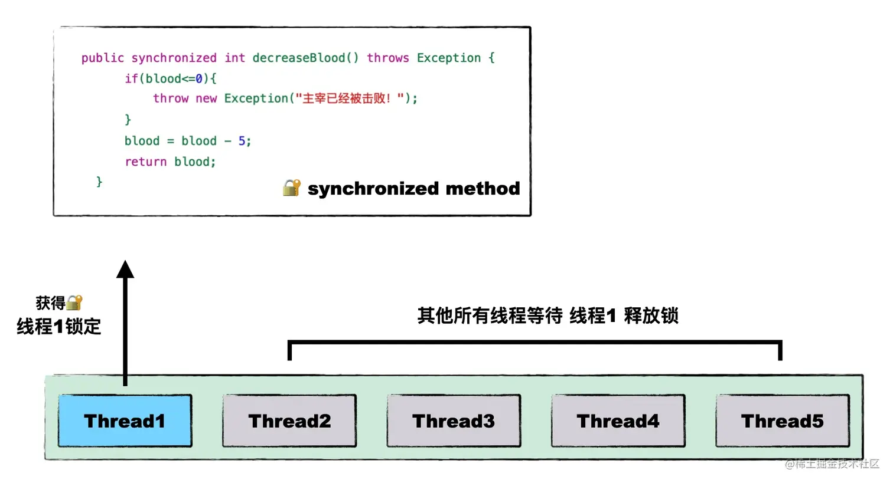

欢迎来到《[王者并发课](https://juejin.cn/post/6967277362455150628)》，本文是该系列文章中的**第4篇**。

在前面的文章《双刃剑-理解多线程带来的安全问题》中，我们提到了多线程情况下存在的线程安全问题。本文将以这个问题为背景，介绍如何通过使用`synchronized`关键字解这一问题。当然，在青铜阶段，我们仍不会过多地描述其背后的原理，**重点还是先体验并理解它的用法**。

## 一、从场景中体验synchronized

**是谁击败了主宰**

在峡谷中，击败主宰可以获得高额的经济收益。因此，在条件允许的情况下，大家都会争相击败主宰。于是，哪吒和敌方的兰陵王开始争夺主宰。按规矩，**谁是击败主宰的最后一击，谁便是胜利的一方**。

假设主宰的初始血量是100，我们通过代码来模拟下：

```Java
Java复制代码public class Master {
    //主宰的初始血量
    private int blood = 100;

    //每次被击打后血量减5
    public int decreaseBlood() {
        blood = blood - 5;
        return blood;
    }

    //通过血量判断主宰是否还存活
    public boolean isAlive() {
        return blood > 0;
    }
}
```

我们定义了哪吒和兰陵王两个线程，让他们同时攻击主宰：

```Java
Java复制代码 public static void main(String[] args) {
        final Master master = new Master();
        Thread neZhaAttachThread = new Thread() {
            public void run() {
                while (master.isAlive()) {
                    try {
                        int remainBlood = master.decreaseBlood();
                        if (remainBlood == 0) {
                            System.out.println("哪吒击败了主宰！");
                        }
                    } catch (InterruptedException e) {
                        e.printStackTrace();
                    }
                }
            }
        };

        Thread lanLingWangThread = new Thread() {
            public void run() {
                while (master.isAlive()) {
                    try {
                        int remainBlood = master.decreaseBlood();
                        if (remainBlood == 0) {
                            System.out.println("兰陵王击败了主宰！");
                        }
                    } catch (InterruptedException e) {
                        e.printStackTrace();
                    }
                }
            }
        };
        neZhaAttachThread.start();
        lanLingWangThread.start();
    }
```

下面是运行的结果：

```vbnet
vbnet复制代码兰陵王击败了主宰！
哪吒击败了主宰！

Process finished with exit code 0
```

两人竟然都获得了主宰！很显然，我们不可能接受这样的结果。然而，细看代码，你会发现这个神奇的结果其实一点也不意外，两个线程在对`blood`做并发减法时出了错误，因为代码中压根没有必要的并发安全控制。

当然，解决办法也比较简单，在`decreaseBlood`方法上添加`synchronized`关键字即可：

```Java
Java复制代码public synchronized int decreaseBlood() {
       blood = blood - 5;
       return blood;
}
```

为什么加上`synchronized`关键字就可以了呢？这就需要往下看了解Java中的**锁**和**同步**了。

## 二、认识synchronized

### 1. 理解Java对象中的锁

在理解`synchronized`之前，我们先简单理解下**锁**的概念。在Java中，每个对象都会有一把锁。当多个线程都需要访问对象时，那么就需要通过获得锁来获得许可，只有获得锁的线程才能访问对象，并且其他线程将进入等待状态，等待其他线程释放锁。如下图所示：



### 2. 理解synchronized关键字

根据Sun[官文文档](https://link.juejin.cn?target=https%3A%2F%2Fdocs.oracle.com%2Fjavase%2Ftutorial%2Fessential%2Fconcurrency%2Fsyncmeth.html)的描述，`synchronized`关键字提供了一种预防**线程干扰**和**内存一致性错误**的简单策略，即如果一个对象对多个线程可见，那么该对象变量（`final`修饰的除外）的读写都需要通过`synchronized`来完成。

你可能已经注意到其中的两个关键名词：

- **线程干扰（Thread Interference）**：不同线程中运行但作用于相同数据的两个操作交错时，就会发生干扰。这意味着这两个操作由多个步骤组成，并且步骤顺序重叠；
- **内存一致性错误（Memory Consistency Errors）**：当不同的线程对应为相同数据的视图不一致时，将发生内存一致性错误。内存一致性错误的原因很复杂，幸运的是，我们不需要详细了解这些原因，所需要的只是避免它们的策略。

从竞态的角度讲，线程干扰对应的是**Read-modify-write**，而内存一致性错误对应的则是**Check-then-act**。

结合**锁**和**synchronized**的概念可以理解为，锁是多线程安全的基础机制，而**synchronized**是锁机制的一种实现。

## 三、synchronized的四种用法

### 1. 在实例方法中使用synchronized

```Java
Java复制代码public synchronized int decreaseBlood() {
       blood = blood - 5;
       return blood;
}
```

注意这段代码中的`synchronized`字段，它表示**当前方法每次能且仅能有一个线程访问**。另外，由于当前方法是实例方法，所以如果该对象存在多个实例的话，不同的实例可以由不同的线程访问，它们之间并无协作关系。

然而，你可能已经想到了，如果当前线程中有两个`synchronized`方法，不同的线程是否可以访问不同的`synchronized`方法呢？

答案是：**不能**。

这是因为每个**实例内的同步方法，能且仅能有一个线程访问**。

### 2. 在静态方法中使用synchronized

```Java
Java复制代码public static synchronized int decreaseBlood() {
       blood = blood - 5;
       return blood;
}
```

与实例方法的`synchronized`不同，静态方法的`synchronized`是基于当前方法所属的类，即`Master.class`，而每个类在虚拟机上有且只有一个类对象。所以，对于同一类而言，每次有且只能有一个线程能访问静态`synchronized`方法。

当类中包含有多个静态的`synchronized`方法时，每次也仍然有且只能有一个线程可以访问其中的方法。

**注意：** 从`synchronized`在实例方法和静态方法中的应用可以看出，`synchronized`方法是否能允许其他线程的进入，取决于`synchronized`的参数。每个不同的参数，在同一时刻都只允许一个线程访问。基于这样的认知，下面的两种用法就很容易理解了。

### 3. 在实例方法的代码块中使用synchronized

```Java
Java复制代码public int decreaseBlood() {
    synchronized(this) {
       blood = blood - 5;
       return blood;
    }
}
```

在某些情况下，你不需要在整个方法层面使用`synchronized`，毕竟这样的方式粒度较大，容易产生阻塞。此时，在代码块中使用`synchronized`就是非常不错的选择，如上面代码所示。

刚才已经提到，`synchronized`的并发限制取决于其参数，在上面这段代码中的参数是`this`，即当前类的实例对象。而在前面的`public synchronized int decreaseBlood()`中，`synchronized`的参数也是当前类的实例对象。因此，下面这两段代码是等同的：

```Java
Java复制代码public int decreaseBlood() {
    synchronized(this) {
       blood = blood - 5;
       return blood;
    }
}

public synchronized int decreaseBlood() {
       blood = blood - 5;
       return blood;
}
```

### 4. 在静态方法的代码块中使用synchronized

同理，下面这两个方法的效果也是等同的。

```Java
Java复制代码public static int decreaseBlood() {
    synchronized(Master.class) {
       blood = blood - 5;
       return blood;
    }
}

public static synchronized int decreaseBlood() {
       blood = blood - 5;
       return blood;
}
```

## 四、synchronized小结

前面，我们已经介绍了`synchronized`的几种常见用法，不必死记硬背，你只要记住`synchronized`可以接受任何**非null**对象作为参数，而每个参数在同一时刻能且只能允许一个线程访问即可。此外，还有一些具有实际指导意义的Tips你可以注意下：

1. Java中的`synchronized`关键字用于解决多线程访问共享资源时的同步，以解决**线程干扰**和**内存一致性**问题；
2. 你可以通过 **代码块（code block）** 或者 **方法（method）** 来使用`synchronized`关键字；
3. `synchronized`的原理基于**对象中的锁**，当线程需要进入`synchronized`修饰的方法或代码块时，它需要先**获得**锁并在执行结束后**释放**它；
4. 当线程进入**非静态（non-static）\**同步方法时，它获得的是对象实例（Object level）的锁。而线程进入\**静态**同步方法时，它所获得的是类实例（Class level）的锁，两者没有必然关系；
5. 如果`synchronized`中使用的对象是**null**，将会抛出`NullPointerException`错误；
6. `synchronized`**对方法的性能有一定影响**，因为线程要等待获取锁；
7. 使用`synchronized`时**尽量使用代码块**，而不是整个方法，以免阻塞整个方法；
8. **尽量不要使用\*String\*类型和\*原始类型\*作为参数**。这是因为，JVM在处理字符串、原始类型时会对它们进行优化。比如，你原本是想对不同的字符串进行加锁，然而JVM认为它们是同一个，很显然这不是你想要的结果。

关于`synchronized`的可见性、指令排序等底层原理，我们会在后面的阶段中详细介绍。

以上就是文本的全部内容，恭喜你又上了一颗星！✨