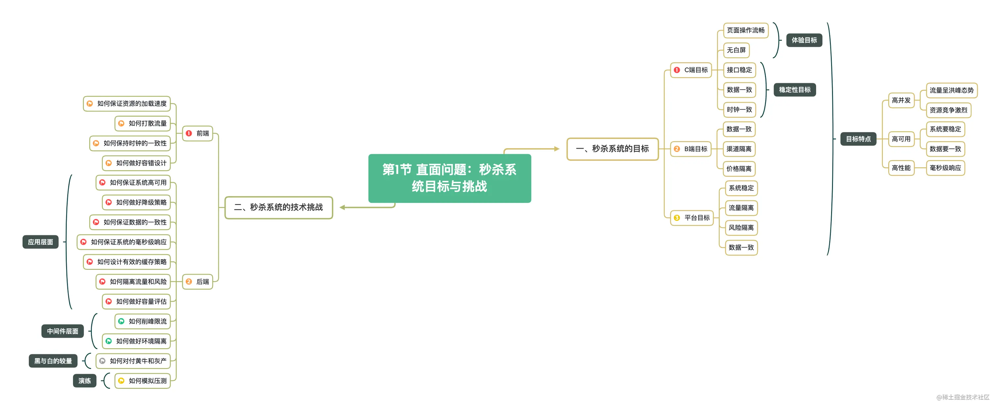
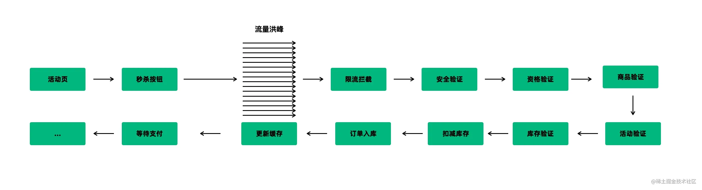

从本章开始至下一章节，是秒杀架构的理论讲述部分。说实话，这部分内容似乎着实**无聊且枯燥**。乍看起来，这部分内容读者懒得看、作者懒得写，忽略完事不好吗？其实不然，须知理论指导实践。只不过，当我们尚未深入实践时，便觉得理论枯燥乏味，可一旦“**躬身入局**”后再回头，就会发现其中之妙。所以，如果这部分内容令你烦躁或头疼时，你完全可以直接跳过去看源码实践部分，哪天你开心了再回头来看完全没问题。

当然，如果你选择继续阅读，那我们就进入正题。

从用户角度来理解秒杀其实是一件非常容易的事情，似乎不用我赘述，你可能早已了然于心，甚至对如何得手可能还颇有心得。可是，**我们不仅是普通的用户，而且是技术人员，甚至是秒杀架构的缔造者**。我们的理解的角度怎么可以和普通用户一样？

所以，**如何从技术的角度，洞见秒杀系统的内涵，理解秒杀系统的精要，设计出可靠的秒杀系统**才是我们关心的重点所在，也是我们在此共同探讨的目的。 

在动机上，秒杀分为**主动秒杀**和**被动秒杀**。所谓主动秒杀，即我们主动设计秒杀活动，借助秒杀活动实现去库存、制造热点效应、拉新促活等目的，一般电商活动就是主动的秒杀。而所谓被动秒杀，即场景非人为设计但由于供给关系紧张导致了不可避免的资源争夺，比如火车票抢购就属于被动秒杀。

但是，无论是主动秒杀还是被动秒杀，只要出现了不可避免的秒杀场景，就必须要从**业务**和**技术**两个层面抓住秒杀的目标，因为**目标是设计与架构的靶向**。

## 一、秒杀系统的目标

通常，我们把秒杀看作是高并发的典型场景，是**大量请求**对**有限资源**的**瞬时争夺**，是用户对系统发起的压力测试。然而，这话其实并不完全准确，秒杀与高并发的关系可疏可密 。

因为，秒杀系统的核心目标是实现**大流量对有限资源的瞬时争夺**。围绕这个核心目标，我们可以进一步将其拆解为三个关键目标，分别是**C端目标**、**B端目标**和**平台目标**。

### （一）C端目标

**C端用户是上帝**。在秒杀体验过程中上帝的**体验是否流畅**、**数据是否无误**至关重要，所以我们要首先保障用户的体验。为什么这么说呢？

对于大部分上帝而言，体验是最直观的感受，**突然的卡顿**、**白屏**、**宕机**等糟糕的体验会导致上帝逐渐失去对我们的眷顾，甚至对我们的技术能力产生怀疑。而能否秒杀成功倒是其次，大部分上帝在秒杀时都默认自己抢不到，他们不会因为抢不到而大为恼火。

### （二）B端目标

**如果说C端用户是上帝，那么B端用户就是我们的金主**（如果B端就是自己的公司，那我们要更为谨慎，因为公司不仅是金主，更是雇主）。对于金主而言，在**价格**、**数量**和**资金**上都不能出错。

首先是价格，秒杀品的价格一般有别于其他渠道的商品，哪怕是同样的商品，价格也会存在差异，所以在价格上我们要做到渠道隔离。其次是数量，也就是不能**超卖**，超卖的后果很严重，会直接造成资损或服务无法兑现，客诉会接踵而至，甚至引发舆情。

最后是资金安全，除了超卖会导致资损外，还有一种情况也会造成资损，那就是**恶意下单**。如果你的竞争对手或者某些恶意用户在瞬间下单了你的所有商品，但就是不付款，这种情况会导致B端因在秒杀活动中无法进账而引发资损，不仅活动前期的推广费用、活动费用无法回收，可能还会导致更为严重的连锁反应。

### （三）平台目标

**至于平台的首要目标则是保障C端目标和B端目标的顺利实现。** 其次，平台的业务往往不止秒杀一种，所以在秒杀活动期间，要保证不能影响到平台其他业务的正常开展。比如，如果我们把秒杀的流量洪峰直接引到其他非重保的应用上，轻则受牵连的应用宕机，重则因雪崩效应而导致整个平台宕机。

在设计秒架构时，以上三个目标都必须全部实现。如果其中某个目标未能实现，可能会导致一地鸡毛，提桶走人也并非耸人听闻。

从秒杀系统的目标来看，我们可以总结出秒杀过程中的几个明显的特征：

- **瞬时大流量**：从秒杀开始的前期，流量会逐渐聚集，在秒杀开始的瞬间，流量会瞬间涌入，监控图上也会体现出瞬间跳起，竖起一根芒刺；
- **高并发**：虽然大流量并不一定意味着高并发，但在秒杀场景中，大流量将直接导致高并发。高并发系统的设计与普通系统的设计有着很多不同，即使提供同样的服务，两者在设计上也会有着天壤之别；
- **高可用**：在任何情况下，我们不能让系统宕机，不能让C端用户失望，不能让兄弟应用跪下；
- **高性能**：即使在洪峰流量下，也要保证C端用户的流畅体验，不能出现白屏、明显卡顿等情况；
- **读多写少**：大流量是"读"，只有在并发中竞争成功的才会涉及到"写"。然而，成功者毕竟是极少数，所以“读多写少”也是秒杀系统的关键特征；
- **数据强一致性**：数据一致性体验在两个方面，一是所有C端用户所看到的秒杀开始时间、库存等信息一致，二是最终成单数量与库存一致，不可以存在超卖的情况。

## 二、秒杀系统的技术挑战

正如我们所见，**秒杀系统具有多维度的目标要求，以及高流量、高并发和高性能等“三高”特征，而正是这些决定了技术的难点和挑战**。与普通系统不同，高并发所导致的系统质变，将影响整个链路上的各个环节，其中任何一个环节的疏忽和故障都将会造成全局的失败。所谓质变，指的是原本体验良好、功能正常的系统，在瞬时高压下会变得极度脆弱，乃至于瞬时崩溃。 

所以，如何解决上述的各种问题，满足多维度的目标要求，正是我们设计秒杀系统的挑战所在。根据秒杀系统所呈现的关键特征，我们可以梳理出如下的技术挑战。

在客户端，我们面临两类挑战：**一是如何保证资源的加载速度，二是如何打散流量。**

首先，客户端的资源包括HTML页面、JS和相关的图片。这些资源与服务端计算是独立的，所以无论服务端面临的流量如何，这部分资源都要保证流畅加载。对于大部分中大型公司而言，静态资源都会走CDN，这也是推荐的做法，将资源放在离用户近的地方。而对于小型和自建机房的公司，可能会将静态资源存放在自己的机房，在流量洪峰下这会存在风险，瞬时的带宽占用可能会导致客户端资源加载困难。

其次，流量洪峰的特点是流量比较集中，集中的流量会导致拥堵和高并发。因此，我们需要考虑在客户端将流量打散，避免所有用户在同一时刻发出请求。比如，常见的做法有滑块、验证码和问答等，每个人的操作速度和问答速度不可能完全一致，所以我们可以利用这点来打散流量。不要小瞧几秒钟的差异，它可能会将流量峰值降低好几倍。

而在服务端我们面临的挑战最多，几乎是客户端的3倍。

**首先，如何保证系统的高可用。** 服务端的首要目标是保证在活动期间系统的高可用，秒杀系统是对整个链路的压力测试，我们需要确保每个环节都不会出纰漏。

**其次，如何削峰限流。** 当客户端的流量洪峰过来后，需要对流量进行逐层地拦截和过滤。所以，我们需要在每一层设置相应的策略，识别出对应的垃圾流量和需要过滤的用户，确保最后达到服务的只有少量的合法流量。

**再次，如何保证系统的响应速度。** 随着流量的激增，系统的负载可能会线性增加。但是，我们不能因此而降低系统的响应速度。一般而言，当接口的响应速度在10ms以内时，用户在操作时不会有明显的卡顿体感。

**然后，如何保证秒杀品不被超卖。** 正如前文所述，超卖的后果很严重，在这方面我们需要慎重设计下单减库存的策略。一旦用户冲破了层层关卡，进入最终的下单环节，性能将不再是主要的考量，数据一致性才是。所以，在减库存操作方面，需要多方面的校验，确保万无一失。

**接着，如何隔离流量和风险。** 非秒杀场景的流量如溪水潺潺，而秒杀的流量则是大江大河波涛汹涌。在错误设计或未考虑流量隔离的情况下，秒杀所调用的其他应用的接口将遭遇水漫金山的灭顶之灾。当然，也可能存在不幸中的万幸，比如所调用的系统有自己的限流，这个时候对方不会死，至少整个应用不会宕机，但是对方所触发的限流会让我们就地跪下。

**还有，如何设计有效的缓存策略。** 秒杀系统的一个关键特征是“读多写少”，因此缓存的使用必不可少。可问题是，虽然缓存可以提高响应速度，但在数据的一致性方面如何保证又会是新的挑战，我们需要保证过程中中心化缓存、本地缓存和数据库之间的数据一致。

**最后，如何对付黄牛和秒杀器。** 没有参与过秒杀活动设计的同学，对黄牛和秒杀器可能没有深刻的体会。而事实上，由于秒杀品一般存在着较大的利益空间，很多用户为了增加成功的概率，会使用多设备、自动化脚本等手段参与秒杀，这就催生了职业化的代秒选手的出现。这些选手有着成熟的、丰富的秒杀设备，他们的存在会严重扰乱秒杀活动的正常进行，设计不完善的秒杀系统可能会被黄牛瞬间抢购一空，其后果可想而知。所以，如何对黄牛和恶意攻击也是秒杀系统中的关键考量；

在中间件部分，我们也会面临两类挑战。

**一是如何应对突增的网络带宽。** 大型公司的同学可能对网络带宽没有切身的体会，但是对于经历过自建机房的同学来说，可能会印象深刻。由于所有的服务共享带宽，当其中某个服务需要大流量时，往往要进行限流，否则突增的网络带宽可能拖垮整个公司的服务； **二是如何监控各环节的状态和数据。** 如果我们不能度量系统，我们将无法设计系统。因此，虽然监控是最后的挑战，但这并不影响它至关重要的地位。对于秒杀系统链路上的所有环节，都应该具有实时的、量化的指标可查看。同时，可以预先评估的流量和环节设计的阈值，设置相应的报警水位。

## 小结

总体上，在不同公司的秒杀场景中，虽然秒杀的目标大同小异，但是秒杀系统在设计时的技术挑战，往往存在较大差距。比如，当公司具备完善的基础设施时，可以提供开箱即用的限流能力或防黄牛能力，而小公司却并不具备。因此，在思考秒杀架构中的技术挑战时，我们要结合自己的业务背景和公司的基础设施能力做出全面的评估。

回答本文开头的问题，秒杀架构和高并发一定存在亲密关系吗？其实未必。通过对秒杀架构整体链路的梳理，我们可以发现如果我们的业务只是少量商品的秒杀，那么我们需要保证的有两点，一是要实现业务上的成功，即通过秒杀促活或者拉新；二是保证不要超卖。对于此类业务，虽然有高并发的场景，但技术上可以把限流作为主要手段，把绝对流量挡在门外。但是，如果像双十一那样的大量商品秒杀，但限流只能是辅助手段，而不能是主要手段，在这种场景下，我们不仅要限流，还要同时提高整个链路，尤其是数据库、缓存等底层的并发能力。

以上就是本文关于秒杀系统的目标和技术挑战的全部内容。在下一篇文章中，我们将结合秒杀架构中的技术挑战，聊一聊它的设计原则和方法。