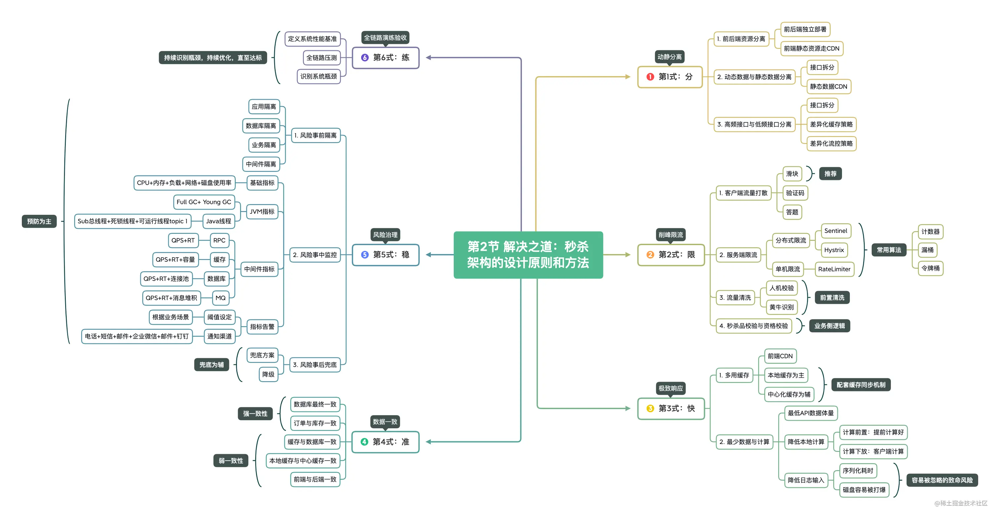

在前面的文章中，我们介绍了秒杀架构的目标和特征，以及由此所带来的一系列的技术挑战。在本文中，我们将探讨攻克这些技术挑战的设计原则与方法。

秒杀架构的技术挑战众多，在设计时不能东一榔头西一棒槌，或者头痛医头脚痛医脚，而是要对特征和挑战进行全面的总结归纳，找出其中的共性，这样才能多维度有的放矢。

概括地说，在设计秒杀架构时要牢牢记住**分-限-快-准-稳-练**六字箴言。为了方便记忆，我们姑且给它们取个可以上天的名字：**六脉神剑**。不要误会，我们没有任何想碰瓷某大厂的意思。其剑式即是秒杀架构设计的原则，理解并掌握它们可以让我们避免犯一些原则性错误。接下来，我们将围绕着六个字逐一讲解。

## 第1式：分-动静分离

所谓“**分**”，主要包含三个方面：**一是前后端资源分离，二是动态数据与静态数据的分离，三是高低频数据分离**。其中，第二点和第三点异曲同工，核心都是对不同类型的数据区分识别，并通过设计独立的接口和其他数据进行隔离，以采取不同的治理措施。

### 1. 前后端资源分离

除了一些较为传统且老旧的系统之外，前后端分离已经是目前较为普遍的做法。前端资源走CDN，一般在前端构建的时候就可以将构建完的静态资源推送到CDN服务器，这一过程完全可以嵌入在持续交付流程中。另外，CDN也不必自建，各大云计算厂商都提供了开箱即用的CDN服务。

### 2. 动态数据与静态数据分离

所谓动态数据指的是秒杀期间容易变更的数据，比如秒杀品的品类、库存和上下架状态等。动态数据对时间极为敏感，变化只在一瞬间。而所谓静态数据的变化相对较慢，比如秒杀结果等个人相关的数据。之所以要将动态数据和静态数据进行分离，是因为不同数据的更新频率会涉及到不同的架构设计和性能优化，分离后可以做到有的放矢。在某些场景下，服务端返回的静态数据也可以考虑推送到CDN；

### 3. 高频接口与低频接口分离

高频与低频指的是调用频次。在所有的数据整合到一个接口中，并不总是好的主意。虽然这种做法可以降低API的请求次数，但是会提高单个接口的计算耗时，并增加它的脆弱性。在秒杀架构中，我们要注意对高频接口的识别，高频接口的数据量相对较少；

## 第2式：限-削峰限流

### 1. 客户端流量打散

客户端包含对外透出的H5、APP和小程序。作为流量的直接来源入口，前端可以通过**答题**、**滑块**和验证码等方式将流量打散。在削峰限流中，这是非常有用的方式。我们不要小看一秒或者几百毫秒的时间，在秒杀过程中，毫秒的差距也足以造成量级的影响。比如 ，在客户端不采取任何措施的情况下，在同一时刻到达服务端的流量是100万QPS，而如果在客户端采取流量打散的措施，这个值则很可能由100万降低到80万、50万以及30万或者更低。

在设计时，答题相对来说成本要高一些，我们需要设计动态的题库和答案。相比之下，滑块和验证码则较为简单。当然，无论是何种方式，都需要在接口设计上体现，而不是仅限于页面使用，要防止绕过页面直接请求接口。

### 2. 服务端限流

无论客户端是否采取了流量打散的措施，服务端都需要设置限流保护，有条件的还要进行流量清洗。根据限流的不同时机和链路位置，我们可以将服务端限流通常分为**分布式限流**和**单机限流**两种。

所谓分布式限流指的是通过独立的中间件在流量入口对系统整体流量进行拦截和管控，只有符合配置的流量才能通过，比如通过Sentinel在Spring Cloud Gateway中设置限流。[Sentinel](https://link.juejin.cn/?target=https%3A%2F%2Fgithub.com%2Falibaba%2FSentinel)由阿里开源，提供了流控规则、降级规则和热点规则等功能，配置也较为灵活。

通过独立的中间件限流是比较通用的做法，当然也需要一定的维护成本，小公司可能不具备这样的条件。相比之下，单机限流则简单很多，就是在应用内自主限流。比如，Guava中提供的RateLimiter就是一款不错的限流器。如果你的流量不是特别大，或者在应用内需要独立的限流处理，那么可以考虑这种方式。

当然，分布式限流和单机层限流两种在使用时并不冲突，事实上两者结合相得益彰。在算法上，限流组件一般采用的是计数器、漏桶和令牌桶等算法，如果我们有特殊的限流需求，也可以考虑根据算法自主实现，**比如我们可以业务规则将概率向特定用户倾斜等**。

### 3. 安全校验

如果说限流是随机拒绝的话，那么安全校验则是有针对性地识别和拒绝特定的流量，也就是流量清洗。**通俗地讲，就是在秒杀活动中，我们要识别出哪些是人，哪些是“鬼”**。恶意竞对或者不怀好意的用户可能会通过CC攻击破坏活动，造成服务资源枯竭；而一些普通用户为了提高成功率则可能会采用自动脚本强刷，不仅给服务端带来较大压力，对其他用户也不公平，比如成群结队的“黄牛党”便是。所以，人机识别和CC攻击是安全校验的主要功能。

### 4. 秒杀品校验与资格校验

通过限流和安全校验两道关卡之后，并不意味着用户此刻就可以高枕无忧，它至少还需要闯过秒杀品校验与资格校验。比如，当前的秒杀活动是否已经结束、秒杀品是否依然有效等，因为用户在客户端时秒杀品依然有效，但是当请求到达服务端之后，活动可能已经结束，所以这一步的校验必不可少。

而所谓资格校验，则是根据秒杀活动具体的业务背景所做的校验。比如，当前用户此前已经存在秒杀记录，那么此时是否还允许进行秒杀。又或者，部分用户可能比较“狡猾”，虽然此前已经秒杀过，但现在换了马甲再次秒杀，那么此刻可能就需要加强身份证等唯一性校验。对于一些重要的秒杀品，如果忽略对用户唯一身份的甄别，不仅对用户不公平，对业务运营或合作方也会造成麻烦。

## 第3式：快-极致响应

### 1. 多用缓存

作为性能提升的利器，在秒杀活动中**缓存**绝对是不可或缺的存在。无论是前端资源等静态资源，还是服务端的动态数据，缓存不仅可以大幅提升性能，也是我们对系统防护的屏障。

试想，在没有缓存或者发生缓存雪崩或穿透的情况下，大量请求打入数据库将会是怎样的画面？毫无疑问，数据库将迅速面临连接池被耗尽的风险，而如果恰好某个SQL查询的性能不佳，在这种屋漏偏逢连夜雨的情况下，数据库大概率会被拖垮，进而会导致整个应用崩坏以及关联应用都会被殃及。由此可见，对于分布式系统来说，尤其是秒杀类的系统来说，缓存是何等的重要。

### 2. 中心化缓存与本地缓存

在分布式系统中，缓存的使用一般以**中心化缓存**和**本地缓存**两种形式存在。所谓中心化缓存，指的是将缓存集中存储于独立的系统，多个应用间共享一份缓存数据，比如Redis即使如此。中心化缓存的优势在于数据物理结构简单，维护成本较低，我们只要保证数据库和中心缓存之间的数据一致性即可。

当然，中心化缓存的优点也正是它的缺点。**在高并发的情况下，缓存系统将承受较大压力，轻则影响到缓存RT，重则直接拖垮缓存系统**。因此，当秒杀场景的并发量较大时，我们需要通过本地缓存设计为一级缓存，也就是在应用本地设置缓存。

### 3. 最少数据与计算

当我们致力于设计极致性能的API时，很显然缓存并不可少，但仅有缓存依然是不够的。所以，我们还要讲究另外一个字：**少**。

所谓“少”，有两层含义：**一是数据量要少，二是计算量要少，二者缺一不可**。不要忘记，我们的瓶颈不是仅网络IO，CPU、内存和磁盘等所有设备都是。虽然我们通过缓存解决了IO问题，但是即使数据全部在本地，在高并发情况下，复杂的计算可能会耗尽CPU，而大体量数据的则可能会耗尽内存。在更为极端的情况下，我们高并发下输出的日志都可以瞬间将磁盘打爆。不要认为这些都是耸人听闻，当我们设计不当的时候，它们就会即刻发生。

## 第4式：准-数据一致

在分布式系统架构中，数据一致性是个老生常谈的话题。在秒杀架构中，中心化缓存和本地缓存可以极大地提升系统性能。**但是，我们需要为此付出数据一致性的维护代价，即维护数据库、中心化缓存和本地缓存之间的一致性**，主要的一致性问题集中在下面四个方面：

- 缓存与数据库一致
- 本地缓存与中心缓存一致
- 订单与库存一致
- 前端与后端一致

在上面这四种一致性关系中，订单与库存属于**强一致性**关系，即决不允许超卖的情况出现。而其他场景则属于**弱一致性**关系，一般允许毫秒级的延迟，以降低维护的复杂度。

关于本地缓存一致性的维护问题，可简单也可以很复杂，我们在此不打算展开陈述，推荐[一篇文章](https://link.juejin.cn/?target=https%3A%2F%2Fwww.infoq.cn%2Farticle%2Fahsatgossvmtpzg3rafb)仅供参考。

## 第5式：稳-风险管控

稳定性是秒杀架构中压倒一切的前提。**我们绝对不能容忍在唱着歌、吃着火锅的时候，车却翻了。甭管来者是张麻子还是王麻子，动不动就翻车的那是狗头师爷，真正的猛男从来不翻车**。

既然稳定性如此重要，我们该从哪些方面进手落实？答案是两个词：**隔离**和**监控**。

### 1. 风险隔离

在风险无法被完全规避时，**隔离**是一种非常有效的手段。

在新冠疫情肆虐全球的时候，我们之所以比很多国家更好地控制住了疫情，**“隔离**”在其中起到了非常关键的作用。通过隔离，我们将风险限定在可控的范围内，阻止了进一步地扩散和蔓延。目前国内仍有不少地方会偶发新一波的疫情，但通过隔离我们依然可以有效控制。此外，隔离在火灾防范方面也应用广泛，比如森林中有防火隔离带，现代建筑中也有防火隔离墙。

同样的，在分布式架构系统中，隔离也是防止灾难蔓延的有效手段，我们常见的“**熔断**”正是如此。

秒杀架构中的风险隔离主要体现在以下几个方面：

- **应用隔离**：秒杀类应用需要承载更高的QPS，同时为了不影响其他业务，可以将秒杀类应用独立部署。隔离后的应用不仅可以防范灾难蔓延，在应用的伸缩方面也可以更为灵活，比如在活动期间增加机器数据量，活动结束后再回收，减少资源浪费。常见的应用隔离有**宿主机隔离**和**同应用分组**两种方式。
- **数据库隔离**：数据库的连接池有限，在没有做数据库隔离的情况下，如果系统存在设计缺陷导致瞬间耗尽连接池，那么全站都将面临被拖垮的风险；
- **业务隔离**：在设计秒杀业务场景时，原则上路径要简单，不要依赖于其他业务场景；
- **中间件隔离**：对于大部分公司来说，实现中间件隔离比较奢侈，使用更多的是**中间件降级**，即在秒杀活动期间，降低其他非核心应用对中间件资源的保障力度，比如延迟投递消息等。

### 2. 风险监控

管理学大师彼得德鲁克曾经说过：**你如果无法度量它，就无法管理它**。同样的，如果我们不能定义风险的指标，我们将无法管理风险。因此，我们需要对系统中的**关键指标**进行梳理和定义：

- **基础指标**：CPU+内存+负载+网络+磁盘使用率；
- **JVM指标**：Full GC和Young GC的次数和耗时，以及Java线程中的总线程、死锁线程和可运行线程等；
- **中间件指标**：接口的QPS和RT、缓存的QPS和RT以及容量、数据库的QPS和RT以及连接池、MQ的QPS和RT以及消息堆积等。

指标定义好之后，接着就是实现对这些指标的监控和多渠道报警，而这方面已经有很多开源的成熟产品，Grafana。

## 第6式：练-全链路演练验收

所谓**练**，即通过压力测试给系统施加一百个点的暴击，看它能不能扛得住。

**俗话说，是骡子是马，拉出来溜溜**。我们设计的秒杀系统究竟如何？系统的负载能力究竟怎样？配套的监控指标的采集和报警是否奏效？回答这些问题，不能凭直觉，而是要实打实地通过**全链路压测**进行验证。

注意，我们刚才说的是**全链路压测**，木桶原理告诉我们只有桶壁上的所有木板都足够高，那木桶才能盛满水。通过压测，我们可以掌握包括中间件在内的整个链路的性能表现，以及系统的瓶颈在哪里，对各方面做到心中有数。

## 小结

以上就是关于秒杀系统的设计原则和方法。总结来说，就是要记住**分-限-快-准-稳-练**这六脉神剑。当然，系统架构没有放之四海而皆准的方法，秒杀架构也是如此。不同的用户规模、不同的业务目标、不同的组织和基础设施，秒杀系统的落地也有着不同的表现形式。

因此，**在设计秒杀系统的时候，我们不要生搬硬套别人的做法，而是要从业务目标、现有的基础设施水平和团队技术能力出发，基于秒杀系统的设计原则，有针对性地采纳和调整，才能设计出符合自己组织的秒杀系统**。

到本文为止，关于秒杀系统设计的**理论部分**已经结束。在下篇文章中，我们将着手进行秒杀系统的需求分析和技术架构设计。