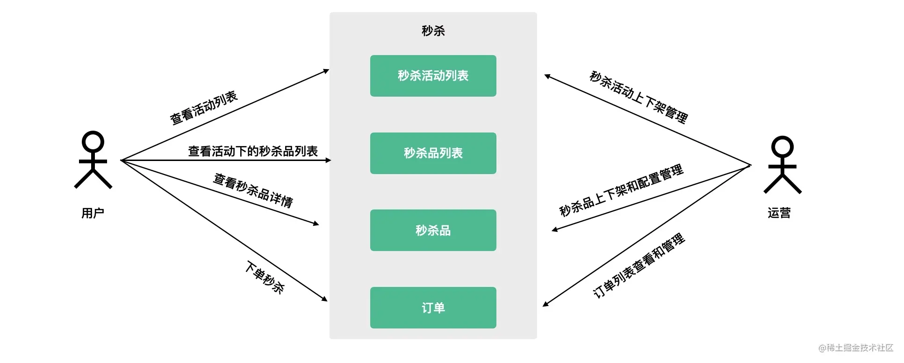
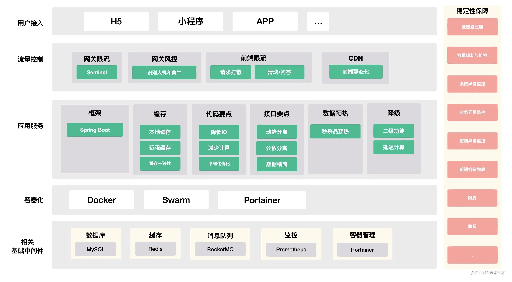
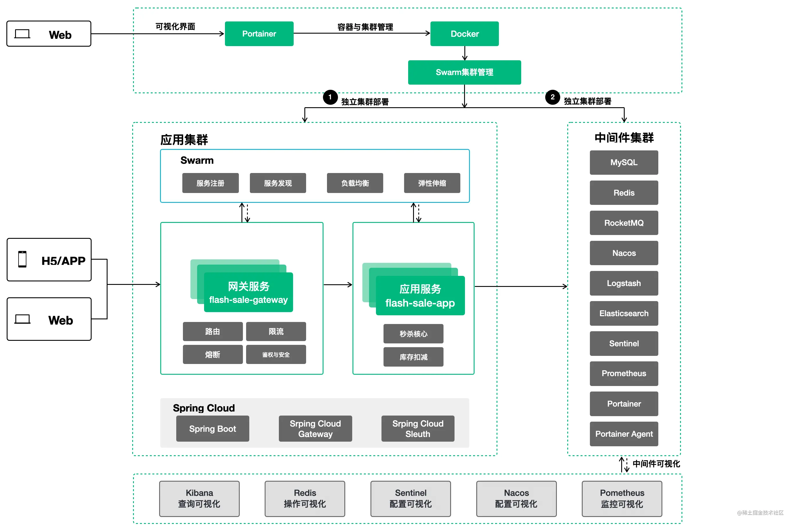
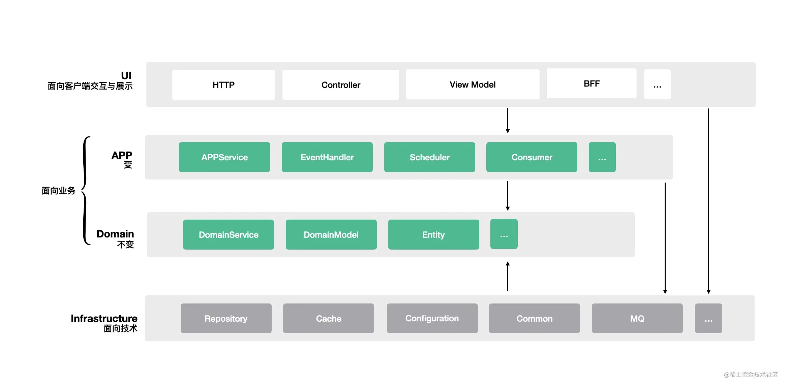
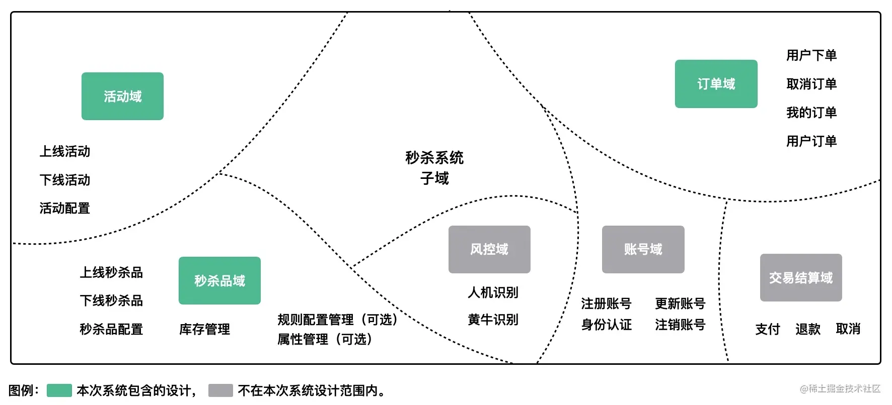
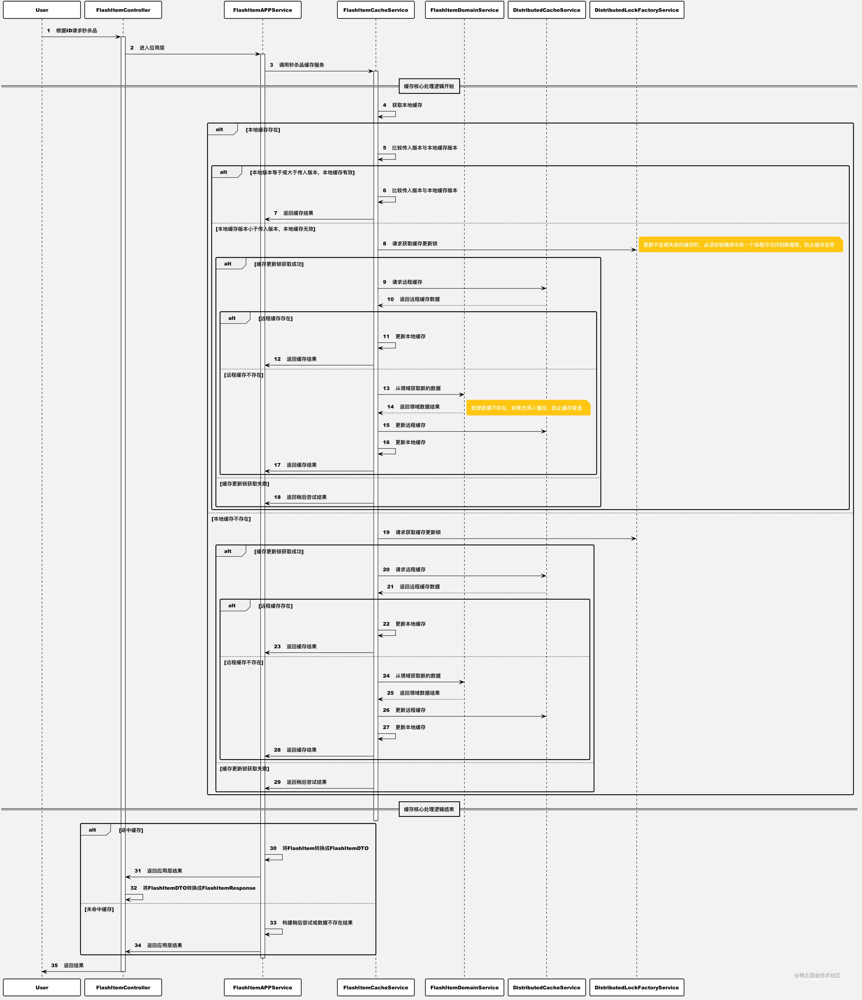
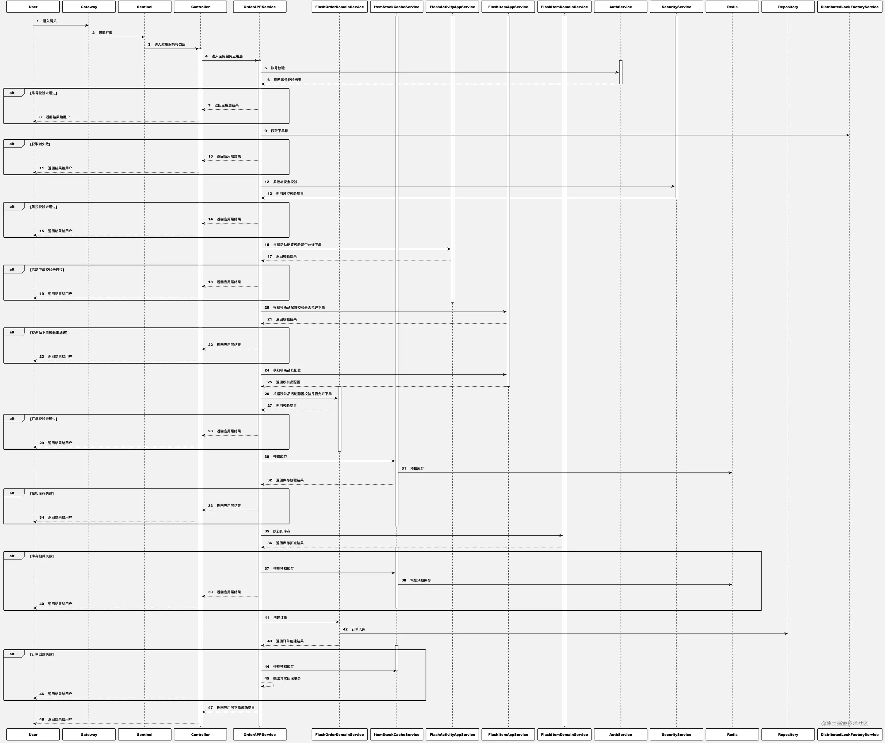

在前两篇文章中，我们介绍了秒杀架构中的技术挑战，以及系统的设计原则和方法。然而，有了原则和方法还远远不够，正所谓**光说不练假把式**。未经实践的文字不仅读起来如同走马观花，而且难以消化理解，刚才还是“**马冬梅**”，转头就成了“**马什么梅**”。为此，我们从本文开始进入实战环节，将前文所述的原则与方法应用到实践中。

在本文中，我们将从秒杀需求出发，探讨如何分析需求以及秒杀系统中的一些总体设计。**当然，限于篇幅，本文在阐述设计方案时将不会呈现完整细节，细节部分会在后续对应的文章中详细描述**。

> **✨阅读提示** 文章篇幅较长且大图较多，阅读时可以浏览器右键新窗口查看高清大图，或在IDE中查看图片脚本及预览；此外，还可以安装[Smart TOC](https://link.juejin.cn/?target=https%3A%2F%2Fchrome.google.com%2Fwebstore%2Fdetail%2Fsmart-toc%2Flifgeihcfpkmmlfjbailfpfhbahhibba)浏览器插件完美体验可拖拽目录阅读，源码下载请参考[第五章节](https://juejin.cn/book/7008372989179723787/section/7016981104028712973)。

## 一、需求概述

周五的傍晚，夕阳晚照，一抹余晖预示着美好的周末即将开始。你哼着小曲收起渔网，躁动着等待着下班时刻的到来。那时，你便可以箭步上前冲出公司，大步走向你风雨无阻、价值千万的专列：**地铁5号线**。

然而，突然间你隐约地察觉到一阵凉风落在了你的后背。莫非又是他？你迅速地把眼睛转向桌角的水杯，在玻璃杯的映射中你看到了背后的产品经理，果然是他。

“**老弟，我们老大说需要一个秒杀系统。可以让用户在中秋节秒杀月饼，在双十一秒杀特价商品，在圣诞节也可以秒杀圣诞老人**”。还没等你转过头来，产品经理已经先开了口。

“呃...还有吗？”

“**还有就是最好下周末能上线**。”

作为职场老兵，你深知无论产品经理怎么说以及说了什么，你都必须保持足够的淡定，即使你听完很生气，即使“**滚犊子**”三个字到了嘴边也得咽下去。对于这样的需求，三言两语断然不行。于是，你故作镇静地把飘到九霄云外的心往回收了收，试图**引导产品经理说出关于产品的更多想法细节**...

经过了半个小时的挖掘，对于产品经理嘴里所说的秒杀系统，你已经帮助产品经理理清了眉目，并确认了其中的一些关键信息：

- **运营可以组织不同的秒杀场次，多场次可以同时进行**；
- **每个秒杀活动场次可以上线不同的秒杀品**；
- **运营可以灵活地控制场次和秒杀品的状态，以及上下线时间**；
- **用户可以按照活动场次查看对应的秒杀品和详情**；
- **在秒杀品详情页，用户可以看到库存和商品介绍等信息，并可以执行下单操作**;
- **前期并发流量大概10万，后面有可能会增加，主要看效果和运营投入**。

## 二、用户故事

**业务是技术的出发点，也是落脚点**。所以，即使你胸有成竹跃跃欲试，也要保持克制，不要上来就着手技术方案设计或直接撸代码，而是要首先将需求理解透彻。

如何将产品的思考条理性地表述出来，有很多种处理方式，我们这里采用**用户故事**的方式。通过分析，我们将与产品的沟通记录转换成以下的表述。 

### 1. 创建秒杀活动

##### 👉 用户故事

作为**运营**，可以**创建新的秒杀活动**，以便可以通过活动**组织和管理秒杀品**。

##### 👉 验收标准

- 创建秒杀活动时，需要提供活动**名称**、**描述**、**活动起止时间**等关键字段；
- 秒杀活动字段校验应满足规则：
  - 名称：非空，字符串，长度不超过20；
  - 描述：可空，文本，长度不限；
  - 起止时间：非空，时间类型，起止时间不能晚于当前时间，结束时间不能早于开始时间；
- 当运营输入的字段符合校验规则时，创建活动成功；
- 当运营输入的字段不符合校验规则时，活动创建失败；
- 创建活动时需要进行权限校验，未授权运营无权创建活动。

### 2. 上线秒杀品

##### 👉 用户故事

作为**运营**，在创建完秒杀活动后可以上线新的秒杀品，以便让用户进行秒杀下单。

##### 👉 验收标准

- 上线的秒杀品应包含**商品编码**、**标题**、**副标题**、**描述**、**库存**、**原价**、**秒杀价**、**起止时间**等必要字段信息；
- 秒杀品字段应该满足规则：
  - 商品编码：非空，字符串，长度不超过20；
  - 标题：非空，字符串，长度不超过50；
  - 副标题：非空，字符串，长度不超过100；
  - 描述：可空，文本，长度不限；
  - 库存：非空，数字，范围大于0；
  - 原价：非空，金额，范围大于0；
  - 秒杀价：非空，金额，范围大于0，且不得高于原价；
  - 起止时间：非空，时间类型，起止时间不能晚于当前时间，结束时间不能早于开始时间；
  - 所属活动：非空，指定所属活动的ID。
- 秒杀品必要信息校验未通过时，应拒绝上架；
- 秒杀活动存在相同商品编码的秒杀品且处于进行中的状态时，应拒绝上架；
- 运营上线秒杀品时，应指定该秒杀品所属活动；
- 如果秒杀品所指定的活动不存在或者已经下架，应拒绝上架；

### 3. 查看秒杀活动

##### 👉 用户故事

作为**用户**，可以在活动页**查看进行中的秒杀活动**，以便**找到并参与**适合自己的秒杀活动。

##### 👉 验收标准

- 进入秒杀活动列表页面，可以查看对应的秒杀活动；
- 活动列表中应包含活动名称、活动状态等信息；
- 查看秒杀活动无需权限校验，对所有用户开放。

### 4. 查看秒杀品

##### 👉 用户故事

作为用户，可以通过点击活动列表页的活动，查看活动下的秒杀品列表，在可以通过点击具体的秒杀品，查看秒杀品详情，以便准确了解秒杀品是否符合自己需要。

##### 👉 验收标准

- 进入秒杀活动列表页面，可以查看对应的秒杀活动；
- 点击指定的秒杀活动时，进入秒杀品列表页；
- 秒杀品列表页应包含的信息：秒杀品标题、秒杀价、剩余库存；
- 点击具体的秒杀品，进入秒杀品详情页；
- 秒杀品详情页包含的信息：**标题**、**副标题**、**描述**、**剩余库存**、**原价**、**秒杀价**、**起止时间**。

### 5. 下单秒杀品

##### 👉 用户故事

作为**用户**，可以在秒杀品详情页通过秒杀按钮提交订单，以便抢购心仪的秒杀品。

##### 👉 验收标准

- 当秒杀品有库存时，秒杀按钮可用；
- 当秒杀品没有库存或秒杀时间已经结束时，秒杀按钮置灰不可用；
- 当用户点击秒杀按钮时，给出loading提示，直到请求结束或超时；
- 当下单成功或失败时，loading消失并给出具体的成功或失败的提示说明。

### 6. 查看我的订单

##### 👉 用户故事

作为**用户**，可以在“我的订单”中查看下单成功的订单，以便了解和管理秒杀成功的订单。

##### 👉 验收标准

- 进入“我的订单”，按分页展示下单成功秒杀品列表；
- 列表中应包含的信息：订单编号、秒杀品标题、下单时间、状态；
- 秒杀品应包含的按钮：取消按钮、删除按钮。

### 7. 管理我的订单

##### 👉 用户故事

作为**用户**，可以在“我的订单”中对已下单成功的订单进行删除和取消，以实现用户对自己订单的管理。

##### 👉 验收标准

- 进入“我的订单”，按分页展示下单成功秒杀品列表；
- 点击对应订单的“取消”按钮，可以取消当前订单；
- 取消订单时将恢复库存，并将仍然存在于订单列表中；
- 点击对应订单的“删除”按钮，可以删除当前订单；
- 已删除的订单不会恢复库存，并从订单列表中消失。

## 三、技术架构目标与方案设计

### 1. 方案目标

| 目标     | 关键点                                                    |
| -------- | --------------------------------------------------------- |
| 业务目标 | 实现用户故事中的各类场景目标，交付无延期                  |
| 技术目标 | 1. 秒杀品详情页接口：**100,000**; 2. 秒杀接口：**10,000** |
| 架构目标 | 系统高可用：指标可监控、故障可预警、资源可伸缩            |


备注：由于QPS目标与硬件规模相关，在忽略服务器硬件配置和集群规模的情况下谈QPS毫无意义。**因此，在系统的开发中，更重要的是着眼于如何评估系统的整体性能表现，以及如何发现瓶颈并优化**。

### 2. 总体架构

系统架构总体设计如下图所示，它展示了我们秒杀系统设计所涉及到的技术选型和拓扑结构。除了Spring Boot等基础框架外，在架构上也采用了容器化等方案。

**分层架构视角** 

**链路视角**  为了兼顾不同层次的读者，降低对技术理解的门槛和成本，在具体的技术选型上我们主要采用目前市面上主流的技术产品和方案：

- 应用框架：Spring Boot
- 数据库：MySQL+Mybatis
- 缓存：Redis+本地缓存
- 单元测试：Junit
- 容器化：Docker
- 容器化管理：Swarm、Portainer
- 可观性与可视化监控：Prometheus、Grafana
- 限流：Sentinel
- 压测工具：Jmeter

### 3. 分层架构

在应用架构上，我们主要借鉴DDD的分层架构思想，将应用分为展示层、应用层、领域层和基础设施层四个层次，各层的职责定义和依赖关系如下图所示。



##### （1）用户界面层（UI）

用户界面层是应用程序的最上层，负责向用户显示信息和解释用户指令，它所承担的其实是类似于**BFF**的职责。在我们平日所见的一般性代码结构里，它是API的最外层。

在我们即将设计的秒杀系统中，用户界面层将主要**负责处理API请求**，以及相关的**模型定义**和**异常处理**。

##### （2）应用层

在软件系统的设计中，软件系统的业务逻辑有两个主要部分构成：**应用程序逻辑**和**领域逻辑**。前者千变万化，后者则稳如泰山，而应用层就属于前者。

应用层面向用户故事，处理多种多样的**前端场景**，以及相关的**事件处理**、**调度处理**和**其他聚合处理**等。

##### （3）领域层

领域层是DDD分层架构中的精髓，它是业务系统中**相对不变**的部分，是领域模型以及所有与其直接相关的设计元素的表现。在MODEL-DRIVEN DESIGN中，领域层的软件构造反映了模型概念。

在我们秒杀系统中，领域层没有依赖基础设施层，甚至于它没有任何的**直接**依赖，它是**纯净、干脆的**存在。

##### （4）基础设施层

基础设施层为上面各层提供**通用的技术能力**，包括**消息处理**、**持久化机制**、**缓存处理**等，基础设施层还可以通过软件架构来支持各层次间的交互模式。

需要注意的是，如果你细看上面的分层架构图，你可能会发现领域层没有依赖基础设施层，反而是基础设施层依赖了领域层。

初看起来，这与我们平时所见的分层架构图不同，但这是我们对系统审慎评估后的方案，我们认为**领域层应该保持足够的纯净，它对外部是抽象依赖，而不是直接的实现依赖**。如果领域层依赖于基础设施层，那么领域层将变得臃肿，同时我们需要增加模块处理持久层的实现等。

### 4. 限界上下文

在一个DDD项目中，会有很多的限界上下。这些限界上下文中，有一个或多个会成为核心域，而其他的限界上下文中则会出现许多不同的子域。



秒杀系统包含了多个领域，包括**核心子域**、**支撑域**和**通用子域**等。比如，**秒杀系统中的活动域、秒杀品域等属于核心子域，是我们需要重点设计并亲自实现的**；而账号子域、交易结算子域等则属于支撑子域，它们具有复用属性，在使用上并不局限于秒杀系统，可以和其他团队和业务共享，这部分可以和其他团队合作完成；最后的风控、缓存、限流等技术型的通用子域则可以通过采用开源产品或购买等引入，不需要我们自己开发。

有效地识别出不同的子域，**可以更加合理地分配组织的资源，把优秀资源投入到重要的事情中**，这也是DDD的重要价值体现。在我们秒杀系统中，当我们把核心域、支撑域识别出来后，我们就可以知道哪些是需要我们讲解和实现的重点，而哪些我们是可以采用其他集成方案并一笔带过的。

> **关于核心域、支撑子域和通用子域的补充说明**
>
> - **核心域（Core Domain）**：所谓核心域，它是一个唯一的、定义明确的领域模型，不需要太过复杂的理解，你只需要知道对待核心域，要对它进行**战略投资**，并在一个明确的限界上下文中投入大量资源去精心打磨通用语言。它是组织中最重要的项目，某种程度上说，它是你与竞争者的区别所在。换句话说，任何组织都无法在所有领域出类拔萃，所以必须把核心领域打造成组织的核心竞争力。
> - **支撑子域（Supporting Subdomain）**：对于支撑子域的建模场景，一般提倡的是**定制开发**。也就是说，它也挺重要，但可能没有现成的方案，又不是核心领域，所以可以定制开发，或者说外包开发。但要注意的是，虽说是支撑子域，在战略投资上不如核心域，但它是核心域成功的基础，也需要认真对待。
> - **通用子域（Generic Subdomain）**：所谓通用子域，你可以简单理解为可以购买现成的，也可以外包实现。总之，它没那么重要，又不可或缺，不必投入太多资源。

### 5. 时序图

根据前面梳理的用户故事，共有7个时序图。限于篇幅，我们这里只展现两个时序图，其他的时序图在后续介绍相关模块时会有详细说明。

**秒杀品详情示例时序图**

[查看高清原图](https://link.juejin.cn/?target=https%3A%2F%2Fp3-juejin.byteimg.com%2Ftos-cn-i-k3u1fbpfcp%2F8a58d782ccf24e429a3d3de6fa9f31cf~tplv-k3u1fbpfcp-zoom-1.image)



**同步下单示例时序图**

[查看高清原图](https://link.juejin.cn/?target=https%3A%2F%2Fp3-juejin.byteimg.com%2Ftos-cn-i-k3u1fbpfcp%2F6e76f9d3271149ad9904b7d7addd231a~tplv-k3u1fbpfcp-zoom-1.image)



### 6. 数据库设计

**（1）秒杀活动表**

```sql
CREATE TABLE IF NOT EXISTS flash_sale.`flash_activity` (
	`id` bigint(20) NOT NULL AUTO_INCREMENT COMMENT '主键',
	`activity_name` varchar(50) NOT NULL COMMENT '秒杀活动名称',
	`activity_desc` text COMMENT '秒杀活动描述',
	`start_time` datetime NOT NULL COMMENT '秒杀活动开始时间',
	`end_time` datetime NOT NULL COMMENT '秒杀活动结束时间',
	`status` int(11) NOT NULL DEFAULT '0' COMMENT '秒杀活动状态',
	`modified_time` datetime NOT NULL DEFAULT CURRENT_TIMESTAMP COMMENT '更新时间',
	`create_time` datetime NOT NULL DEFAULT CURRENT_TIMESTAMP COMMENT '创建时间',
	PRIMARY KEY (`id`),
	KEY `flash_activity_end_time_idx` (`end_time`),
	KEY `flash_activity_start_time_idx` (`start_time`),
	KEY `flash_activity_status_idx` (`status`)
) ENGINE = InnoDB CHARSET = utf8mb4 COMMENT '秒杀活动表';
```

**（2）秒杀品表**

```sql
CREATE TABLE IF NOT EXISTS flash_sale.`flash_item` (
	`id` bigint(20) NOT NULL AUTO_INCREMENT COMMENT '主键',
	`item_title` varchar(50) NOT NULL COMMENT '秒杀品名称标题',
	`item_sub_title` varchar(50) NULL COMMENT '秒杀品副标题',
	`item_desc` text COMMENT '秒杀品介绍富文本文案',
	`initial_stock` int(11) NOT NULL DEFAULT '0' COMMENT '秒杀品初始库存',
	`available_stock` int(11) NOT NULL DEFAULT '0' COMMENT '秒杀品可用库存',
	`stock_warm_up` int(11) NOT NULL DEFAULT '0' COMMENT '秒杀品库存是否已经预热',
	`original_price` bigint(20) NOT NULL COMMENT '秒杀品原价',
	`flash_price` bigint(20) NOT NULL COMMENT '秒杀价',
	`start_time` datetime NOT NULL COMMENT '秒杀开始时间',
	`end_time` datetime NOT NULL COMMENT '秒杀结束时间',
	`rules` text COMMENT '秒杀可配规则，JSON格式',
	`status` int(11) NOT NULL DEFAULT '0' COMMENT '秒杀品状态',
	`activity_id` bigint(20) NOT NULL COMMENT '所属活动id',
	`modified_time` datetime NOT NULL DEFAULT CURRENT_TIMESTAMP COMMENT '更新时间',
	`create_time` datetime NOT NULL DEFAULT CURRENT_TIMESTAMP COMMENT '创建时间',
	PRIMARY KEY (`id`),
	KEY `flash_item_end_time_idx` (`end_time`),
	KEY `flash_item_start_time_idx` (`start_time`),
	KEY `flash_item_status_idx` (`status`)
) ENGINE = InnoDB CHARSET = utf8mb4 COMMENT '秒杀品';
```

**（3）秒杀订单表**

```sql
CREATE TABLE IF NOT EXISTS flash_sale.`flash_order` (
	`id` bigint(20) NOT NULL AUTO_INCREMENT COMMENT '主键',
	`item_id` bigint(20) NOT NULL COMMENT '秒杀品ID',
	`activity_id` bigint(20) NOT NULL COMMENT '秒杀活动ID',
	`item_title` varchar(50) NOT NULL COMMENT '秒杀品名称标题',
	`flash_price` bigint(20) NOT NULL COMMENT '秒杀价',
	`quantity` int(11) NOT NULL COMMENT '数量',
	`total_amount` bigint(20) NOT NULL COMMENT '总价格',
	`status` int(11) NOT NULL DEFAULT '0' COMMENT '订单状态',
	`user_id` bigint(20) NOT NULL COMMENT '用户ID',
	`modified_time` datetime NOT NULL DEFAULT CURRENT_TIMESTAMP COMMENT '更新时间',
	`create_time` datetime NOT NULL DEFAULT CURRENT_TIMESTAMP COMMENT '创建时间',
	PRIMARY KEY (`id`),
	UNIQUE `flash_order_id_uk` (`id`),
	KEY `flash_order_user_id_idx` (`user_id`)
) ENGINE = InnoDB CHARSET = utf8mb4 COMMENT '秒杀订单表';
```

注意，以上建表语句均适用于未分库分表情况，分库分表相关建表语句请参考源码`enviroment`下的初始化建表语句和相关章节。

### 7. 代码结构

```css
css复制代码.
├── README.md
├── environment  --> 应用依赖的中间件初始化脚本及数据
│   ├── config
│   ├── data
│   ├── docker-compose.yml
│   └── grafana-storage
├── postman  --> Postman测试脚本
│   └── flash-sale-postman.json
├── flash-sale-app  --> 应用层
│   ├── pom.xml
│   └── src
│       ├── main
│       │   └── java
│       │   │   └── com.actionworks.flashsale
│       └── test
│           ├── java
│           │   └── com
│           │       └── actionworks
│           │           └── flashsale
│           └── resources
│               └── logback-test.xml
├── flash-sale-controller   --> UI层
│   ├── pom.xml
│   └── src
│       └── main
│           └── java
│               └── com.actionworks.flashsale
├── flash-sale-domain   --> 领域层
│   ├── pom.xml
│   └── src
│       ├── main
│       │   └── java
│       │       └── com.actionworks.flashsale
│       └── test
│           └── java
│               └── com.actionworks.flashsale
├── flash-sale-infrastructure  --> 基础设施层
│   ├── pom.xml
│   └── src
│       ├── main
│       │   ├── java
│       │   │   └── com.actionworks.flashsale
│       │   └── resources
│       │       ├── mybatis
│       │       └── mybatis-config.xml
│       └── test
│           ├── java
│           │   └── com.actionworks.flashsale
│           └── resources
│               ├── logback-test.xml
│               └── mybatis-config-test.xml
├── mvnw
├── mvnw.cmd
├── pom.xml
└── start  --> 系统启动入口
    ├── pom.xml
    └── src
        ├── main
        │   ├── java
        │   │   └── com.actionworks.flashsale
        │   └── resources
        └── test
            ├── java
            │   └── com.actionworks.flashsale
            └── resources
                └── logback-test.xml
```

## 四、需求与进度管理

因部分读者反馈Trello存在国内访问困难问题，所以Trello暂停维护，直接使用Github的集成[看板](https://link.juejin.cn/?target=https%3A%2F%2Fgithub.com%2FThoughtsBeta%2Fflash-sale%2Fprojects%2F1)。

## 小结

在本文中，我们确定了秒杀系统的业务需求和技术目标，并根据目标制定了对应的技术方案。在技术方案的选型上，我们选取了市面上主流的技术类型，并借鉴了DDD的分层架构思想。此外，在梳理技术方案之前，我们应仔细理解并梳理产品需求。

需要注意的是，**本文并非标准的技术方案文稿，而是为了讲清楚我们后面要做的事情，对于相关技术细节并没有展开描述**。此外，接口设计、类图设计等其他技术细节会在讲解是实现具体模块时提供。

在下一篇文章中，我们将介绍并实现**上线秒杀活动和秒杀品的管理**。