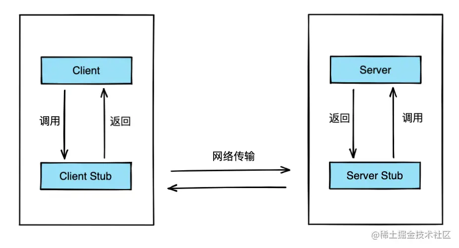
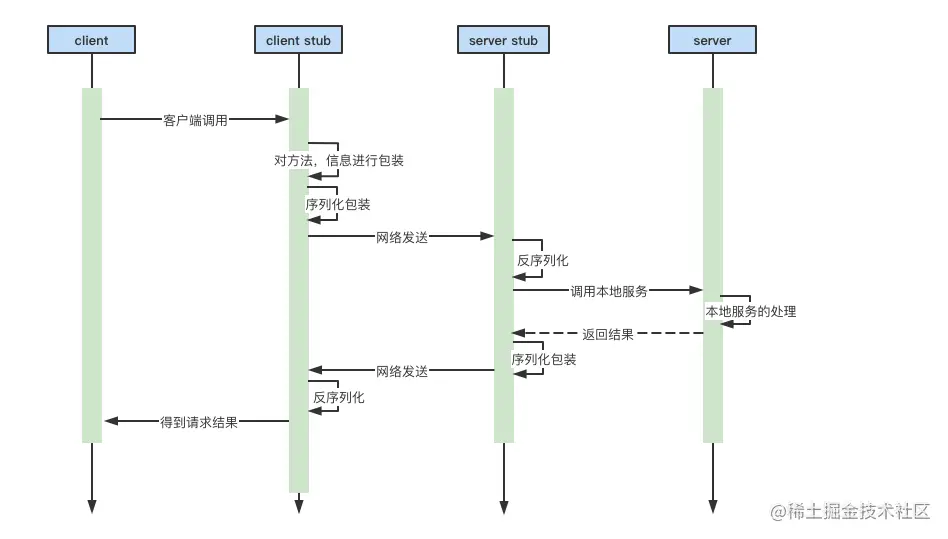
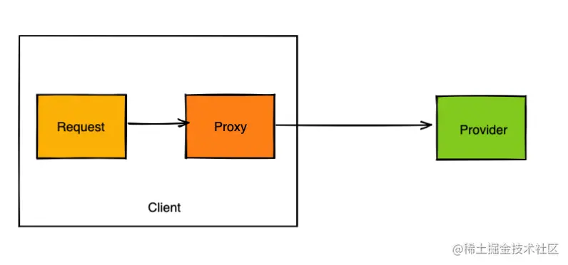
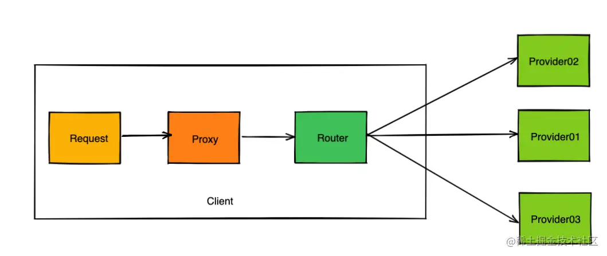
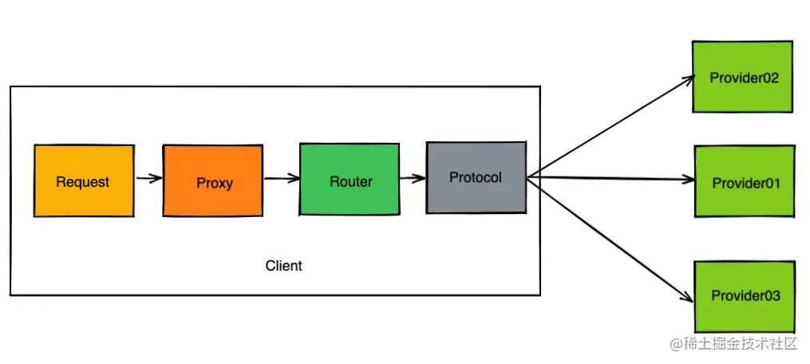
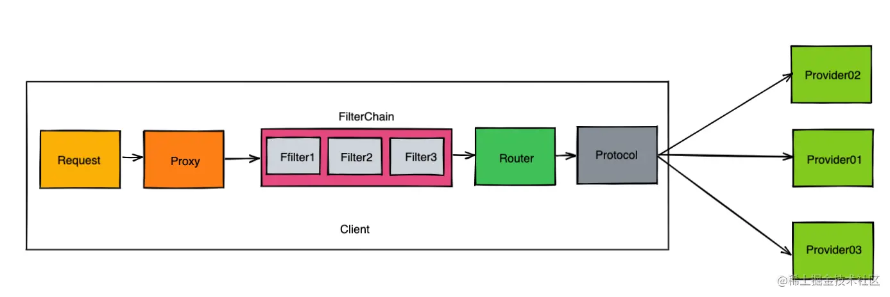
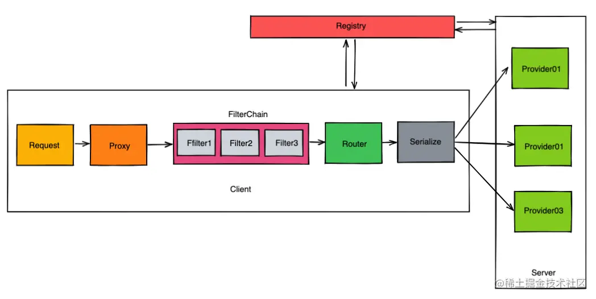
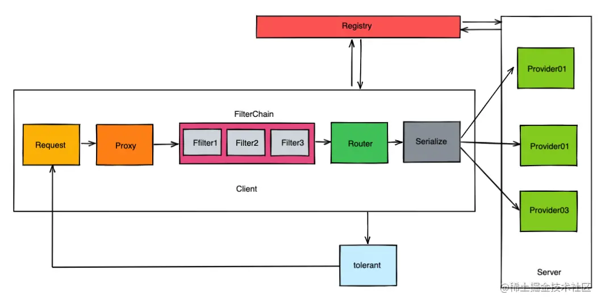
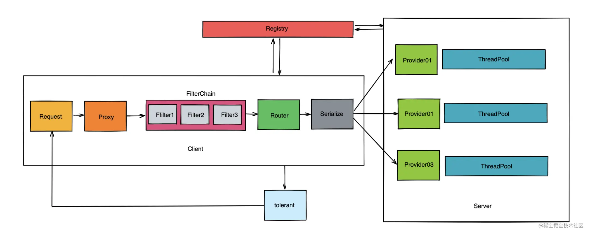
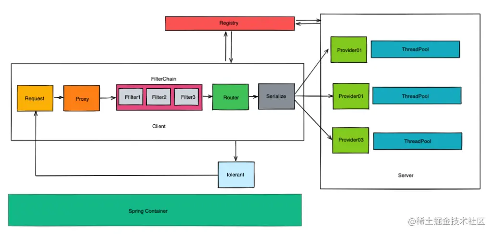

在开始学习本课程之前，我们需要先对RPC框架进行设计。为什么要先设计？二话不说直接上手写代码，想到哪写到哪，这种感觉看起来很爽，但是当整个框架的功能越来越完善，代码量越来越复杂的时候，分层设计就会变得越来越模糊，尤其是在自己调试bug的时候还非常容易掉进了坑里。因此我觉得良好的设计是写好一款中间件的关键。

# 认识RPC框架

既然我们要写一款RPC框架，就需要先系统认识一下什么是RPC。

RPC（remote procedure call），全称为远程调用。

很早的时候，国外的工程师设计了一种能够通过A计算机调用B计算机上边应用程序的技术，这种技术不需要开发人员对于网络通讯了解过多，并且调用其他机器上边程序的时候和调用本地的程序一样方便好用。A机器发起请求去调用B机器程序的时候会被挂起，B机器接收到A机器发起的请求参数之后会做一定的参数转换，最后将对应的程序结果返回给A，这就是最原始的RPC服务调用了。

通常我们将一个完整的RPC架构分为了以下几个核心组件：

- Server
- Client
- Server Stub
- Client Stub

Server和Client两个名词的概念一般都比较好理解，我就不做过多的解释了，主要来讲解下Server Stub和Client Stub的概念。

**Client Stub** 就是将客户端请求的参数、服务名称、服务地址进行打包，统一发送给server方。

**Server Stub** 用通俗易懂的语言来解释就是，服务端接收到Client发送的数据之后进行消息解包，调用本地方法。

为了更方便大家的理解，这里我画了一张图来介绍：



# RPC框架的整体结构分析

在大概了解了关于RPC框架的设计规范之后，我们可以开始对自己的RPC框架展开进一步的分析与设计。等有了一个整体的设计思路之后再来编写代码时，你就会发现思路非常清晰。好了接下来我们开始对RPC调用的流程开始逐步深入剖析。

## 调用流程分析

首先本地的客户端需要通知到一个本地的存根（stub），接着本地存根需要进行一些数据格式的包装，网络请求的封装，按照一定的规则将这个数据包发送到指定的目标机器上。

服务端的存根在接收到相关的数据信息之后，需要将其按照事先约定好的规则进行解码，从而识别到数据包内部的信息，然后将对应的请求转发到本地服务对应的函数中进行处理。处理完的数据需要正常返回给调用方。

调用方存根在接收到服务方数据的时候，需要进行数据解码，最后得到这次请求的最终结果。

大致的调用流程我绘制成了以下图片的形式。



现在这幅图只是一个最简单的设计流程，接下来我们主要在这张调用图的基础不断地进行功能扩展，从而最终落地实现一个成熟的RPC框架。

## **代理层的设计**

从使用角度来说，希望这款框架在使用的期间，对于远程方法调用，最好能够将其内部的细节进行封装屏蔽，使得使用起来就像本地方法调用一样方便好用。

这么描述起来可能还是比较难以理解，我们可以通过这么一段案例代码来理解：

```java
java复制代码public class Client {

    public static void main(String[] args) {
        //调用一次远程服务
        Server server = new Server("127.0.0.1",9999);
        server.doConnect();
        Object sendResponse = server.doRef("sendSms","这是一条短信信息",10001);
        System.out.println(sendResponse);
    }
    
}
```

假设我们希望在本地应用中调用短信服务的发送短信功能，需要手动实现服务端的连接，然后是远程的调用，最后是获取调用的结果。这段代码看起来比较清晰易懂，但是实际上内部屏蔽了很多的细节点。

server.doRef内部实则就是一种代理的手段，内部可以设计一个统一的代理组件，辅助开发者发送远程服务的调用，并且将对应的数据结果返回。

**看到这里不知道你是否会联想到代理模式？** 由于某些原因需要给某对象提供一个代理以控制对该对象的访问。这时，访问对象不适合或者不能直接引用目标对象，代理对象作为访问对象和目标对象之间的中介。

代理模式的主要优点有：

- 代理模式在客户端与目标对象之间起到一个中介作用和保护目标对象的作用；

- 代理对象可以扩展目标对象的功能；

- 代理模式能将客户端与目标对象分离，在一定程度上降低了系统的耦合度，增加了程序的可扩展性。

所以面对发送端的请求，我们可以设计一个代理层，统一将内部的细节都屏蔽起来，让调用者使用起来无感知。这个时候我们可以尝试绘制一张调用请求的流程图：



## **路由层的设计**

当面对的服务提供者是一组集群的时候，我们需要考虑以下问题：**当目标服务众多的时候，客户端需要如何确定最终请求的服务提供者是谁呢？**

这里我给出一套自己的设计思路，引入一个叫做路由的角色，此时客户端的调用整体流程大致如下：



客户端的请求会经过一个叫做路由层的部分，通过路由层内部的规则去匹配对应的provider服务。

因此我们在路由层做设计的时候需要考虑到以下几个点：

- 如何获取到provider的服务地址？
- 如何从集群服务中做筛选？
- 如何设计能够较好地兼容后期的路由扩展功能？
- provider服务地址下线之后，下线的通知需要告知到路由层。

关于这部分的实现细节，我们会在后续的章节中进行深入介绍。

## 协议层的设计

client端在使用RPC框架进行远程调用的时候，需要对数据信息进行统一的包装和组织，最终才能将其发送到目标机器并且被目标机器接收解析，因此对于数据的各种序列化、反序列化，协议的组装我们统一可以封装在协议层中进行实现，此时客户端的调用整体流程如下所示：



router模块会负责计算好最终需要调用的服务提供者具体信息，然后将对应的地址信息、请求参数传输给到protocol层，最终由protocol层对数据封装为对应的协议体，然后进行序列化处理，最终通过网络发送给到目标机器。

## 可插拔式组件设计与开发

从本地请求，到protocol层发送数据，整个链路中可能还需要考虑后续的一些二次扩展设计，例如某些自定义条件的过滤，服务分组等等，所以在设计的时候可以考虑在proxy和router之间加入一些链路模块。这类设计有点类似于责任链模式，整体的设计结构大致如下：



过滤链部分的设计，我在后续的章节中会通过代码实战带大家深入学习和理解。

## **注册中心层的设计**

当服务提供者呈现集群模式的时候，客户端需要去获取provider的诸多信息，那么在这个过程中就需要引入一个叫做注册中心的角色。

服务提供者将自己的地址，接口，分组等详细信息都上报到注册中心模块，并且当服务上线、下线都会通知到注册中心。然后服务调用方只需要订阅注册中心即可。

面对市面上常见的注册中心技术，常见的组件有**ZooKeeper，** **Nacos，** **etcd**， **Redis**等等，所以对于注册中心层我们也可以统一抽取一个层面出来，现在我们再来调整下整体的设计结构图：



关于注册中心层，我们需要重点关注的点是：

- 如何与注册中心进行基本的连接访问？
- 如何监听服务数据在注册中心的实时变化？
- 注册中心如果出现了异常，需要有哪些安全手段？

## 容错层的设计

在进行远程调用的过程中，通常都会出现一些异常情况。而市面上常见的RPC框架在处理调用异常的时候通常都会提供一些容错方面的处理手段，常见手段如：

- 超时重试；
- 快速失败；
- 无限重试；
- 出现异常后回调指定方法；
- 无视失败；
- ……

面对这种场景，我们可以尝试将这些处理手段统一抽象出来，交给容错层去处理，所以此时我们再对这款RPC组件进行设计图的修改，修改后大致如下：



## 服务提供者的线程池设计

当请求发送到了服务提供者的时候，服务提供方需要对其进行相应的解码，然后在本地进行核心处理。这部分的工作需要交给专门的线程去计算。关于线程池部分的设计我们在后续的章节中会详细介绍，具体实践也会抽象出一层来进行封装。此时我们再对RPC框架的调用图进行修改，大致如下：



这里面所涉及到的相关技术点例如：

- io线程和worker线程的拆分；
- 调用结果和客户端请求的唯一匹配；
- 客户端请求后的同步转异步处理；
- 单一请求队列和多请求队列的设计差异性；

关于这部分内容点，我也会在后续的章节中详细实现分析。

## 接入层的设计

在整套RPC组件基本设计实现之后，我们需要考虑如何将其接入到实际开发项目中。团队主要使用技术大多数都是基于Spring框架作为基本骨架，所以这款RPC框架也需要考虑接入对应的starter组件，让使用Spring技术的团队也能更好地接入使用。最后我们再来修改下整体结构设计图：



有了上边所画的大致流程思路之后，我们大致清楚了应该如何去设计一个基础版本的RPC调用框架了。在下一章节中，我会带着各位一同进入实际的项目编码实战环节。

# **小结**

在大致了解了整个RPC框架的基本结构之后，我们不妨可以尝试做一些整理。RPC框架的整体结构基本分层为：

- 代理层：负责对底层调用细节的封装；
- 路由层：负责在集群目标服务中的调用筛选策略；
- 协议层：负责请求数据的转码封装等作用；
- 链路层：负责执行一些自定义的过滤链路，可以供后期二次扩展；
- 注册中心层：关注服务的上下线，以及一些权重，配置动态调整等功能；
- 序列化层：负责将不同的序列化技术嵌套在框架中；
- 容错层：当服务调用出现失败之后需要有容错层的兜底辅助；
- 接入层：考虑如何与常用框架Spring的接入。
- 公共层：主要存放一些通用配置，工具类，缓存等信息。

在小册课程后续的章节中，将会针对上述的这些技术点带各位读者一一深入实现。

# 课后思考

你觉得本地调用和RPC调用有什么区别呢？

关于这道思考题，我希望各位朋友们能够将自己的想法在评论区发表自己的观点。我将会在下一篇文章中阐述自己的思考。