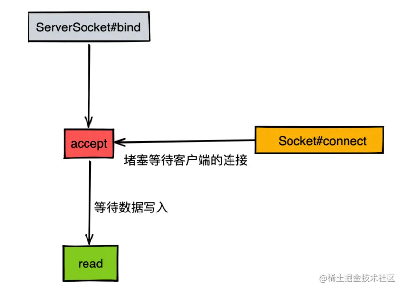

上一篇文章中，我们大致地介绍了整款RPC框架在实际开发中可能会遇到的问题点，例如**负载均衡** **，注册中心，服务** **线程** **与处理队列**等。为了减少后续开发工作中的困难，我们尽可能在写代码之前先进行清晰地设计和思考。

既然我们需要做的是搭建基本的网络通讯模型，那么就需要先对已有的几种网络io技术原理有一定的了解，下边我会先从Java内部的几款网络IO技术开展讨论。

### 阻塞IO技术

首先我写了一段简单的基于BIO实现的阻塞IO服务端程序代码：

```java
java复制代码package org.idea.irpc.framework.core.bio;

import java.io.IOException;
import java.io.InputStream;
import java.io.OutputStream;
import java.net.ServerSocket;
import java.net.Socket;
import java.util.concurrent.ExecutorService;
import java.util.concurrent.Executors;


 /**
 *  @Author linhao
 *  @Date created in 10:24 上午 2021/11/27
 */

public class BioServer {

    private static ExecutorService executors = Executors.newFixedThreadPool(10);

    public static void main(String[] args) throws IOException {
        ServerSocket serverSocket = new ServerSocket();
        serverSocket.bind(new InetSocketAddress(1009));
        try {
            while (true) {
               //堵塞状态点--1
                Socket socket = serverSocket.accept();
                System.out.println("获取新连接");
                executors.execute(new Runnable() {
                    @Override
                    public void run() {

                        while (true){
                            InputStream inputStream = null;
                            try {
                                //堵塞的状态点--2
                                inputStream = socket.getInputStream();
                                byte[] result = new byte[1024];
                                int len = inputStream.read(result);
                                if(len!=-1){
                                    System.out.println("[response] "+new String(result,0,len));
                                    OutputStream outputStream = socket.getOutputStream();
                                    outputStream.write("response data".getBytes());
                                    outputStream.flush();
                                }
                            } catch (IOException e) {
                                e.printStackTrace();
                                break;
                            }
                        }
                    }
                });
            }
        }catch (Exception e){
            e.printStackTrace();
        }
    }
}
```

这段代码当中的主要关注点在于accept函数和read函数，因为传统的bio技术会在这两个模块中发生堵塞情况。

服务端创建了socket之后会堵塞在等待外界连接的accept函数环节，大概流程我整理了如下所示：



当客户端连接上了服务端之后，accept的堵塞状态才会放开，然后进入read环节（读取客户端发送过来的网络数据）。

客户端如果一直没有发送数据过来，那么服务端的read调用方法就会一直处于堵塞状态，倘若数据通过网络抵达了网卡缓冲区，此时则会将数据从内核态拷贝至用户态，然后返回给read调用方。


不过这里存在了一个问题，如果客户端单纯地连接上了服务端，但是没有发送数据给到目标机器，此时服务端就会一直处于堵塞状态。所以这里我们需要引出一种叫做非阻塞io的技术。

### 非阻塞IO技术

假设让我们来对上边的**阻塞** **io** **技术**进行性能提升方面的改造的话，其实是可以尝试在accept函数获取到客户端连接之后，再去创建一个线程专门用于处理read函数。整体流程如下图所示：


看到这里，你是否会有疑惑，**来一个请求才创建一个线程，这部分工作为什么不交给线程池去完成呢？**

没错，线程池确实可以帮助我们提前创建好一定数量的线程，当请求量增大的时候还能有队列缓冲，以及增加worker线程的效果，从而可以降低这块的实现难度。但是这样的设计依然是存在不足点，因为在用户态层面调用的 **read** 函数依旧是堵塞的。就现阶段而言，**这种技术方案还不能称之为非阻塞IO技术。**

此时的**read**函数在调用的时候如果没有目标数据抵达，则会一直处于**阻塞状态**，那么如何对其进行设计升级实现非阻塞效果呢？

其实在JDK的**NIO**模型中就有相关的设计存在，下边我贴出一段简单的NIO服务端代码：

```java
java复制代码package org.idea.irpc.framework.core.nio;

import java.io.IOException;
import java.net.InetSocketAddress;
import java.nio.ByteBuffer;
import java.nio.channels.SelectionKey;
import java.nio.channels.Selector;
import java.nio.channels.ServerSocketChannel;
import java.nio.channels.SocketChannel;
import java.util.Iterator;
import java.util.Set;

public class NioSocketServer extends Thread {
    ServerSocketChannel serverSocketChannel = null;
    Selector selector = null;
    SelectionKey selectionKey = null;

    public void initServer() throws IOException {
        selector = Selector.open();
        serverSocketChannel = ServerSocketChannel.open();
        //设置为非阻塞模式,默认serverSocketChannel是采用了阻塞模式
        serverSocketChannel.configureBlocking(false);
        serverSocketChannel.socket().bind(new InetSocketAddress(8888));
        selectionKey = serverSocketChannel.register(selector, SelectionKey.OP_ACCEPT);
    }

    @Override
    public void run() {
        while (true) {
            try {
                //默认这里会堵塞
                int selectKey = selector.select();
                if (selectKey > 0) {
                    //获取到所有的处于就绪状态的channel，selectionKey中包含了channel的信息
                    Set<SelectionKey> keySet = selector.selectedKeys();
                    Iterator<SelectionKey> iter = keySet.iterator();
                    //对selectionkey进行遍历
                    while (iter.hasNext()) {
                        SelectionKey selectionKey = iter.next();
                        //需要清空，防止下次重复处理
                        iter.remove();
                        //就绪事件，处理连接
                        if (selectionKey.isAcceptable()) {
                            accept(selectionKey);
                        }
                        //读事件，处理数据读取
                        if (selectionKey.isReadable()) {
                            read(selectionKey);
                        }
                        //写事件，处理写数据
                        if (selectionKey.isWritable()) {
                        }
                    }
                }
            } catch (IOException e) {
                e.printStackTrace();
                try {
                    serverSocketChannel.close();
                } catch (IOException e1) {
                    e1.printStackTrace();
                }
            }

        }
    }

    public void accept(SelectionKey key) {
        try {
            ServerSocketChannel serverSocketChannel = (ServerSocketChannel) key.channel();
            SocketChannel socketChannel = serverSocketChannel.accept();
            System.out.println("conn is acceptable");
            socketChannel.configureBlocking(false);
            //将当前的channel交给selector对象监管，并且有selector对象管理它的读事件
            socketChannel.register(selector, SelectionKey.OP_READ);
        } catch (IOException e) {
            e.printStackTrace();
        }
    }

    public void read(SelectionKey selectionKey) {
        try {
            SocketChannel channel = (SocketChannel) selectionKey.channel();
            ByteBuffer byteBuffer = ByteBuffer.allocate(100);
            int len = channel.read(byteBuffer);
            if (len > 0) {
                byteBuffer.flip();
                byte[] byteArray = new byte[byteBuffer.limit()];
                byteBuffer.get(byteArray);
                System.out.println("NioSocketServer receive from client:" + new String(byteArray,0,len));
                selectionKey.interestOps(SelectionKey.OP_READ);
            }
        } catch (Exception e) {
            try {
                serverSocketChannel.close();
                selectionKey.cancel();
            } catch (IOException e1) {
                e1.printStackTrace();
            }
            e.printStackTrace();
        }
    }


    public static void main(String args[]) throws IOException {
        NioSocketServer server = new NioSocketServer();
        server.initServer();
        server.start();
    }
}
```

下边我将上边这段代码中关于NIO是如何接受参数处理的，用一张流程图绘制出来给大家看：


好了，现在我们来思考下代码会怎么走，当socket的服务端启动之后，会对每个socket连接的对象都开启一个线程，然后在一个循环里面去调用read函数，此时的read函数调用不会进入阻塞状态了，但是似乎还是没有解决根本性问题：每次来请求都要创建一个线程来监听客户端的请求。如果客户端在建立连接之后长时间没有传输数据，此时对于服务端而言就会造成资源浪费的情况。

**每次请求都需要建立一个线程，如何优化？**

我们不妨可以将accept和read分成两个模块来处理，当accept函数接收到新的连接（其实本质就是一个文件描述符fd）之后，将其放入一个集合，然后会有一个后台任务统一对这个集合中的fd遍历执行read函数操作。

此时整体的流程我绘制如下图所示：


看到这里，不知道你是否会带有疑惑点：循环调用read方法岂不是循环进行**用户态和内核态的切换**？噢，这样不断地进行上下文切换也不是什么好的设计思路啊，能否将这个循环的调用的操作交给内核态去处理呢？

#### select模型

在Linux内核中设计了一个叫做select的函数，这个函数在内核态中对fd集合进行遍历，如果对应的fd接收到客户端的抵达数据，则会返回给用户态调用方（注意用户态发送select调用的时候依然会处于堵塞状态）。

> 关于select函数的官方介绍地址：[www.man7.org/linux/man-p…](https://link.juejin.cn/?target=https%3A%2F%2Fwww.man7.org%2Flinux%2Fman-pages%2Fman2%2Fselect.2.html)

当网卡没有接收到新的数据报文请求时，用户态执行select函数会处于堵塞状态中，此时内核态会对fd集合进行循环遍历，对每个连接上的fd都执行read操作，判断是否有新的数据报文抵达。如下图所示：


如果此时有新的数据报文抵达网卡缓冲区，则会将数据信息拷贝到内核态指定的内存块区域中，并且返回给调用select函数的用户态程序。如下图所示：（图中绿色部分是数据抵达网卡的部分）


所以综上所述，**一次select函数调用，会发生一次系统内核调用，和内核态内部的n多次就绪文件符的read函数调用**，这个流程我绘制了一幅图，如下所示：


看到这里，你应该对select函数有些了解了吧，那么我们再来聊聊什么是poll和epoll。

#### poll模型

**poll**也是和**select**相似，通过一次系统调用，然后在内核态中对连接的文件描述符集合进行遍历判断是否有就绪状态的连接接收到了网卡数据。但是select函数中只能监听1024个文件描述符（之所以是1024，我推断是为了尽量避免过多的集合在用户态和内核态之间的拷贝情况发生），而**poll**函数则是去除掉了这块的限制。

> 关于poll函数的官方文档地址：[www.man7.org/linux/man-p…](https://link.juejin.cn/?target=https%3A%2F%2Fwww.man7.org%2Flinux%2Fman-pages%2Fman2%2Fpoll.2.html)

#### epoll模型

通过上边对select介绍，可以发现它虽然将之前**在用户态循环调用内核态的设计改进为了在用户态发起调用触发内核态中的循环遍历**，但是依然存在以下几个不足点。

- select函数在从用户态拷贝fd集合传入内核态之后，后续主要关注的点就是哪个fd的就绪状态发生了改变。**举个应用场景解释下：内核态中已经存在一个fd集合，这个集合中的任一fd的状态发生变更，则整个fd集合都需要返回给到用户态，这个拷贝过程会将状态没有变化的fd也返回。**
- select函数在内核态中依然是通过遍历的方式来判断究竟哪个fd已经处于就绪状态。

因此，epoll模型就是基于这些不足点的基础上去进行优化的。

- 用户态无需将整份fd数据在用户态和内核态之间进行拷贝，只会拷贝发生变化的fd数据。
- 内核态中不再是通过循环遍历的方式来判断哪些fd处于就绪状态，而是通过异步事件通知的方式告知。
- 内核态会将有数据抵达的fd返回到用户态，此时用户态可以减少不必要的遍历操作。

> 关于epoll模型的官方地址：[www.man7.org/linux/man-p…](https://link.juejin.cn/?target=https%3A%2F%2Fwww.man7.org%2Flinux%2Fman-pages%2Fman7%2Fepoll.7.html)

那么epoll的内部到底是如何将这些技术点进行优化的呢？这里就需要深入了解下epoll内部的三个函数代表。

- **epoll_create** **：** 创建epoll的实例对象。

- **epoll_ctl** **：** 根据epoll_id去添加，修改，删除各个文件描述符。

- **epoll_wait** **：** 等待外界的io数据请求，有些类似于select()操作。

epoll模型的内部会有一个叫做eventPoll的对象，它的内部存在着一个等待队列，等待队列的对象其实就是一堆等待着外部链接的socket信息。

当其中的某个socket接收到了外界传输进入的数据信息，就会将eventPoll内部等待队列的数据转移到cpu对应的工作队列中。

看起来其实epoll的工作流程还是和select差不多，但是对于socket的集合信息存储却有所不同。epoll底层使用了红黑树的数据结构，这种结构可以按照事件类型对socket的集合信息进行增删改查，相对高效稳定。

为了方便大家理解epoll的执行过程，这里我绘制了一张图带大家理解：

- 首先是调用epoll_create函数，它会在内核态中开辟一块空间。


- 当用户态调用epoll_ctl函数的时候，就会往这个内存块区域中放入fd。


这个函数它的内部其实还细分为了三个部分（EPOLL_CTL_ADD、EPOLL_CTL_MOD、EPOLL_CTL_DEL），这三个更细的函数将fd集合的修改操作拆解得更细粒度化。

- 用户态调用epoll_wait函数之后会进入一个阻塞状态，只有等网卡数据抵达之后，epollo_wait函数才会返回网络数据。


另外epollo_wait在解决大量fd拷贝的问题上引入了mmap的技术进行优化。mmap将用户空间的一块地址和内核空间的一块地址同时映射到相同的一块物理内存地址（不管是用户空间还是内核空间都是虚拟地址，最终要通过地址映射映射到物理地址），使得这块物理内存对内核和对用户均可见，减少用户态和内核态之间的数据交换。

### **Netty框架的介绍**

Netty是一款基于NIO（Nonblocking I/O，非阻塞IO）开发的网络通信框架，对比于BIO（Blocking I/O，阻塞IO），它的并发性能得到了很大提高。

**传统的阻塞IO**


**非阻塞IO**


#### Netty传输的高性能特点

在Java的内存中，存在有堆内存、栈内存和字符串常量池等等，其中堆内存是占用内存空间最大的一块，也是Java对象存放的地方，一般我们的数据如果需要从IO读取到堆内存，中间需要经过Socket缓冲区，也就是说一个数据会被拷贝两次才能到达它的终点，如果数据量大，就会造成不必要的资源浪费。

Netty针对这种情况，使用了NIO中的一大特性——零拷贝，当它需要接收数据的时候，它会在堆内存之外开辟一块内存，数据就直接从IO读到了那块内存中去，在netty里面通过ByteBuf可以直接对这些数据进行直接操作，从而加快了传输速度。

#### Netty良好的封装性特点

相比于JDK内部提供的NIO编码格式，Netty在进行nio技术开发的时候，封装的Api更加方便开发者使用，能够降低开发者对于操控NIO技术的门槛。例如下边这段基于Netty技术开发的一个客户端和服务端通讯程序代码：

**服务端程序**

```java
java复制代码package org.idea.irpc.framework.core.netty.server;

import io.netty.bootstrap.ServerBootstrap;
import io.netty.channel.ChannelInitializer;
import io.netty.channel.ChannelOption;
import io.netty.channel.EventLoopGroup;
import io.netty.channel.nio.NioEventLoopGroup;
import io.netty.channel.socket.SocketChannel;
import io.netty.channel.socket.nio.NioServerSocketChannel;
import io.netty.handler.codec.string.StringDecoder;
import io.netty.handler.codec.string.StringEncoder;


/**
 *  @Author linhao
 *  @Date created in 8:12 上午 2021/11/29
 */
public class Server {

    private static EventLoopGroup bossGroup = null;
    private static EventLoopGroup workerGroup = null;

    public static void main(String[] args) throws InterruptedException {

        bossGroup = new NioEventLoopGroup();
        workerGroup = new NioEventLoopGroup();
        ServerBootstrap bootstrap = new ServerBootstrap();
        bootstrap.group(bossGroup, workerGroup);
        bootstrap.channel(NioServerSocketChannel.class);
        bootstrap.option(ChannelOption.SO_BACKLOG, 1024);
        bootstrap.option(ChannelOption.SO_SNDBUF, 16 * 1024)
                .option(ChannelOption.SO_RCVBUF, 16 * 1024)
                .option(ChannelOption.SO_KEEPALIVE, true);
        bootstrap.childHandler(new ChannelInitializer<SocketChannel>() {

            @Override
            protected void initChannel(SocketChannel ch) throws Exception {
                System.out.println("初始化连接通道信息,编解码处理器：定长处理器");
                ch.pipeline().addLast(new StringEncoder());
//                ch.pipeline().addLast(new FixedLengthFrameDecoder(3));
                //指定通过回车换行符来识别每次发送的数据，但是一旦当文本数据超过类maxLength就会抛出异常
//                ch.pipeline().addLast(new LineBasedFrameDecoder(5));
                //指定特殊符号的分割处理
//                ch.pipeline().addLast(new DelimiterBasedFrameDecoder(50, Unpooled.copiedBuffer("[end]".getBytes())));
                ch.pipeline().addLast(new StringDecoder());
                ch.pipeline().addLast(new ServerHandler());
            }
        });
        bootstrap.bind(9090).sync();
        System.out.println("server is open");
    }
}
```

**客户端程序**

```java
java复制代码package org.idea.irpc.framework.core.netty.client;


import io.netty.bootstrap.Bootstrap;
import io.netty.buffer.Unpooled;
import io.netty.channel.ChannelFuture;
import io.netty.channel.ChannelInitializer;
import io.netty.channel.EventLoopGroup;
import io.netty.channel.nio.NioEventLoopGroup;
import io.netty.channel.socket.SocketChannel;
import io.netty.channel.socket.nio.NioSocketChannel;
import java.io.UnsupportedEncodingException;


/**
 *  @Author linhao
 *  @Date created in 8:22 上午 2021/11/29
 */
public class Client {


    public static void main(String[] args) throws InterruptedException, UnsupportedEncodingException {

        EventLoopGroup clientGroup = new NioEventLoopGroup();
        Bootstrap bootstrap = new Bootstrap();
        bootstrap.group(clientGroup);
        bootstrap.channel(NioSocketChannel.class);
        bootstrap.handler(new ChannelInitializer<SocketChannel>() {
        
            @Override
            protected void initChannel(SocketChannel ch) throws Exception {
                ch.pipeline().addLast(new ClientHandler());
            }
        });
        ChannelFuture channelFuture = bootstrap.connect("localhost",9090).sync();
        while (true){
            Thread.sleep(2000);
            channelFuture.channel().writeAndFlush(Unpooled.copiedBuffer("send data[end]bbbb".getBytes()));
            System.out.println("发送数据！");
        }
    }
}
```

代码整体思路非常清晰，内部将已有的NIO相关API封装到位，开发者可以灵活调整相关的属性。

### **小结**

本文系统地和大家介绍了IO技术的分类：阻塞IO和非阻塞IO，以及它们各自存在的不足点和相关解决手段。在探讨非阻塞IO的同时也深入了解了select模型、poll模型、epoll模型三者在底层实现上的区别，同时也简单地介绍了下Netty这款技术框架的使用。

之所以在小册课程的开头和大家讲解这些技术原理，是因为后续我们的实战开发都要基于这些基础知识进行扩展。了解了这些，对于后续的学习来说会更加**知其然且知其所以然**。

好了，看到这里你应该对常用到的IO技术原理有了一定的了解了，下一章节中我们将会开始通过使用Netty实战演练来开启RPC框架的开发。

本文相关的源代码案例地址：

> [gitee.com/IdeaHome_ad…](https://link.juejin.cn/?target=https%3A%2F%2Fgitee.com%2FIdeaHome_admin%2Firpc-framework%2Ftree%2Flession-01%2F)

### 课后思考

关于上一篇文章的尾部我留了一道思考题，是关于本地调用和RPC调用的比对。这里我简单谈下自己的思考：

在早期的单体应用开发中，在调用本地方法时通常都是会先将下一条的指令压入到操作数栈里面，然后当当前函数执行完毕之后再去调用它。这样的调用原理是通过CPU寻址的方式来调用方法，但是对于远程的方法引用，单纯依靠本机的CPU寻址是不可能实现的，因此还得需要引用到SOCKET技术。所以RPC技术不仅仅局限于单台物理机层面，更多的需要网络层面的SOCKET通讯帮助，从而实现远程的方法调用。

除开考虑网络层面的因素之外，RPC调用还需要额外考虑分布式下的一些问题：

- 面对集群下的服务提供者，发起远程调用的时候需要有路由策略。
- 远程调用所传输的数据包的大小需要由客户端和服务端共同约定。
- 本地调用的时候，服务提供的压力主要来自于本地调用者，而在RPC中，服务提供方的压力有可能会来自多个调用方。
- 本地调用的时候，失败结果可以立马返回，而rpc调用可能不会立马返回异常导致客户端调用超时。

同样的，今天的课程结尾，我也打算给大家留一道思考题：臭名昭著的JDK NIO空指针BUG大家是否有所了解呢？感兴趣的朋友可以在评论区中进行讨论。