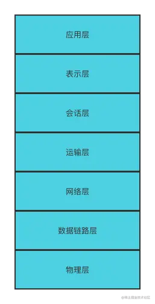
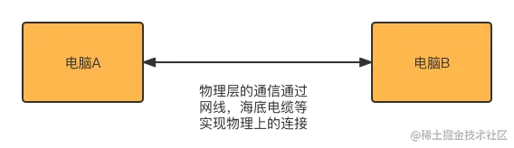
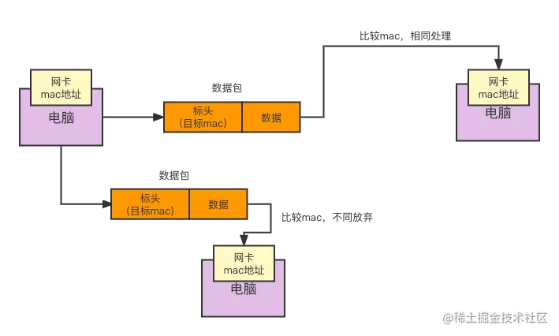
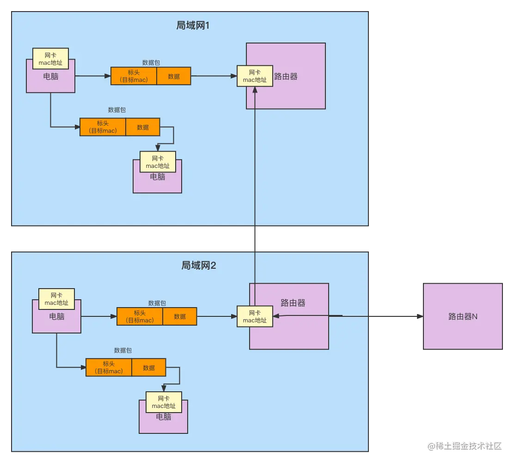

Java 工程师学习网络通信，不可避免地要接触到 OSI 七层网络模型和 TCP/IP 四层网络协议。在正式讲解之前，我先给大家介绍一下 OSI 七层网络模型和 TCP/IP 四层网络协议的意义和关系。

- **OSI 七层网络模型**。这是一个网络协议设计模型，分为七层： 物理层、数据链路层、网络层、传输层、会话层、表示层、应用层。这个模型的目的是给计算机厂商设定了网络通信协议的规范，厂商必须要遵循这个模型来设计自己的网络通信协议。因为这个模型是合理的、通用的。
- **TCP/IP 四层网络协议**。包括四层：数据链路层、网络层、传输层、应用层。这是对 OSI 七层网络模型的实现和优化精简，并且是当今互联网正在使用的通用的网络协议。

无论 OSI 七层网络模型也好，TCP/IP 四层网络协议也罢，它们都是**一套通用的规范**。每个模型或者协议里面还包含着很多小的协议，而且非常复杂。

所以，本小册我只讲解一些网络协议的核心知识，这些核心知识能够满足 Java 工程师实现网络通信模块就足够了。 同时，在使用 Netty 碰到网络问题时，能够大体知道如何排查问题即可。

今天这一节，我主要给大家整体讲一讲 OSI 七层网络模型。

**那么，为什么需要有这套所谓的标准化呢？有什么意义呢？**

很多年以前，有很多的计算机厂商，比如说， IBM、微软、苹果等一些国外计算机厂商。无论是大型服务器还是个人电脑，如果每个厂商不管别的厂商，只定义自己的网络协议的话，这个就会导致：苹果计算机只能跟苹果计算机去通信，IBM 计算机只能跟 IBM 计算机通信，苹果计算机跟 IBM 电脑由于网络通信协议不一样而造成无法通信。因为没有统一的网络协议通信，造成互联网无从谈起。

所以，为了解决这个问题，国际上搞了一个 OSI 七层网络模型，当然这只是一个模型并不是具体的网络协议的实现，只是定义了一个标准。网络协议由计算机厂商来实现，**所有厂商都会基于这个网络模型来设计自己的网络协议**，从而使不同厂商的计算机实现了通信。

那么， 什么是 OSI 七层网络模型呢？

## OSI 模型的层次

OSI 七层网络模型如下图所示，我会自底向上地给大家梳理：

### 1. 物理层

物理层作为最底层，**它的作用是在网络节点之间传递`电信号`（用来表示 0 和 1）** 。

这里我举个例子，如下图，这里有两个电脑，两台电脑之间由一条网线连接，两个电脑通信时，电信号就在这根网线传输。物理层干的就是这个事情。

我不知道大家有没有印象，就很多年前，当时还是在用台式机的时候，咱们如果让电脑上网，需要从电脑上面插一根网线，然后把那根网线接到调制解调器上，英文叫做 modem，或者你可以叫做“猫”。当你要通过联通或移动上网时，相关的工程师会过来把你的“猫”处理一下，然后你把电脑通过网线连接到“猫”上，就能上网了，当然你也可以去连一个无线的 WiFi，原理其实是一样的。

同时，你在中国也可以上美国的网站访问，一般美国的网站会把服务器放到美国。那么我们中国人是如何访问到美国的网站呢？

中国的电脑要是想访问美国的网站，就要依赖海底光缆，所以说物理层指的就是这个意思，通过网线、WiFi、海底光缆让计算机间互相传递电信号。

### 2. 数据链路层

物理层是电信号，那么有了电信号还是不够的。比如说，我们怎么知道哪些电信号是一个请求发送的，以及如何控制数据块的传输。

比如，在物理层是这样的：

- 01010101（从 A 电脑发送到 C 电脑）
- 01110001（从 C 电脑发送到 B 电脑）
- 11010100（从 B 电脑发送到 C 电脑）
- 10001010（从 C 电脑发送到 A 电脑）

大家可以看到，如果我们只有电信号 1、0 的话，我们无法判断这些信号是发送给哪个电脑的。这就是数据链路层要做的事情。

那数据链路层是如何做的呢？

数据链路层把一组电信号称为**帧**，每个帧分为两个部分，分别是标头和数据体。

- head（也称为`标头`）：用来保存一些元数据，包括数据帧从哪个地址发出的，要发送到哪个地址去。在数据链路层，地址使用 MAC 地址来表示。另外，标头里的数据还包括节点的数据类型等。
- `数据体`：这是真正要发送的数据。

> MAC 地址是网卡生产商写在网卡中的 12 位十六进制的序列号，这个序列号是全球唯一的编号，序列号前 6 个十六进制是厂商编号，后 6 个十六进制是网卡的流水号。

当局域网中的一个电脑想对外发送数据的时候，会向自己所在的`局域网`中所有的电脑用广播的方式发送请求。局域网内的电脑收到请求后电脑会从请求数据包里获取接收者的 MAC 地址，然后跟自己的 MAC 地址进行比对。如果相同，自己就是接收者，对数据做进一步处理；否则，就抛弃这个请求。这是一个协议，叫**以太网协议**。

> 注意：广播是向局域网内部广播，可不是整个互联网。也就是说，数据链路层的工作只在某个局域网内。

如下是数据链路层以太网协议的工作示意图：

就是说一个电脑发出一个请求会广播到局域网中每一个电脑。但是这里有一个问题，我怎么知道请求是要发送到子网的？如果不是发送的子网，该如何处理呢？这时就要提到数据链路层的上一层：网络层。

### 3. 网络层

数据链路层实现了局域网内的通信，但是请求不一定只在局域网内，如果局域网之间需要通信怎么办呢？这就是网络层要做的事情了！网络层也有它自己的协议，叫 **IP 协议**，下面给大家大体介绍一下 IP 协议。

为了便于理解，我结合下面的网络层工作示意图给大家讲解：

比如，如果两个局域网通过两个路由器联通。当局域网 1 的一个电脑发送请求，而且这个请求的目标机器不是发往局域网 1 的电脑，首先通过广播发送到局域网内的所有有网卡的机器（包括路由器），因为不是发往局域网内机器的，所以局域网内的电脑不会处理。

但是路由器收到请求后，由于要发送的目标机器 MAC 地址和路由器的 MAC 地址不一样，这个路由器就会把请求转发给其他局域网的路由器，然后局域网 2 中的路由器再判断这个请求是否属于局域网 2 的机器，如果属于就不用再寻找别的局域网了。

总之，**数据链路层的以太网协议是`局域网内`的广播通信，而网络层的 IP 协议则实现了`局域网之间`的联通**。

看到这里，估计有小伙伴还会有个疑问：`路由器怎么知道请求不是发到它所在的局域网呢？`很简单，原理就是：当一个局域网建立起来的时候，所有的电脑都会向局域网内所有电脑（包括路由器）广播自己的 IP 和 MAC 地址，这样路由器就有了局域网内所有电脑的 IP 和 MAC 地址列表。

那`如何判断哪些机器在一个局域网（子网）里呢？`这时我们就需要借助**子网掩码**来判断了。

IP 地址其实分为两段，第一段是表示局域网，第二段表示主机。如果两个电脑的 IP 地址局域网部分相同，那这两个电脑就在同一局域网网络里。而**子网掩码**就是来判断 IP 地址的局域网，如果两个主机的 IP 地址的局域网相同，那么这两个主机就是在一个局域网里。

比如：一个 IPv4 地址，由 32 位二进制数构成，我们把每 8 个一组转化十进制，就是我们常见的 IP 地址了。一般设置为：前三段表示局域网标识，最后一段用来表示主机。

在这个 32 位的 IP 地址中，子网掩码用前面 N 位二进制的 1 来代表子网标识，剩下的表示主机。比如常见的子网掩码为：255.255.255.0，其实就是这样的二进制：1111 1111.1111 1111.1111 1111.0000 0000。

判断是否在同一个子网，方法是用电脑的 IP 地址和子网掩码做`与运算`，然后看前面 3 段是否一致就可以了，如果一致的话，就是在一个局域网里。

所以，给你一组 IP 地址，只要用它跟上面的一串二进制的子网掩码做与运算（ 与运算的规则：`跟 1 做与不变还是 1，跟 0 做与为 0`）得到的结果，如果 IP 前三段相同，即为同一局域网。

这里结合个具体例子说明下。比如，下面的两个 IP 地址：

- A：219.218.44.123
- B：219.218.45.34

如果有两个子网掩码，分别为 M1 和 M2。通过计算，子网掩码 M1：255.255.254.0 下为 A 和 B 在相同的局域网，而在 M2：255.255.255.0 下 A 和 B 在不相同的局域网。

分析如下：

- A：11011011-11011010-00101100-01111011
- B：11011011-11011010-00101101-00100010
- M1：11111111-11111111-11111110-00000000（254）
- M2：11111111-11111111-11111111-00000000（255）

通过做 and 运算，可以看出来：

- A&M1：11011011-11011010-00101100-00000000
- B&M1：11011011-11011010-00101100-00000000
- A&M2：11011011-11011010-00101100-00000000
- B&M2：11011011-11011010-00101101-00000000

### 4. 传输层

传输层东西还挺多的，我打算下节讲解 TCP/IP 四层协议的时候给大家细讲。这里你只需要知道端口是怎么回事就行。

比如，一台机器和另外一台机器通信，除了建立两台机器的通信，你还要再做一个更加细化的一个区分：我这台机器上的某一个程序，要访问另外一台机器上的某一个程序，这种情况下如何通信呢？

于是就引入了一个新的概念——**端口**。比如，目标机器上有多个程序，我们机器上的一个程序要想跟目标机器上的某一个程序通信，就必须知道这个程序的端口，请求的时候带上`端口号`，这样目标机器就知道你要通信的程序啦。简单说就是对端口来进行一个通信，解决了“程序对程序通信”的问题。

**传输层引用了这个端口的这么一个概念，极大地提升了网络通信的便利性。**

至于会话层、表示层和应用层，我认为都可归属于`应用层`的范围，这些知识会在下节课讲解 TCP/IP 网络协议的时候给大家详细分析和说明。

## 总结

今天，我给大家讲解了七层网络模型的结构和功能，重点给大家讲解物理层、数据链路层、网络层。其中，数据链路层的以太网协议是局域网内的广播，而网络层的 IP 协议是可以跨子网通信的。除此之外，还给大家介绍了如何用子网掩码来划分局域网，以及传输层引入端口来解决“程序对程序通信”这个问题。这些知识虽然基础，但都很重要，希望大家有所收获。