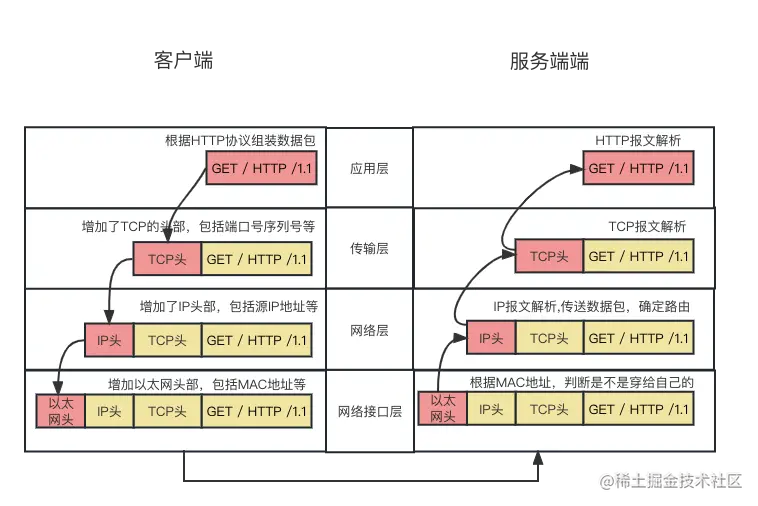
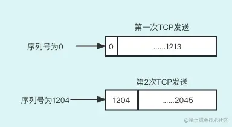

上节课我们讲解了 7 层网络模型，这节课，我们开始讲解 4 层网络模型。

实际上，ISO 7 层网络模型仅仅是一个`标准`，而基于 7 层网络协议实现的 4 层网络协议（又称 TCP/IP 协议）才是现在真正使用的`互联网协议`。

那两者有什么不同呢？我们通过下面的图来说明：

7 层网络模型和 TCP/IP 协议的区别

你可以看到，7 层网络协议的应用层、表示层、会话层合并到 TCP/IP 协议的应用层，数据链路层和物理层合并到网络接口层。也就是说，**TCP/IP 协议不仅是对 7 层网络协议的实现，也是对它的简化**。

## 四层网络协议

那么 TCP/IP 协议每层都做了什么事情，然后数据是如何流转的呢？下面的图能够给大家解释清楚：

当客户端向服务端发送请求时，根据网络分层数据不断组包每层的数据，直到客户端的物理层直接与服务端的物理层联通，然后服务端根据每层增加的数据再逐层拆包。

那么，`分层`的好处是什么呢？

- `各层独立`：限制了依赖关系的范围，各层之间使用标准化的接口，各层不需要知道上下层是如何工作的，增加或者修改一个应用层协议不会影响传输层协议。
- `灵活性更好`：比如路由器不需要应用层和传输层，分层以后路由器就可以只用加载更少的几个协议层。
- `易于测试和维护`：提高了可测试性，可以独立地测试特定层，某一层有了更好的实现可以整体替换掉。
- `能促进标准化`：每一层职责清楚，方便进行标准化。

TCP/IP 协议我们会重点介绍传输层，而传输层的协议为 TCP 协议和 UDP 协议，因为这一层跟我们平时的工作是息息相关的。

## UDP 和 TCP 的区别

传输层分为 UDP 和 TCP 两种协议，这两个协议的区别如下：

- UDP（User Datagram Protocol）：用户数据报协议。
- TCP（Transmission Control Protocol）：传输控制协议。

|              | TCP                        | UDP                        |
| ------------ | -------------------------- | -------------------------- |
| 连接性       | 面向连接                   | 无连接                     |
| 可靠性       | 可靠传输，不丢包           | 不可靠传输，尽最大努力交付 |
| 首部占用空间 | 大                         | 小                         |
| 传输效率     | 慢                         | 快                         |
| 资源消耗     | 大                         | 小                         |
| 应用场景     | 浏览器，文件传输，发送邮件 | 音视频通话，直播           |
| 应用层协议   | HTTP,HTTPS,FTP,SMTP        | DNS                        |

首先，TCP 是`面向连接`的，因为 TCP 要想保证`可靠性`，就必须要知道双方是可以连接的，所以，TCP 要建立连接。TCP 连接是通过`三次握手`建立的，而关闭连接是通过`四次挥手`实现的（下节课会给大家详细讲解三次握手和四次挥手）。而 UDP 为了增加传输效率就放弃了损耗性能的连接行为，也就是说 UDP 的可靠性比 TCP 的要低。所以，TCP 适合对可靠性要求高的场景，比如浏览器、文件传输等。而 UDP 因为传输效率高，为了节省网络的资源开销，有些应用场景会使用 UDP，比如音视频通话、直播等。

同时，TCP 是`面向字节流`的。网络里不同机器上的两个应用通过 TCP 连接交换 8bit 字节构成的字节流。TCP 不在字节流中插入记录标识符，也就是说应用层所有的数据不会在传输层的 TCP 协议中解释。比如，在应用层有意义的数据会在传输层根据 TCP 协议转化为无意义的数据流。我们将这称为字节流服务（Byte Stream Service）。也就是说，TCP 层只负责把应用层的`数据字节流化`，解释字节流数据的任务是应用层的事情。TCP 只负责传输数据流，这也许也是传输层的来历。

举个例子：如果一方的应用程序先传 10 字节又传 20 字节，再传 50 字节，接收方无法了解发送方每次发送了多少字节。接收方可以分 4 次接收这 80 个字节，每次接收 20 字节。一端将字节流放到 TCP 连接上，同样的字节流将出现在 TCP 连接的另一端。

也就是说应用层要做好粘包和拆包，这个事情我们会在后面 Netty 相关的模块和章节给大家详细讲解。

> **长连接和短连接**
>
> 可能有小伙伴会问：TCP 是长连接，还是短连接呢？其实，TCP 这个协议谈不上是长连接还是短连接，而且 TCP 中所谓的连接其实是由相关算法实现的虚拟连接。所谓的长连接或短连接是对于应用层的，比如我们的浏览器，或者说 HTTP 协议这些都是工作在应用层的。HTTP 1.0 只支持短连接，也就是说 HTTP 1.0 对于每次请求完成后都会释放 TCP 连接，下次请求要再次建立连接。
>
> 这样的工作模式显然效率比较低，于是 HTTP 1.1 提供了 KeepAlive 模式，这样每次请求后就不会释放现存的 TCP 连接，而是下次请求的时候重用上次创建的连接。

## TCP 协议概述

做应用开发的同学应该都知道，我们的软件项目或者 App 只是应用层，而 TCP 协议是在操作系统（如 Linux、Windows）内实现的，然后操作系统向应用层暴露 TCP 的接口供应用层调用，那么应用层发送一个请求，TCP 协议是如何工作的呢？

要搞明白这个问题，我们首先要概要地学习 TCP 协议相关的知识，我们要知道 TCP 的`数据结构`，TCP 数据结构第一部分为`数据头`，也就是首部，第二部分是`数据内容`。数据内容很简单，都是字节流，我们先看看 TCP 报文的数据结构长什么样子，如下：

接下来，我们对上述字段做逐一的解释。

- 源和目的端口号用于寻找发端和收端应用进程。这两个值加上 IP 首部中的源端 IP 地址和目的端 IP 地址唯一确定一个 TCP 连接。也就是发送端的 IP:PORT 和接收端的 IP:PORT。
- **32 位序号**：TCP 用`序号`对每次发送数据的字节进行计数。序号是 32bit 的无符号数，序号到达 2 的 32 次方减 1 后又从 0 开始。如果大家还不理解，下面的图能够让你更好地理解。

> 给大家解释一下上图，一个数据报文的长度是 1024 个字节，那么，每次发送数据报文后数据报文的序号加 1024。

- **确认序号**：确认序号是接收方发出给发送方的，意思是接收方`下次要接收的字节位置`，ACK 是已成功收到数据字节数加 1。TCP 为应用层提供`全双工服务`。这意味着数据能在两个方向上独立地进行传输。因此，连接的每一端必须保持`每个方向`上的传输数据序号。
- 四位首部长度：这个很好理解，就是 TCP 一次请求的数据头的大小。
- 6 个标志比特。它们中的多个可同时被设置为 1。
  - URG 紧急指针（urgent pointer）。URG 控制位是用来告诉接收端在数据包中某特定的数据是紧急的，需要优先处理。
  - ACK 确认序号有效。接收方告诉发送方：这个序号之前的数据都收到了，下次需要的数据从这个序号开始。
  - PSH 接收方应该尽快将数据从 TCP 放到应用层里。
  - RST 重建连接。也就是说以前的连接是异常的，需要重新建立连接。
  - SYN 同步序号用来发起一个连接，用来做 TCP 连接建立的。
  - FIN 发端完成发送任务。用来做 TCP 连接关闭的。
- **滑动窗口**： 首先给大家介绍一下，TCP 数据报文的发送 **ACK 确认机制**。

上面这幅图体现了 TCP 的数据报文`应答机制`，发送发每次向接收方发送数据报文后，接收方如果收到数据报文就会放回给发送方一个 ACK `确认报文`，携带的数字是接收方要求发送方下次要发送的数据报文的数据字节起点，比如接收方发送的 ACK 513，就是告诉发送方从 513 字节开始发送数据报文。

**滑动窗口的目的是提升 TCP 的通信效率**。也就是说收方收到的数据大小只要在滑动窗口内，收方可以选择不确认 ACK，这样就大大提升了数据收发效率，大家想下如果接收方每次收到的数据都 ACK，那势必造成过多的通信。

> 在 TCP 比较老的版本，滑动窗口协议是没有选择确认的，什么意思呢？
>
> 例如，如果 0 到 1024 字节已经成功收到，下一报文段中包含序号从 2049 到 3072 的字节，收端并不能确认这个新的报文段（2049 到 3072），中间缺少了字节序号从 1025 到 2049 之间的数据报文。它所能做的就是发回一个确认序号为 1025 的 ACK，也就是说接收方要的还是 1025，于是会发生不断地出现 ACK 确认请求。这样做就极大地影响了通信效率。

而有了选择确认后，只要发送缺少的数据字节就行了，比如上面例子的 1025 到 2028 的数据。

下面我给大家画了一张图，以帮助大家理解滑动窗口的含义：

这里再说明下`滑动窗口的另一个作用`。

TCP 的流量窗口大小，由连接的在一端通过 ACK 确认请求来提供给对方。窗口大小为字节数，这个值是接收方控制发送方可以连续发送未经确认的报文的数量。但是如果要发送超过窗口大小的数据报文就必须要接收方的 `ACK 确认`才能发送，所以这是一个`接收方控制`的流控。窗口大小最大为 65535 字节。它允许这个值按比例变化以提供更大的窗口，后面的章节我会给大家深入讲解。

- **校验和**：又称 Checksum，是一个端到端的校验和，由发送端计算，然后由接收端验证。其目的是发现 TCP 首部和数据在发送端到接收端之间是否发生任何改动。如果接收方检测到校验和有差错，则 TCP 段会被直接丢弃，然后接收方还会通过 ACK 确认来重新获得指定的数据报文。检验和覆盖了整个的 TCP 报文段：TCP 首部和 TCP 数据。
- **选项**：最常见的可选字段是最长报文大小，又称为 MSS（Maximum SegmentSize）。每个连接方通常都在通信的第一个数据报文段（为建立连接而设置 SYN 标志的那个段）中指明这个选项。它指明本端所能接收的最大长度的报文段。
- **数据**：这才是真正要传送的数据。

## 总结

这节课我们讲解了四层网络协议的大概模型，也给大家比较了传输层的两个协议 UDP 和 TCP 的区别。同时对我们编程时经常会用到的 TCP 协议给大家做了重点讲解。具体给大家讲解了 TCP 的首部，对首部的每个数据都做了比较简单的概述。

下一节课，我们重点学习 TCP 可靠性相关内容：网络的连接建立和连接关闭。