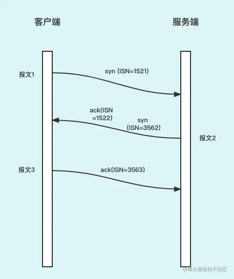
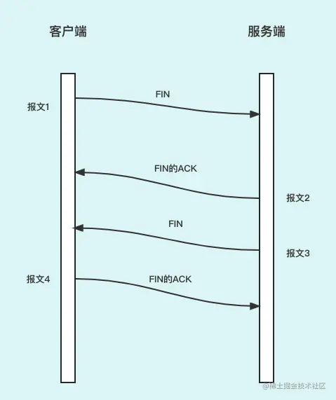
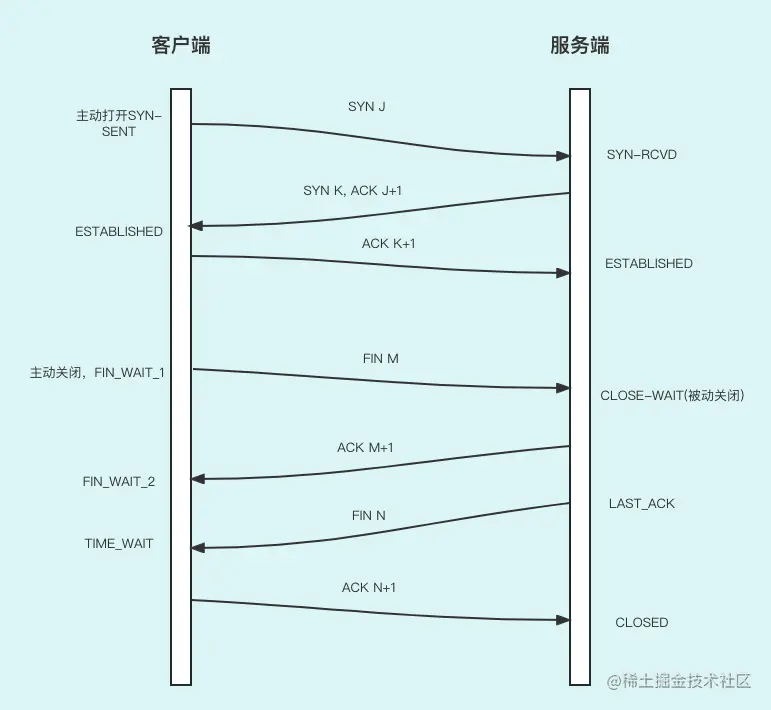

上节课我们学习了四层网络模型和传输层，其中重点讲解了传输层的 TCP 基本协议。从这节课开始，我们学习 TCP 的`可靠性`。

TCP 的可靠性体现在它的很多设计上。TCP 是面向连接的，**连接的存在大大增加了通信的可靠性**，因为如果发送方连接收方是否存在都不知道，那么，根本就无法谈及通信的可靠性。

这节课我们主要讨论 TCP 的连接创建和连接关闭。

## 连接创建：三次握手

首先，我们如何确定一个 TCP 连接建立了？那么我们的标准是什么？有以下`四个前提`：

1. 客户端可以向服务端发送数据；
2. 客户端可以收到服务端发送来的数据；
3. 服务端可以向客户端发送数据；
4. 服务端可以收到客户端发送来的数据。

也就是说要满足这四个前提，我们才能认为连接建立。

为了满足上述要求，三次握手分三个步骤，下图描述了`三次握手`的过程：

1. 当客户端调用 connect() 函数后，TCP 协议会组建一个数据报文，并设置 SYN 标志位，表示该数据包是用来建立同步连接的（TCP 报文的数据结构我们上节讲过，不理解的同学可以再看一下）。同时生成一个随机数字 1521 作为序列号（ISN），表示该数据包的序号。完成这些工作，开始向服务器端发送连接的 SYN 数据包。

> **序列号（ISN）在这里的作用和产生机制**
>
> 由于网络环境方面的原因，有一些数据报文并没有及时到达目的地，而是在网络中不断游荡，当网络条件变好了，接收方收到时，接收方已经建立新的连接了，同时新的连接节点和游荡的数据报文的发送方是一个节点。那么，接收方是不能再接收这个游荡很久的数据报文的。
>
> 接收方如何判断是不是以前的数据报文呢？这里就体现了序列号存在的意义之一了。每次建立连接的时候，在 syn 报文中会生成有这次连接的序列号初始值，以后每次请求都会根据上次数据报文的字节数自动增加。
>
> 序列号是如何产生而不会重复呢？那么就要做到随时间而变化，每个连接都将具有不同的序列号初始值，这里给大家介绍一个算法。
>
> RFC 793：把 ISN 可看作是一个 32 比特的计数器，初始值是 0，每 4ms 加 1。这样选择序号的目的在于防止在网络中被延迟的数据报文在以后又被传送，而导致某个连接的一方对它做错误的解释。同时，序列号累加到最大值后再从 0 开始。

1. 服务器端收到数据报文，检测到已经设置了 SYN 标志位，就知道这是客户端发来的建立连接的“请求包”。服务器端也会组建一个数据包，并设置 SYN 和 ACK，标志位 SYN 表示该数据包用来建立连接，ACK 用来确认收到了刚才客户端发送的数据包，ACK 的序列号是 1522，也就是加了 1。同时服务端也开始生成它的序列号了，初始值是 3562。这时，服务端收到了客户端的请求（**满足了前提 4**）。

2. 客户端收到数据包，检测到已经设置了 SYN 和 ACK 标志位，就知道这是服务器发来的“确认包”。客户端会检测“确认号（ACK）”字段，看它的值是否为 1521+1，如果是就说明连接建立成功。这时，发送端知道了上次的发送成功了（**满足了前提 1**)。同时，收到了来自服务端的响应（**满足了前提 2**）。

   接下来，客户端会继续组建数据包，并设置 ACK 标志位，表示客户端正确接收了服务器发来的“确认包”。同时，将刚才服务器发来的数据包序号（3562）加 1，得到 3563，并用这个数字来填充“确认号（ACK）”字段。

   客户端将数据包发出，进入`ESTABLISED`状态，表示连接已经成功建立。

3. 服务器端收到数据包，检测到已经设置了 ACK 标志位，就知道这是客户端发来的“确认包”。**满足了前提 3**，服务器会检测“确认号（ACK）”字段，看它的值是否为 3562+1，如果是就说明连接建立成功，服务器进入`ESTABLISED`状态。

至此，客户端和服务器都进入了`ESTABLISED`状态，连接建立成功，接下来就可以收发数据了。

## 连接关闭：四次挥手

接下来，我们讨论一下四次挥手是怎么工作的。

同样，客户端和服务端之间连接关闭，那么我们的标准是什么？同样有`四个前提`：

1. 客户端关闭向服务端发送数据的通道；
2. 客户端关闭接收服务端数据的通道；
3. 服务端关闭向客户端发送数据的通道；
4. 服务端关闭接收客户端数据的通道。

建立一个连接需要三次握手，而终止一个连接要经过 4 次握手。这由 TCP 的半关闭（half-close）造成的。**一个 TCP 连接是全双工（即数据在两个方向上能同时传递），因此每个方向必须单独地进行关闭**。原则就是当一方完成它的数据发送任务后，就能发送一个 FIN 来终止这个方向连接。当一端收到一个 FIN，它必须通知应用层另一端已经终止了数据传送。

**`四次挥手`步骤如下**：

1. 首先，客户端想要关闭连接，于是向服务端发送带有 FIN 的数据报文，这时客户端不会向服务端发送数据类报文了（ACK 报文还是会发的）。（**满足了前提 1**。）
2. 服务端收到客户端的 FIN 报文后，知道客户端要协商关闭连接，于是返回客户端 ACK 报文，告诉客户端你要求的关闭连接的事已经知道了。
3. 服务端会检查自己是否有没有发送完成的数据，如果有就继续发送，如果没有就向客户端发送带有 FIN 的数据报。（**满足了前提 3**。）
4. 客户端先收到 FIN 的 ACK 后，知道服务端已经开始处理连接关闭的请求了，紧接着会收到服务端发送的 FIN 报文，这样客户端知道了服务端也关闭了连接。然后向服务端发送 ACK 数据报，告诉服务端客户端收到它发的 FIN 报文了。最终，连接关闭。（**满足了前提 2 和前提 4**。）

> **为什么是四次挥手而不是三次**？
>
> 其实主要的原因还是 TCP 连接是双工的，客户端在关闭向服务端发送数据报文后，这个 TCP 只能算个半关闭，因为这时服务端还没准备好，说不定还在向客户端传输数据，所以这时候还不能关闭。
>
> 那么第二次和第三次挥手能不能放到一起呢？答案是不行，因为服务端处理完了正在发送数据的行为才能做第三次挥手，即向客户端发送 FIN。如果和第二次挥手的 FIN 放在一起，那么如果服务端处理好久才发送 FIN，那么客户端可能就超时了，客户端还以为服务端挂了，所以要尽快返给客户端 ACK，告诉客户端已经知道了要关闭连接的通知了，然后服务端再处理自己的连接状况。

连接的建立和关闭就讲解完了，但是我们只讲解了建立和关闭经历的步骤，并没有涉及到客户端和服务端相关状态的讲解。因此，接下来我们再来看看这个过程中客户端和服务端状态的变迁。

## TCP 的状态变迁

下面是 TCP 状态变迁图：

接下来，我给大家讲解一下状态的改变流程，包括三次握手和四次挥手。

1. 首先，客户端发起连接，向服务端发送 SYN J 的数据报文，同时客户端的状态为 SYN_SENT，也就是 SYN 已发送状态。服务端收到后把状态改为 SYN-RCVD，也就是 SYN 已接收状态.
2. 服务端向客户端发送 SYN K,ACK J+1 的数据报文，客户端收到后状态设置为 ESTABLISHED，也就是说客户端连接建立好了，可以接收数据了。
3. 客户端向服务端发送 ACK K+1 的数据报文，服务端收到后会把状态设置为 ESTABLISHED，也就是说服务端连接建立好了，服务端可以接收数据了，至此三次握手完成了。
4. 现在开始 4 次挥手，首先还是客户端发起，客户端把自己的状态设置为 FIN_WAIT_1，然后向服务端发送 FIN M 的数据报文，服务端收到后把自己的状态设置为 CLOSE_WAIT（被动关闭）状态。
5. 服务端向客户端发送 ACK M+1 的数据报文，客户端收到后把状态设置为 FIN_WAIN_2。然后服务端把自己的状态设置为 LAST_ACK，同时向客户端发送 FIN N 的数据报文。
6. 客户端收到 FIN N 报文后把自己的状态设置为 TIME_WAIT，也就是说开始等待状态。然后发送 ACK N+1 的数据报文给服务端（表示收到了服务器发出的 FIN 数据报文），服务端收到后把状态设置为 CLOSED，也就是关闭连接。
7. 客户端等待 2MSL 时间后，也会设置为 CLOSED 状态。

> **客户端为什么要设置 WAIT_TIME 状态？同时为什么等到 2MSL 时间后，再设置 CLOSED 状态？**
>
> 先回答第一个问题：因为客户端给服务端发了 ACK N+1 的数据报文后，但服务端不一定能收到，如果超时，服务端就必须再次向服务端发送 FIN N 的数据报文做重试。所以，客户端必须要有一定的时间等待。
>
> 等多久呢？大于超时重传时间，也就是说让服务端有机会重传。因为从发送 FIN 数据报文到收到 ACK 数据报文，需要在网络上往返两次，而 MSL 指 TCP 报文在 Internet 上最长生存时间，所以一个往返绝不会大于 2 倍的 MSL。

同时，2MSL 时间的等待还会造成以下的结果。

- 这个 TCP 连接在 2MSL 等待期间内，这个连接的插口对（客户的 IP 地址和端口号，服务器的 IP 地址和端口号）不能再被使用，也就是说这个连接不能用。这个连接只能在 2MSL 结束后才能再被使用。
- 在连接处于 2MSL 等待时，任何迟到的报文段将被丢弃。因为处于 2MSL 等待的、由该插口对（Socket Pair）定义的连接在这段时间内不能被再用，因此当要建立一个有效的连接时，来自该插口对的以前的旧连接的一个迟到报文不能视为从新连接产生的。

## 总结

这节课我们讲解了创建连接的三次握手和关闭连接的四次挥手，给大家分享了连接建立和关闭的详细步骤，以及客户端和服务端的状态转换。最后，还给大家解释了为什么客户端会有 WAIT_TIME 状态，以及等待时间为什么是 2MSL。

到这里 TCP 连接的创建和关闭就讲完了，下节课我们继续学习 TCP 连接建立后数据是如何传输的。