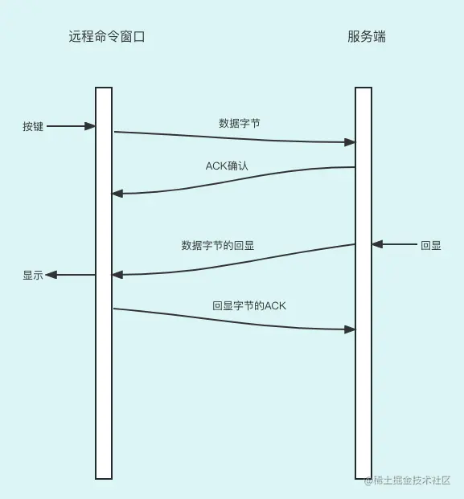
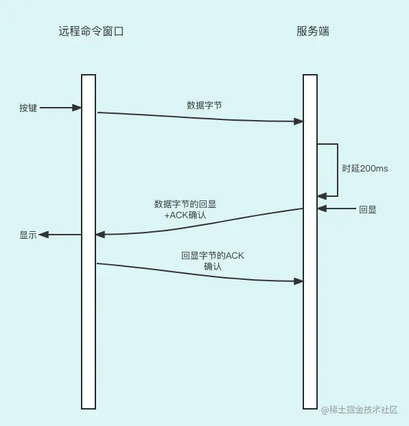
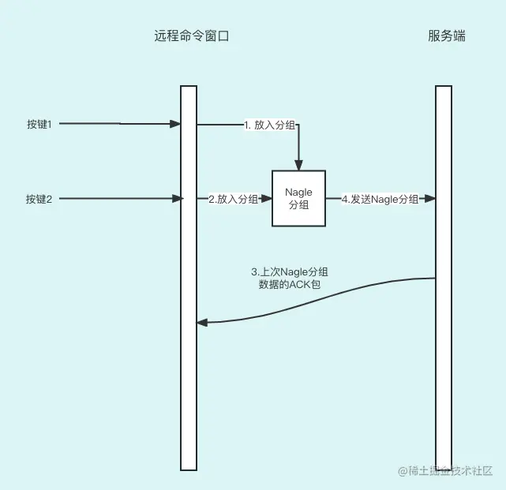
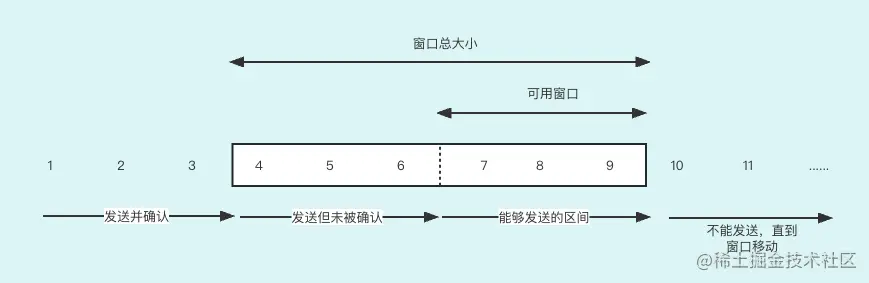
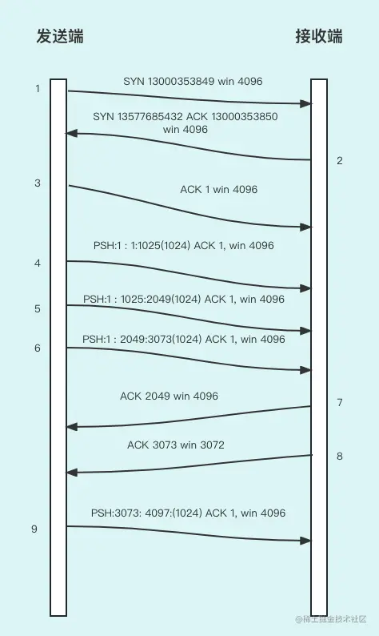
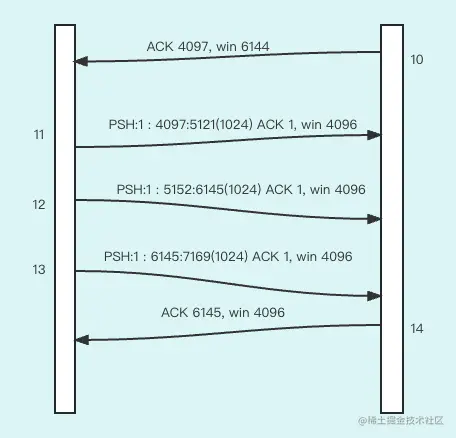
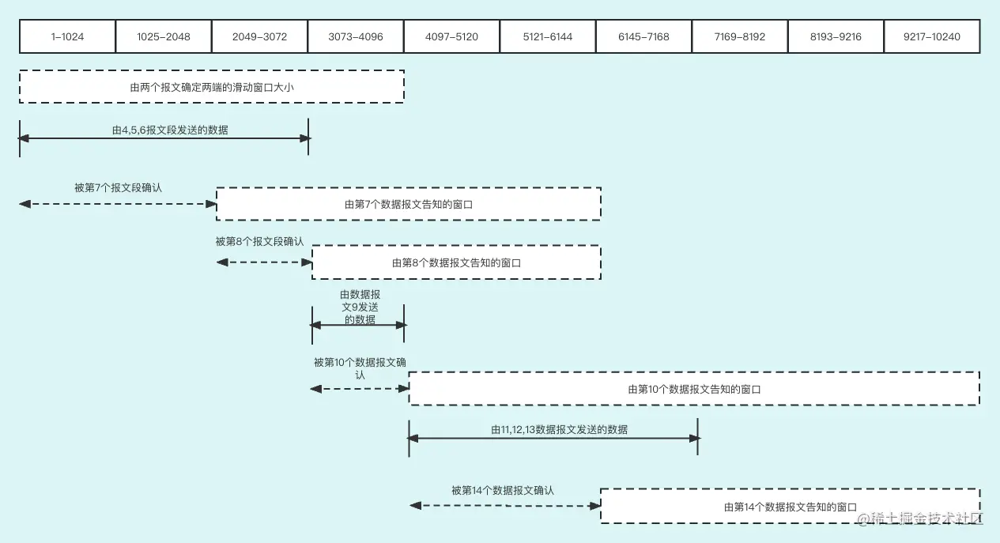
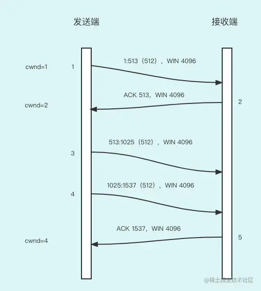

上一节课，我们学习了 TCP 连接的创建和关闭，这节我们学习 TCP 是怎么传输数据的。

对于 TCP 传输数据类型来讲，有两个大类。

- 第一个是小数据报文的情况比较多，比如我们工作时，通过远程窗口用命令控制远端的一个机器。
- 第二个是大数据报文的情况比较多，比如我们上传一个文件，等等。

对于不同的场景，TCP 为了提升传输效率和用户体验采用了不同的方式传输数据。

## 对于小包比较多的情况

首先，给大家讲解第一种数据的处理方式，也就是小数据报文比较多的情况。

这里我们以交互式数据流为例。

交互数据流就是通过远程窗口用命令控制远端的一个机器，使用者通过在窗口按键向远程服务器发送命令。首先，这些按键数据报文要通过 TCP 传输到远程服务端，然后服务端解析按键代表的命令后做出相应的行为。

我们先根据前面的课程内容想象一下命令远程窗口和服务端的交互过程，如下图：

首先，工程师在远程窗口按了一个按键，然后这个按键转换成数据报文发送到服务端。服务端收到数据报文后，立即向远程窗口发送 ACK 数据报文来确认，代表服务端已经收到了命令窗口的按键请求。

服务端执行数据报文代表的命令后，向远程窗口发送回显数据，比如命令是否发送成功了等，远程窗口接收到后还要告诉服务端收到了回显，也就是 ACK 数据报文。

很明显，一个按键会产生 4 个报文段，而且如果一个按键只有一个字节的话，而数据报文头部有 40 个字节，那么数据报文整体 41 个字节，有效报文才 1 个字节，这样做可靠性虽然可以，但是效率太低，网络开销太大，而且交互式报文的交互频率还很高。于是 TCP 协议有相应的优化措施来解决这个问题，包括：有时延的确认、Nagle 算法。

首先，我们先聊聊有时延的确认。

### 时延确认

通常 TCP 在接收到数据时并不立即发送 ACK，相反它推迟发送，以便将 ACK 与需要沿该方向发送的数据一起发送（有时称这种现象为数据捎带 ACK）。绝大多数实现采用的时延为 200ms，也就是说，TCP 将以最大 200ms 的时延等待是否有数据一起发送。

具体什么意思呢？我们还是通过一张图来讲解：

大家可以看到，服务端把 ACK 确认和发送数据字节的回显放在一起发送了。这样做就增加了每次发送数据报文的数据大小，从而提升了发送效率。

但是，有利必有弊，延迟确认一定会影响体验。不过频繁交互的过程中由于响应很频繁，所以这种延迟现象不是很容易察觉，需要依据情况而定。

除了有延时的确认，还有 Nagle 算法能够提升网络资源的利用率。

### Nagle 算法

这个算法是作用在发送端的，发送端会把多个请求数据报文放入到一个分组中，当收到上个报文的 ACK 的时候再把当前分组发送出去。该算法要求一个 TCP 连接上最多只能有一个未被确认的分组，在该分组的确认到达之前不能发送其他的分组。

为了更好地理解，下面给大家画了张流程图：

流程大致分为四步：

1. 第一步和第二步向本地的 Nagle 分组放入两个数据报文，但不会发送；
2. 然后，收到上次 Nagle 分组数据的 ACK 包；
3. 最后，把当前的 Nagle 分组发送出去。

Nagle 算法的优点，主要有下面两点：

1. 由于有了分组，极大提升了每次发送数据报文的大小，提升了利用率；
2. 体现了自适应性：确认到达得越快，数据分组也就发送得越快。也就是说，发送数据分组的频率和服务器的处理能力是自适应的，这样就极大地提升了网络通信的弹性。

那么，Nagle 算法有没有不适宜的场景呢？是有的，下面列举两个场景。

- 一个典型的例子是我们远程命令窗口连上了远端服务器，我们鼠标的移动都是要经过服务端的反馈才能得到，而 Nagle 算法是分组发送，这样就出现了延迟，从而降低了用户体验，这种场景必须无时延地发送，以便为用户提供实时的操作反馈。
- 另外一个例子：在一个交互注册过程中键入终端的一个特殊功能键。这个功能键通常可以产生多个字符，如果 TCP 每次得到一个字符，它很可能会发送第一个字符，然后缓存其他字符并等待对该字符的确认。但当服务器接收到该字符后它并不发送确认，而是继续等待接收序列中的其他字符。这就是这节课说的时延的确认算法，而这样的延迟会长达 200ms，这样对交互用户而言体验将明显降低。

接下来，我们讲解对于大包多的情况 TCP 是如何处理的。

## 对于大包比较多的情况

TCP 对大包多的情况的处理方式肯定与小包多的情况的处理方式不一样，采取的算法也不一样，主要有`滑动窗口`和`拥塞窗口`。

接下来，我们首先讲解滑动窗口算法。

### 滑动窗口

滑动窗口是一个分组，这个分组在通信双方都有，分组规定了一定的字节大小。发送方不必每发一个数据报文就停下来等待确认，而是可以发送滑动窗口设定的分组内可用字节的大小，因此该协议可以加速数据的传输。同时，滑动窗口协议也是流量控制方法，因为分组一旦没有可用空间对方就不能发送数据报文了，如果出现这种情况，发送方会停止发送数据报文，并等待确认可以发送的数据报文。

首先，我们要了解一下滑动窗口的工作模式，还是用一张图来解释：

在这个图中，我们将字节从 1 至 11 进行标号。接收方通告的窗口称为提出的窗口（offered window），它覆盖了从第 4 字节到第 9 字节的区域，表明接收方已经确认了包括第 3 字节及以前的数据，且通告窗口大小为 6。发送方计算它的可用窗口，该窗口表明多少数据可以立即被发送，然后把可用窗口发送给对方，对方根据可用窗口的大小来计算能发送多少未经确认的数据。当接收方确认到数据后，这个滑动窗口不时地向右移动，窗口两个边沿的相对运动增加或减少确定了窗口的大小。

**滑动窗口边沿的移动**

滑动窗口边沿的移动方式主要有`左边的合拢`和`右边的张开`。如下图所示：

- 窗口左边沿向右边沿靠近为窗口合拢。这种现象发生在数据被发送并确认时。
- 窗口右边沿向右移动时将允许发送更多的数据，我们称之为窗口张开。这种现象发生在另一端的接收进程读取已经出来完确认的数据并释放了 TCP 的接收缓存时。

好，我们再结合数据报文发送来解释滑动窗口的变化，下面两个图是数据报文的发送情况：

下面是随着数据报文的传输，接收方也就是右边服务器的滑动窗口对应的变化：

你可以结合上面两个数据报文图和滑动窗口图来看下面的讲解。

- 首先，两端通过三次握手向对方发送了滑动窗口的大小，为 4096 个字节。由于双方没有发送任何有数据的数据报文，窗口大小为 4096。
- 然后左边的机器发送了 4、5、6 三个数据报文，每个大小都是 1024 个字节。随后，接收方返回一个数据报文并且 ACK 的值为 2049，同时 WIN 为 4096（win 在这里是窗口大小的意思），也就是说接收方处理了从 0～2048 个字节的数据，同时窗口大小还为 4096，说明滑动窗口向右边整体移动了 2048 个字节。
- 然后接收端又发送了第 8 个数据报文，这时报文的内容是 ACK=3073，WIN=3072，也就是说 3073 之前的数据报文已经处理完了，而 3072 的窗口大小说明滑动窗口缩小了 1024 个字节，同时告知发送方只能发送 3072 个字节大小的数据。
- 然后接收端又收到了第 9 个数据报文，并向发送方发送第 10 个确认报文 ACK=4097，WIN=6144。说明接收方已经处理完了 4097 字节前的数据，同时滑动窗口大小增加为为 6144 字节大小。

后面几步就不说了，道理都是一样的。

好，滑动窗口的工作模式就给大家讲解完了，本质上在延时确认的基础上，**滑动窗口是在接收端发起，然后影响到发送端的数据报文发送频率，从而实现了限流的作用**。

下面，我们讲解拥塞窗口，同滑动窗口的作用一样也是为了限流，不过限流的作用端不一样，拥塞窗口是在接收端限流的。

### 拥塞窗口

首先在讲解拥塞窗口前，我们先讲解一下`慢启动`的概念。

首先，我们得讨论一下为什么会有慢启动的概念。

如果发送方一开始便向网络发送多个报文段，直至达到接收方通告的窗口大小为止，这似乎看起来没什么问题，当发送方和接收方处于同一个局域网时，这种方式是可以的。但是，如果在发送方和接收方之间存在多个路由器和速率较慢的链路时，就有可能出现一些问题。一些中间路由器必须缓存分组，并有可能耗尽缓存空间然后发生丢包。

这个问题是因为发送方瞬时发送数据过多造成的，而滑动窗口是作用在接收端间接影响发送方的，所以，必须在发送方来解决这个问题。

于是，TCP 采用“慢启动（slow start）”算法来降低一开始就发送过多的数据到网络。

慢启动为 TCP 连接的两端分别建立了拥塞窗口：拥塞窗口（congestion window），记为 cwnd。这是一种指数增加的关系，下图给大家一个说明：

根据上图所示，当与另一个网络的主机建立 TCP 连接时，拥塞窗口被初始化为 1 个数据报文。每收到一个 ACK，拥塞窗口就增加 1 个数据报文大小。发送方开始时发送 1 个数据报文，然后等待 ACK。当收到该 ACK 时，拥塞窗口从 1 增加为 2，即可以发送两个数据报文。发送端发完两个数据报文后，只收到 ACK=1025 的确认报文，拥塞窗口就增加为 3。后面会收到全部的确认报文，这样拥塞窗口为 4，然后根据这个规律会不断以 2 的 N 次方指数增加。

好，通过上面的学习，我们能够知道：**滑动窗口是作用在接收端，然后间接控制发送端的发送频率，而拥塞窗口是直接作用在发送端的**。那么有这两个窗口的制约，发送方究竟最大能发送多大的数据呢？或者说发送方的传送通道容量是多少？

## 带宽的计算方法

要想讨论这个问题，首先我们要明白如何计算发送一个数据报文的时间。

**发送一个数据报文的时间**：

- 通常发送一个数据报文的时间取决于两个因素：传播时延和发送时延（带宽）。
- 对于一个给定的两个接点之间的通路，传播时延一般是固定的，而发送时延则取决于数据报文的大小。
- 在速率较慢的情况下发送时延起主要作用，而在千兆比特速率下传播时延则占主要地位。

为了最大限度地利用带宽，必须确保发送方源源不断地收到接收方发送的 ACK，对收到数据的确认和更新可用滑动窗口的大小。

在开始阶段，通告的可用滑动窗口必须大于等于带宽和往返时延的乘积，才能确保在收到第一个 ACK 前能够一直发送数据流量。因为发送第一个数据报文到收到对应的 ACK，时间至少为 RTT 时间（RTT 是客户到服务器往返所花时间）。

传送通道容量计算方式：

capacity(bit) = bandwidth(b/s) x round-trip time(s)

也就是：`传送通道容量 = 带宽 ✖️ 往返时延`。

## 总结

这节课给大家讲解了 TCP 是如何传输数据报文的。

TCP 协议对于小包比较多的情况，采用的是 Nagle 算法，通过发送多个数据报文组成的分组，提升了发送方的发送效率。

而对于大包比较多的情况，采用了滑动窗口和拥塞窗口。接收端通过可用滑动窗口告诉发送端：没被确认的情况下还能发送多少数据报文，这样做的目的是保护接收方不被发送方打爆。而拥塞窗口是直接作用在发送方的限流算法。

最后，我们还一起学习了传送通道容量计算方式。