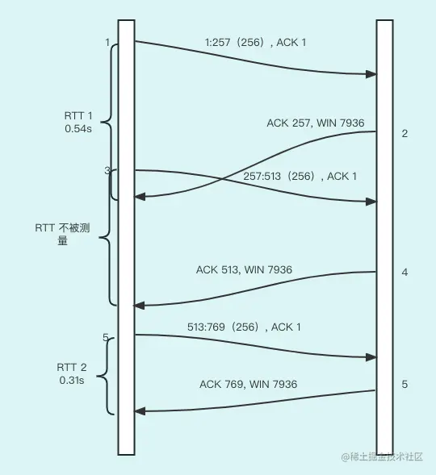
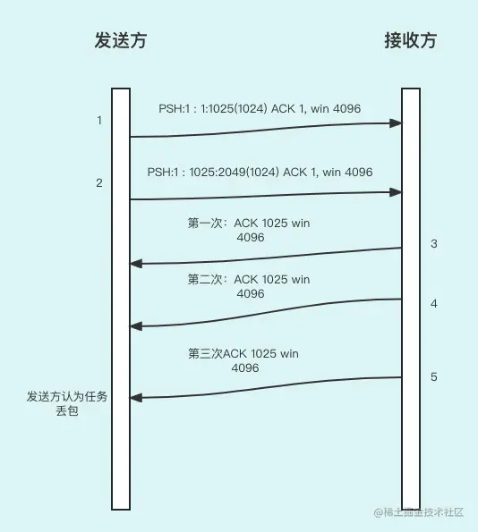

上节课我们学习了 TCP 传输数据的方式，讨论的都是数据报文成功发送并且 ACK 确认成功的常规情况。但是，在复杂多变的网络环境中，数据报文没有到达接收方或者超时到达接收方的情况也是有的。那么，TCP 协议是如何处理这种情况的呢？

这节课我们重点讲解 TCP 数据报文的超时与传输。

TCP 采用了很多方法来保证可靠性，方法之一就是确认从另一端收到的数据，也就是前面课程常讲的 ACK。但发送的数据和对发送数据的确认都有可能会丢失或超时。这节课，我们会围绕着这个问题展开讲解。

## 重传定时器

TCP 如何解决这个问题呢？答案是`定时器`，**TCP 通过在发送端发送数据时设置重传定时器来解决这种问题**。如果定时器过期了还没有收到接收方确认，发送端就重传该数据报文。对任何实现而言，关键之处就在于超时和重传的策略，即`怎样确定超时时间和多次重传的间隔`。

那定时器都有哪些分类呢？

对每个 TCP 连接，TCP 管理 4 个不同的定时器。

- **重传定时器**：用于当发送一个数据报文时，在规定时间内，发送方需要收到另一端发出的接收报文确认，如果在规定的时间没有确认，就会重传。在本章我们将详细讨论这个定时器以及一些相关的问题，如拥塞避免。
- **坚持（persist）定时器**：使窗口大小信息保持不断流动，即使另一端关闭了其接收窗口，目的是避免发送方不知道接收方的可用滑动窗口大小，从而引发发送方无法发送数据报文的问题。后面的章节会给大家讲解。
- **保活（keepalive）定时器**：用于检测一个空闲连接的另一端是否依然还保持连接。后面的章节会给大家讲解。
- **MSL 定时器**：测量一个连接处于 TIME_WAIT 状态的时间。这个定时器在以前章节讲连接关闭的时候给大家详细讲过。

好，我们开始学习重传定时器。

重传定时器在一定时间内收不到接收方的 ACK 确认时，就会发送重传，而且会不断失败、不断尝试重传。重传的时间间隔并不是线性的，而是`指数增长`的，按照以下的方法实现的。

- 第 1 次：1.5 秒。
- 第 2 次：3 秒。
- 第 3 次：6 秒。
- 第 4 次：12 秒。
- 第 5 次：24 秒。
- 第 6 次：48 秒。
- 第 7 次：64 秒。
- 第 8 次：64 秒。
- ……

直到一个重试次数后，指数增长结束，然后用多次间隔 64 秒尝试。

那么，如果一直重试失败的话，是不可能继续重传下去的。那么，什么时候停止重传呢？不同的操作系统有不同的设置，一般会设置为几分钟左右。而且，大部分操作系统可以设置最长重试时间。

## TCP 协议中计算 RTT 的方法

TCP 超时与重传中最重要的部分就是**对一个 TCP 连接的往返时间（RTT）的测量**。数据报文在网络中传输花费的时间肯定会算进超时时间内的，由于网络状况的多变性，RTT 时间经常会发生变化，TCP 应该跟踪这些变化并相应地改变超时重传时间。

那么，TCP 是如何计算 RTT 呢？

RTT 的概念在上节课给大家说过，就是一个数据报文从发送方发送到收到报文的 ACK 确认的时间段。

最简单的计算方法是：

> TCC = 发送数据报文的时间点 - 收到 ACK 确认的时间点

但是这个值仅仅是个初始值，在生产环境里是远远不够的，因为单个 TCC 很难有实际的使用意义。实际情况下主要有两种计算方法，RFC793 计算方法和 Jacobson 计算方法。

### RFC793 计算方法

TCP 使用**低通过滤器**来更新一个被平滑的 RTT 值（记为 0）。

所谓低通过滤器是指数据的变化不会被突然变化而有太大的波动。这样的设计基本上是合理的，我们看下计算 RTT 公式：R = &R+(1-&)M

& 是一个推荐值为 0.9 的平滑因子。每次进行新测量的时候，这个被平滑的 RTT 将得到更新。每个新估计的 90% 来自前一个估计，而 10% 则取自新的测量。也就是说，既要体现当前算出的这个值，也要把以前计算的值加上，而且以前的值是占大部分权重的，目的就是当网络突然有波动时 RTT 值保持稳定和合理。

重传超时（即 RTO）是基于 RTT 的，对于超时重传的时间肯定要大于 RTT 的值，下面是计算公式：

> RTO = R@

这里的 @ 是一个推荐值为 2 的时延离散因子。

不过，RFC793 计算方法也是有缺陷的。

我们可以分析一个问题，比如 RTT 的值突然出现了大幅增长并且在这个大幅增长之后稳定住了，那么如果我们的 RTO（重传时间）还是平滑的没有太大变化，就会造成 TCP 误以为出现了超时会不断地重试，从而引起不必要的重传。当网络已经处于饱和状态时，不必要的重传会增加网络的负载，于是恶性循环造成网络拥堵。于是，我们有了更好用的计算方法，即 Jacobson 计算方法。

### Jacobson 计算方法

除了被平滑的 RTT，还需要跟踪 RTT 的方差这样的数据，在往返时间变化起伏很大的情况下，基于均值和方差来计算 RTO，比只用均值的常数倍数来计算 RTO（重传时间）提供更好的对网络传送数据状况的表示方法。

公式如下：

> Err = M - A
>
> A + gErr = A
>
> D = D = h(|Err|_D)
>
> RTO = A + 4D

这个公式看起来比较复杂，其实我们只要搞清楚最后一行就可以了。

M 是初始的 RTT，A 是被平滑的 RTT（均值的估计器），而 D 则是被平滑的均值偏差。Err 是刚得到的测量结果与当前的 RTT 估计器之差，是方差。增量 g 起平均作用，取为 1/8(0.125)。偏差的增益是 h，取值为 0.25。当 RTT 变化时，较大的偏差增益将使 RTO 快速上升。

由于比较接近于实际，现在这种方法被许多操作系统所采用。

好，这里我们总结一下这两个算法的区别：Jacobson 计算 RTO 的公式依赖于被平滑的 RTT 和被平滑的均值偏差，而 RFC793 方法则使用了被平滑的 RTT 的一个倍数。所以说，**RFC793 方法为了保持平滑而忽视了真实的网络情况，而 Jacobson 计算则很好地弥补了这一个缺点**。

### 计算 RTT 的例子

下面给出一个计算 RTT 的例子：

由上图大家可以看到，计算 RTT 的方式是一对发送和确认来确认一个 RTT，并且是随时更新的。但是大家看到中间的一个一对发送和确认并没有用来测量 RTT。这是为什么呢？

大多数 TCP 实现在任何时候对每个连接仅测量一次 RTT 值。在发送一个报文段时，如果给定连接的定时器已经被使用，则该报文段不被计时。大家可以对应着上图看一下，在发送第一个数据报文的时间就开始计时了，然后第 3 个数据报文又发送过去了，之后第 1 个数据报文的 ACK 确认才到达，第 3 个数据报文的 RTT 不会被计算和采用。直到第 5 个报文发送的时候才开启第 2 个计时器。

结合上面的学习，我们再回顾一下 RTO 的计算方式。

- 大多数 TCP 实现在任何时候对每个连接仅测量一次 RTT 值。在发送一个报文段时，如果给定连接的定时器已经被使用，则该报文段不被计时。
- 对每个连接而言，计时器会把起始序号也记录下来，当收到一个包含这个序号的确认后，该定时器就被关闭。如果 ACK 到达时数据没有被重传（定时器没有超时），则被平滑的 RTT 和被平滑的均值偏差将基于这个新的测量值进行更新。

好，重传定时器我们讲解完了，我们再看看 TCP 协议中有哪些情况被判断为丢包，以及根据这些情况如何处理。

## 丢包

丢包有两种场景：`超时`和`接收到重复的确认`。

超时很简单，就是如果定时器规定的时间内没收到接收方的 ACK 确认，那么发送方就认为数据报文丢了，也就是丢包。

那么，接收到重复确认又是什么呢？

### 接收到重复确认

我们先看下图：

根据上图大家可以看到，发送方发送了两个数据报文，一个报文是序列号前 1024 个字节的数据，第二步报文是序号从 1025 到 2048 的字节数据。但是，发送方连续三次收到 ACK 1025 的 ACK，说明接收方仅仅处理了前面 1024 个字节的数据，而 1025 到 2048 的字节数据的数据报文则认为已经丢了。

那么如何避免丢包呢？

### 避免丢包的方法

我们前面讲的`拥塞避免算法`（也称拥塞窗口）是一种解决方案。

拥塞避免算法是一种处理丢失数据报文的方法。慢启动算法前面的文章也提到过，这里再跟拥塞避免算法比较一下。

拥塞避免算法和慢启动算法是两个目的不同、独立的算法。我们希望连接一开始的时候降低数据报文进入网络的传输速率，于是可以调用慢启动来实现这一点。在实际中这两个算法通常在一起实现。

拥塞避免和慢启动都是`发送方`使用的流量控制。

- 慢启动允许一方发送连续的未经确认的数据报文，发送数据报文次数的增加方式采用指数增加。
- 慢启动结束后，拥塞避免算法开始生效，拥塞避免允许一方发送连续的未经确认的数据报文，增加方式采用线性增加。

而滑动窗口则是接收方进行的流量控制。拥塞避免是发送方对网络可能发生拥塞的估计，而滑动窗口则与接收方分配给该连接的接收缓存大小有关。拥塞避免算法和慢启动算法会在下节课给大家详细讲述。

## 总结

这节课主要给大家讲解了 TCP 为了提升可靠性而有的特性：超时和重试。为了实现这两个特征，TCP 设计了重传定时器。

然后，又给大家介绍了与重传定时器关系密切的 RTT，讲解了 RTT 的计算方法，包括 RFC793 计算方法和 Jacobson 计算方法。

最后，还给大家讲了丢包的两种情况，以及为了避免丢包，TCP 协议都做了哪些工作。