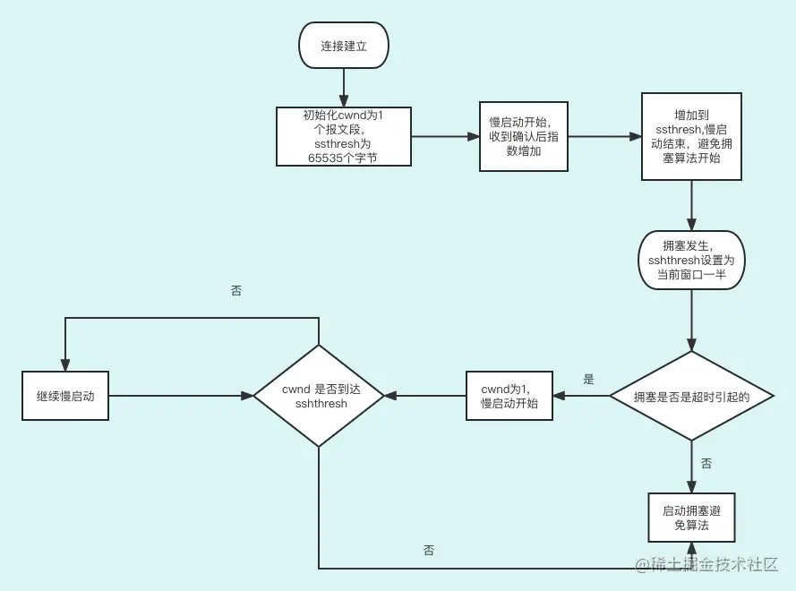
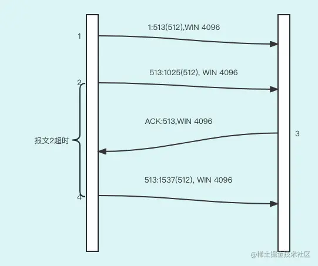
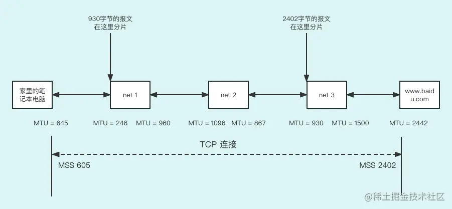
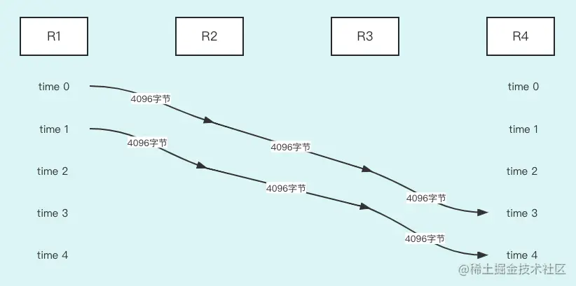
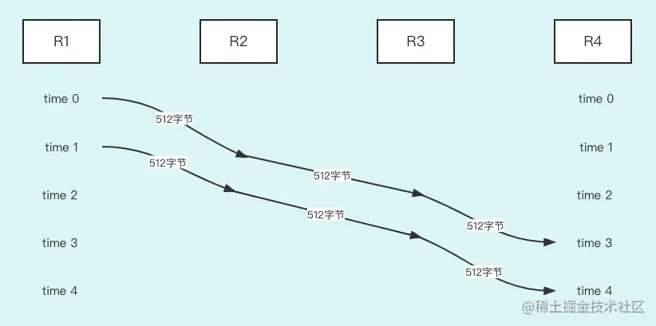
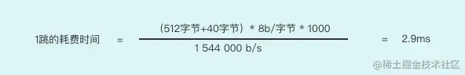

上节课，我们讲解了 TCP 协议中的超时和重试，这节课继续深入讲解`超时`和`重试`的细节，然后我们也再进一步分析下前面提过的`慢启动算法`和`避免拥塞算法`。

## 拥塞避免算法和慢启动算法

因为这两个算法经常一起工作，所以放在一起讲解。

拥塞避免算法和慢启动算法需要对每个连接维持两个变量：一个拥塞窗口 cwnd，一个慢启动门限 ssthresh。

这两个算法的工作流程如下：

1. 对于一个刚建立的连接，初始化 cwnd 为 1 个报文段，ssthresh 为 65535 个字节，同时慢启动开始。
2. TCP 发出未经确认的报文总大小不能超过 cwnd 或接收方通告窗口的大小。
3. 在 1 和 2 阶段实际上是慢启动算法在起作用。拥塞避免算法在第 3 阶段才开始发挥作用。当拥塞发生时（超时或收到 3 次重复确认），ssthresh 被设置为当前窗口大小的一半（当前窗口：cwnd 与接收方滑动窗口大小的最小值，但最少为 2 个数据报文大小）。此外，如果是超时引起了拥塞，则 cwnd 被设置为 1 个报文段（慢启动又开始了）。
4. 当新的数据被对方确认时，就增加 cwnd，但增加的方法在于我们是否正在进行慢启动还是拥塞避免。如果 cwnd 小于或等于 ssthresh，则正在进行慢启动，否则正在进行拥塞避免。慢启动一直持续到 cwnd 回到当拥塞发生时所处位置一半时才停止（步骤 3 中设置的 ssthresh 为窗口大小的一半），然后才接下来执行的是拥塞避免。

**慢启动算法**。初始设置 cwnd 为 1 个报文段，此后每收到一个确认就加 1。会使发送窗口按指数方式增长：发送 1 个报文段，然后是 2 个，接着是 4 个……

**拥塞避免算法**。要求每次收到一个确认时将 cwnd 增加 1/cwnd，前面的文章讲的是增加 1，这里怎么变成 1/cwnd 了？

当 cwnd 为 2 的时候，发送方可以发送 2 个数据报文而不用考虑接收方的 ACK 确认，当接收端收到一个 ACK 确认时，cwnd=cwnd+1/cwnd（ACK 都回来之前的 cwnd），发送方发送数据报文前 cwnd=2+1/2，所以现在的 cwnd=2.5。然后，第二个 ACK 确认也来了，发送方发送数据报文前 cwnd=2，还是等于 2，于是还是增加 1/cwnd，这里也是 1/2，最终 cwnd=3。所以，如果有的 ACK 确认没有收回的话，那么增加量还不到 1，只有全部 ACK 确认都返回的才能增加 1，这就是 cwnd 最多增加 1 原因。

下面的图描述了这种增长模式是如何配合使用的：

拥塞避免算法与慢启动的指数增加比起来，这是一种线性增长。在 cwnd 个数据报文往返时间内最多为 cwnd 增加 1 个报文段（不管在这个 RTT 中收到了多少个 ACK），然而慢启动将根据这个往返时间中所收到的确认的个数增加 cwnd，显然慢启动里 cwnd 增加的要快得多。

## 重传算法

接下来我们学习重传算法，主要包括快速重传和快速恢复。

**快速重传算法**：如果一连收到重复的 ACK 确认数据报文达到 3 个或 3 个以上，非常可能是一个数据报文丢失了。我们不用等待重传定时器超时，直接重传丢失的数据报文。

**快速恢复算法**：快速重传后执行的不是慢启动算法而是拥塞避免算法，因为拥塞避免算法比慢启动算法快，所以叫快速恢复算法。

> 没有执行慢启动的原因如下。
>
> 收到重复的 ACK 不仅仅告诉我们一个数据报文丢失了，还告诉我们一个数据包能顺利地到达接收者。这是由于接收方只有在收到另一个报文段并发现这个报文不是我当前需要序号的报文才会产生重复的 ACK，说明数据报文已经收到并进入了接收方的缓存。也就是说，在收发两端之间仍然有流动的数据，而我们不想执行慢启动来突然减少数据流。
>
> 如果因为网络还可以的情况下就进入慢启动，慢启动时 cwnd 会为 1，这样短期发送未确认的数据报文的数量会很少，最终造成网络利用率不足。

快速恢复法的步骤如下：

1. 当收到第 3 个重复的 ACK 时，将 ssthresh 设置为当前拥塞窗口 cwnd 的一半。然后，重传丢失的数据报文，**设置 cwnd 为 ssthresh+3 个数据报文大小**。

> 为什么要加 3 个数据报文大小呢？
>
> ssthresh 本应立即设置为当重传发生时正在起作用的窗口大小的一半，但是在接收到重复 ACK 的过程中 cwnd 允许保持增加，这是因为每个重复的 ACK 表示接收方收到了 1 个数据报文，收到 3 个重复的 ACK，表示有 3 个报文离开了发送方并被接收方接收 TCP 和缓存了这几个报文段，只是接收方正在等待想要的数据而已。

1. 每次收到另一个重复的 ACK 时，cwnd 增加 1 个报文段大小。
2. 当下一个确认新数据的 ACK 到达时，设置 cwnd 为 ssthresh。这个 ACK 是在进行重传后的一个往返时间内对步骤 1 中重传的确认。另外，这个 ACK 也应该是对丢失的数据报文和收到的第 1 个重复的 ACK 之间的所有中间数据报文的确认。这一步采用的是拥塞避免，因为当数据报文丢失时我们将当前的速率减半。

### TCP 的数据重新分组

当 TCP 超时后重传时，它不一定要重传同样的报文段。相反，TCP 允许进行重新分组而发送一个较大的报文段，这将有助于提高性能（当然，这个较大的报文段不能够超过接收方声明的 MSS，即最大报文大小）。在协议中这是允许的，因为 TCP 是使用字节序号而不是报文段序号来进行识别它所要发送的数据和进行确认。

如下图所示：

我给大家讲解一下上图，首先发送方发送了 1、2 两个报文，分别都是 512 个字节。接收方收到报文 1 并发送对应的 ACK 给发送方，但是由于网络出了问题，第 2 个报文的 ACK 迟迟没有收到，以至于延迟直至超时重发，重发的时候并不是仅仅发送需要重发的数据，而是跟 512 个字节的新数据一起发送，所以报文 4 的大小为：需要重发的数据报文大小+新的数据报文大小=1024 个字节

### 对每条路由进行度量

TCP 在路由表项中维持许多我们在前面已经学到的指标，包括对被平滑的 RTT、被平滑的均值偏差以及 ssthresh。当一个 TCP 连接关闭时，如果已经发送了足够多的数据来获得有意义的统计指标，那么这些信息就会保存在路由表项中以备下次使用。

当建立一个新的连接时，不论是主动还是被动，该连接会使用的路由表项已经有这些度量的值，则用这些度量来对相应的变量进行初始化。

接下来，我们看看 TCP 协议对 ICMP 的差错是如何处理的。

## ICMP 差错处理

首先，我们讨论一下，ICMP 是做什么的。

ICMP 也是 IP 协议里的一个协议，具体作用是完成 IP 协议里的信息发送。除此之外，还有两种功能：

1. 确认 IP 包是否能够成功到达目标地址；
2. 网络诊断，比如，我们常用的命令 ping 就是 ICMP 协议的命令，用来测试两个机器直接是否是联通的。

而在信息发送的过程中，由于网络环境很复杂，ICMP 不可避免地出现错误信息。以下是 TCP 能够遇见 ICMP 的错误信息分类。

- 源站抑制：由于发送方发送数据比较快，接收方承受不住，所以会发出错误信息，用来降低发送方的发送数据报文的速度。
- 主机不可达：当网络不能交付数据报文时，就会向发送方发送终点不可达的数据报文。
- 网络不可达：表示路由器寻址出错，下一跳路由器可能存在故障。

TCP 协议对这些错误的处理方式有以下。

- 源站抑制：拥塞窗口 cwnd 被置为 1 个报文段大小，开始慢启动，但是慢启动门限 ssthresh 没有变化，所以发送窗口将打开直至它或者充分利用收发双方的链路（受窗口大小和往返时间的限制）。
- 接收到的主机不可达或网络不可达：忽略。因为这两个差错都被认为是短暂现象。这有可能是由于网络发生故障而收敛，需要一定的时间选择替换路径。在收敛过程中可能引起发送这两种 ICMP 差错中的一种，但是 TCP 连接并不必被关闭。相反，TCP 试图发送引起该差错的数据，尽管最终有可能会超时。

前面我们系统地学习了超时和重试，接下来我们学习如何提升 TCP 的吞吐量。

## 提升 TCP 通信的吞吐量

我们先介绍一个名词概念：MTU。

**MTU 是数据链路层给 IP 层定义的最大传输大小**。如果 IP 层有一个数据报文要传，而且数据帧的长度比链路层的 MTU 还大，那么 IP 层就需要进行分片，即把数据报文分成若干片，这样每一片就都小于 MTU。

一个数据报文穿过一个大的网络，它其间会穿过多个网络，每个网络的 MTU 值是不同的。所以，要想数据报文在所有设备中都能顺利穿过而不用分片，那么我们需要找到发送数据报文链路中所有网络的最小 MTU 值。

给大家举一个简单的例子，如下图所示：

给大家讲解一下上图，一个人在家里用笔记本上网使用百度搜索，那么他发送的访问百度的请求要想到百度服务器中间要经过三个网络，分别是 net 1、net 2、net 3。

每个网络在进出都有不同的 MTU。用户笔记本请求发送时经历的 MTU 是：645->960->867->1500。百度服务端响应是：2442->930->1096->246

我们以百度的服务端响应数据报文为例，来解释一下 MTU 最小值的算法： 首先，百度服务器看到出数据的 MTU 是 2442，I 的头部是 40 个字节，那么 TCP 就是 2402 个字节，也就是 MSS=2402。由于 net3 的 MTU=930 < 2442 个字节，也就探测到了会发生 IP 层的数据分片，于是 MSS 又变成了 890，然后又开始重复的动作，到 net1 时同样碰到了比 930 还小的 MTU（246)，进而，又发生了一次回传，造成最小的 MTU 再次减小为 246，MSS 值为 206。

而从用户笔记本发送的数据报文没有回传，因为初始的 MTU 45、MSS 605，而路上的所有 MTU 都比初始值大，于是最小 MTU 就是初始值。

所以，大家可以看到一个 TCP 连接，两个方向上的最小 MTU 是不一样的，这是因为网络情况比较复杂，一个设备进数据和出数据的带宽是不一样的。

好，我们讨论另一个问题：我们是发小数据分组好，还是发送大数据分组好呢？

**大分组 OR 小分组**

我们在感性上可能会觉得大分组比小分组效率高，因为头的大小是固定的，如果整体报文越大，那么数据报文携带有效数据的比例就会越大。接下来，我们举个例子来看看大数据报文和小数据报文的在耗时上的区别。

首先，我们看看大包数据报文的情况：

上幅图的意思是，一个端点发送同样大小的两个 4096 个字节大小的报文，报文经历了 R1、R2、R3、R4 四个网络到达最终目标 R4 网络，我们来计算一下耗时。

我们要计算网络中 1 跳的时间，定义请求从一个网络到另一个网络为 1 跳，同时，我们设计一个理想状况，我们假定所有网络的网速是 1544 000b/s。

我们先看看`大包`的情况，首先是单跳的耗时时间：

**大包总耗时为**：总耗时 = 1 跳的耗时 * （数据报文个数 + （总跳数-1））= 21.4ms * (2+(3-1)) = 21.4ms * 4 = 85.6ms

具体的计算方式是：一跳的时间乘以一个系数，这个系数是：发送数据的数据报文个数加上跳数，可以看到是 4 个单位时间，最终结果是 85.6 毫秒。

我们再看看`小包`的情况：

同样首先是单跳的耗时时间：

**小包总耗时为**：总耗时 = 1 跳的耗时 * （数据报文个数 + （总跳数-1））= 2.9ms * (2+(3-1)) = 2.9ms * 4 = 11.6ms

经过计算小包的耗时明显比大包小，那么我们能认为小包的效率比大包高吗？

> 在实际情况下，网速一般足够大，小包的效率明显比大包低。这与我们感性认识正好相反。
>
> 为什么会是这样呢？
>
> 因为整条发送路径分为 3 段，如果包过大在某一段发送时间过长就会造成其他两段没有数据可发，这样就造成延迟比较高。但是，这种情况是在报文数据撑满整个网络带宽来计算的，也就是所谓的 1544000 b/s。但是，这种极端情况很少出现。所以，一般情况下还是大包的传播效率高。

## 总结

这节课给大家讲解了拥塞避免算法和慢启动算法。慢启动算法的发送窗口是指数增长的，而拥塞避免算法是线性增长的，而且每次只加 1。

然后给大家介绍了快速重传算法，快速重传算法对应的问题是接收到重复的确认，重复 3 次就会激发快速重传算法；快速重传算法是拥塞避免算法，并讲解了快速重传算法为什么不是慢启动的原因。

接着，给大家讲解了快速恢复算法的步骤，同时，讲解了针对 ICMP 的错误信息 TCP 都做了什么措施。

最后给大家讲解了一些关于提升 TCP 通信的吞吐量的知识点。