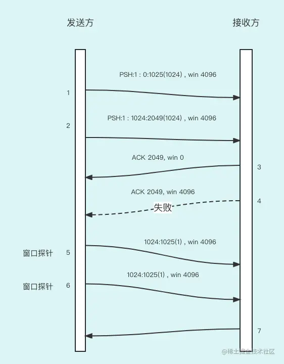

这节课，我们学习 TCP 协议里两个重要的定时器：`坚持定时器`和`保活定时器`。

这两个定时器都是为了 TCP 协议的可靠性而服务的，但是它们的作用是不同的。

## 坚持定时器

### ACK 丢失的问题

我们先从坚持定时器学起。不过，在具体学习坚持定时器前，我们先分析下图这种 ACK 丢失的问题：

大家可以看到，首先发送方发送了两个字节长度为 1024 的数据报文，接收方收到后填充了长度为 2048 个字节的滑动窗口，这时候返回给接收方 ACK，同时告诉接收方滑动窗口已经没空间了，已经为 0 了，不要再发送数据报文了。然后，接收方通过窗口张开滑动窗口又恢复到 2048 个字节，并通过发送 ACK 告诉接收方滑动创建的最新情况，但是，就在这时，这个 ACK 由于网络通信等原因失败了，由于 ACK 本身是不用确认的，这个 ACK 不会重复发送。

> 这就发生了`死锁`的现象：发送方还在一直等着接收方的 ACK 确认才能发送后面的数据，但是接收方以为 ACK 已经发送了，发送方会把接收方需要的数据发送回来，双方都在互相等待，而无法打破这个僵局。

### 解决方案

为防止这种情况，当接收方告诉发送方窗口为 0 时，发送方有一个坚持定时器（persist timer）来周期性地向接收方发送查询请求，以便发现窗口是否已经增大。发送方来确认接收方窗口大小的请求被称为`窗口探针`（window probe）。

大家可以根据下图详细地学习：

大家可以看到，发送方发送了 2 个分别为 1024 字节大小的数据报文，然后接收方发送 ACK 2049、win 0 确认报文，显示可用窗口为 0，但是当接收方有 4096 个字节大小的可用窗口后，又向发送方发送了 ACK 2049、win 4096。但是，发送方没有收到，于是造成了 ACK 确认丢失的问题。

为了解决这个问题，第 5 和 6 数据报文都是用来探测接收方的窗口大小的，直到接收方返回 ACK 确认数据报文才会停止发送窗口的探测。

窗口探针包含 1 个字节的数据。但是这个报文并不会被接收方确认，仅仅是返回当前窗口而已，也就是说不会因为窗口探针而增加确认的字节大小的序号。因此这个字节可以被持续重传，而不会增加确认的 ACK 字节序号，被持续用来探测对端窗口的变化情况。

### 坚持定时器算法

坚持定时器使用了超时重传定时器的指数退避机制，随着时间的推移，重传的间隔时间会指数级增加。比如：

- 第 1 次间隔：4s
- 第 2 次间隔：4s
- 第 3 次间隔：6s
- 第 4 次间隔：12s
- 第 5 次间隔：48s
- 第 6 次间隔：60s
- ........：60s

坚持定时器除了能够解决 ACK 丢失的问题，还能够解决糊涂综合症问题。

什么是糊涂综合症？

这种问题的出现，一般是因为数据收发双方的处理能力相差过大造成的。比如，发送方发送能力很强，而接收方发送能力很弱以至于接收方的窗口可用的空间很小，会造成接收方释放很少字节就会向发送方发送 ACK 的窗口大小很少的字节窗口，甚至于仅仅为 1。当然，如果收发双方的处理能力都特别低，也会发生这种情况。

这种情况会造成数据报文很小，特别是携带的有效数据很小。极端情况下，有效数据只有 1 个字节，而传输开销有 40 字节（20 字节的 IP 头+20 字节的 TCP 头），就会造成网络传输的效率很低，这种现象就叫`糊涂窗口综合症`。

糊涂窗口综合症的解决也是要依靠坚持定时器的，那么我们看看具体的解决方案是什么。

这个方案只要在发送方或接收方中任何一方实施，它就能避免双方出现糊涂窗口综合症的现象。

1. 接收方不通告小窗口。通常的算法是接收方不通告小于一个数据报文大小的窗口，或者窗口小于接收方缓存空间的一半，不论实际有多少。
2. 如果发送方想防止出现糊涂窗口综合症，那么满足下面条件之一才能够发送数据：
   - 可以发送一个满长度的报文段；
   - 可以发送大于等于接收方告知的最大滑动窗口一半的报文段；
   - 以前发给接收方的数据都被确认了或该 TCP 连接上禁止使用 Nagle 算法。

> 如果有还没被确认的数据报文，Nagle 算法会禁止小数据报文的发送；禁止 Nagle 算法后，即便有未确认数据报文，也可以发送数据报文。

好，坚持定时器我们已经讲解完了，接下来我们开始讲解保活定时器。

## 保活定时器

保活定时器是用来保证 TCP 连接的两端都是可用的，当连接出现问题时能够及时地发现问题从而解决问题。

根据前面的文章，我们可以了解到，所谓的 TCP 是面向连接的，其实并不是真正的连接，而是通过三次握手我们就判断连接已经建立了。其实，如果 TCP 连接的两端没有发送数据报文，我们是无法判断 TCP 连接的两端是否都是正常的。

这时候大家可能会想到探活心跳能够解决这个问题，其实本质上就是由心跳解决这个问题。但是，有时候并不希望有心跳，理由如下：

- 在出现短暂差错的情况下，这可能会使一个非常好的连接释放掉。比如，请求超时了，重试几次还不行，就会切断连接来降低服务器的资源消耗。
- 探活心跳消耗了网络带宽，这个问题并不大，因为以现在的带宽应付探活心跳还是没问题的。

> 保活定时器的功能饱受争议。而且，保活定时器并不在 TCP 协议中，很多人认为探活心跳应该在应用层实现。
>
> 但是，Linux 里对 TCP 的实现确实包含了保活定时器，所以 TCP 里实现保活定时器还是主流。

接下来，我们继续讨论保活探测器的工作步骤。

### 保活定时器如何工作及主机的相关状态

在一个 TCP 连接中，一个服务器有两个小时都没有数据包文传递了，那么，这个服务器的保活定时器会向对方服务器发送保活探测的数据报文，来判断对方服务器是否还活着。发送保活探测报文后，对方的主机一定处于以下 `4 个状态`之一。

1. 对方服务器依然正常运行，并且是**从服务器可达**。客户的 TCP 响应正常，而服务器也知道对方服务器是正常工作的。在最后一个数据报文交换结束之后，保活定时器开始计时，但是在两个小时之内出现数据交换，那么保活计时器从新计时。如果已经有两个小时没有数据交换了，服务器会启动保活定时器。
2. 对方服务器处于关闭或者正在重新启动。在任何一种情况下，对方服务器的 TCP 都没有响应。对方服务器将不能够收到对探查的响应，并在 75 秒后超时。服务器总共发送 10 个这样的探查，每个间隔 75 秒。如果服务器没有收到一个响应，它就认为客户主机已经关闭并终止连接。
3. 客户主机崩溃并已经重新启动完成。这时对方服务器将收到一个对其保活探查的响应，但是这个响应是一个复位，使得服务器终止这个连接。因为，对方服务器刚重启起来以前保持的连接都没了，当探活请求到来后会认为是现存一个非连接的请求，所以会拒绝。
4. 客户主机正常运行，但是**从服务器不可达**。这与状态 2 相同，因为 TCP 不能够区分状态 4 与状态 2 之间的区别，它所能发现的就是没有收到探查的响应。

好，TCP 的核心知识到这里就基本上给大家讲解完了，接下来我们分析 TCP 协议会出现的一些极端情况，以及相应的解决方案。

### 长肥管道

首先，我们定义一个名词，叫一个连接容量，其实就是把连接看成一个队列，里面装满了数据报文。

**计算公式**：**连接容量** = 带宽(b/s) x RTT (报文时延)

这个公式可以看作带宽时延乘积，也有人称为两端的管道大小，下表列出了不同类型的网络呈现的不同的相关指标。

| 网络                  | 带宽       | RTT (ms) | 带宽时延乘积 (字节) |
| --------------------- | ---------- | -------- | ------------------- |
| 以太局域网            | 10 000 000 | 3        | 750                 |
| 横跨大陆的T1电话线    | 1544000    | 60       | 11580               |
| 卫星T1电话线          | 1544000    | 500      | 96500               |
| 横跨大陆的T3电话线    | 45000000   | 60       | 337500              |
| 横跨大陆的gigabit线路 | 1000000000 | 60       | 7500000             |

当连接容量不断增大时，我们称这个网络是`长肥网络`，而建立在长肥网络上的 TCP 连接称为`长肥管道`。当出现长肥网络时，会出现很多问题，都会出现哪些问题呢？

1. **窗口不能满足最大吞吐**。TCP 首部中窗口大小为 16bit，所以发送或接收窗口最大也就 65535 个字节。然而由于出现了一个很大的网络容量，那么最大 65535 个字节的窗口大小肯定是不够的，无法充分利用现有网络来提升吞吐量。

> 解决方案：只能通过窗口扩大选项来完成。

1. 在一个长肥网络内的数据报文的丢失会使吞吐量急剧减少。无论非长肥网络还是长肥网络都会出现丢包，一旦丢包就会出现重传，从而更加加重了网络环境的恶化。在长肥网络中，因为带宽已经充满了，丢包造成的问题会更加严重，根据测试 5% 的丢包会造成吞吐量降低 50%。
2. 前面的课程我们知道，TCP 对每个窗口对应的 RTT 仅进行一次测量，并没有对每个数据报文进行 RTT 测量。在一个长肥网络上，我们需要更精确、更及时的 RTT 测量方法，因为随着网络环境的变化带宽也会发生变化，要想充满整个长肥网络就要近乎实时地监测 RTT。

> **解决方案**：
>
> 时间戳选项，它允许更多的报文段被计时，包括重传。
>
> 发送方发送的每个数据报文都包括一个时间戳选项，同时，接收方在确认中也会返回时间戳，所以发送方对于每一个数据报文都能够计算 RTT。我们提到过目前许多实现为每一个窗口只计算一个 RTT，对于包含 8 个报文段的窗口而言这是正确的。然而，较大的窗口大小则需要进行更好的 RTT 计算。
>
> 发送方在发送数据报文放置一个 32bit 大小数值用来填充时间戳，接收方在应答字段中回显这个数值。时间戳是一个单调递增的值。由于接收方只需要回显收到的内容，因此不需要关注时间戳单元是什么。这个选项不需要在两个主机之间进行任何形式的时钟同步。原因很简单，接收方计算数据报文耗时就是用当前的时间戳减去 ACK 回来的时间戳就可以了。

1. **TCP 序号回绕问题**。TCP 对每个字节数据使用一个 32bit 无符号的序号来进行标识。如果在网络中有一个被延迟一段时间的报文段，它所在的连接已被释放，而一个新的连接在这两个主机之间又建立了，怎样才能防止这样的报文段再次出现呢?

   例如，大家可以想象这种情况，当把 32bit 无符号用完了，又重新从 0 开始使用，这时在外面游荡的数据报文到达接收方了，而且序号就是上次分配的序号 0。这就会出现歧义。

   在长肥网络上，这样的问题出现的概率会更大，由于序号空间是有限的，在已经传输了4294967 296个字节以后序号会被重用。如果一个包含序号 N 字节数据的数据报文在网络上被迟延，并在连接存在的时候又出现，会发生什么情况呢?

   在一个以太网上要发送如此多的数据通常需要 60 分钟左右，因此不会发生这种情况。但是在带宽增加时，这个时间将会减少，比如：一个 T3 的电话线（45Mb/s）在 12 分钟内会发生回绕，FDDI（100Mb/s）为 5 分钟，而一个千兆比网络（1000Mb/s）则为 34 秒。

   这时问题不再是带宽时延乘积，而在于带宽自身比较大造成的。

> **解决方案**： 解决这个问题的方案也比较简单，使用 TCP 的时间戳选项的 PAWS，用它来保护回绕，因为序号可能会绕一圈，但是时间戳不可能是相同的，肯定是递增的。

## 总结

这节课给大家讲解了 TCP 是如何解决死锁和探活。

解决死锁是通过坚持定时器，当接收方可用滑动窗口大小为 0 的时候，发送方的坚持定时器会不断地发送探活探针，用来主动获取滑动窗口的大小，同时坚持定时器还可以解决糊涂窗口问题。保活定时器是来判断连接的双方是否正常，如果有问题可以在早期暴露出来。

最后还给大家列出了 TCP 连接的 4 个极端问题及解决方案。