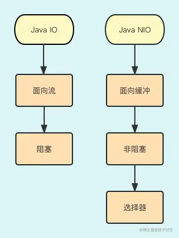
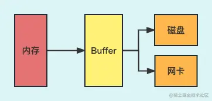
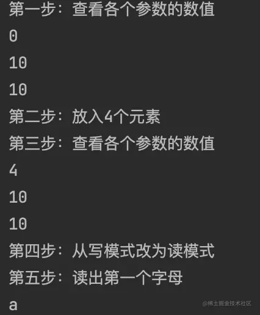
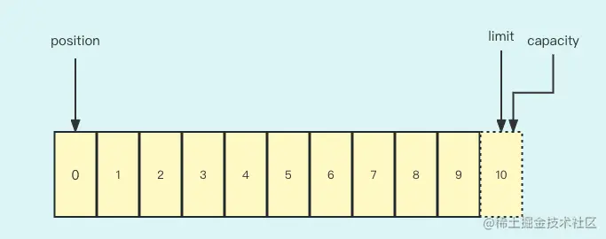
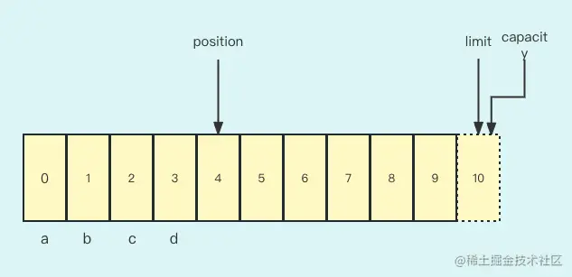
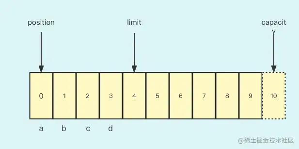
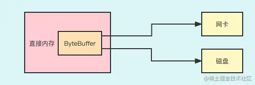
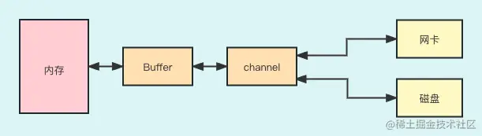

从今天这一讲开始，我们就要来讲解 Java NIO 相关的内容。

为什么要讲解这块的内容呢？

首先，一个 Java 程序员想实现网络通信，如果不选择网络通信中间件的话，他只有选择两个 Java 类库模块：`IO`和 `NIO`。那么这两种模块的区别是什么？



**首先，Java IO 是面向流的，而 Java NIO 是面向缓冲的**。面向流的 Java IO 每次只能从流中读取一个字节，直到读取到所有的字节，同时接收到的数据没有缓冲的地方。而 Java NIO 首先提供管道 Channel，同时自身提供了一个缓冲区 Buffer。比如读数据时，数据先进缓冲区，然后再用 Channel 从缓冲区读出数据，数据处理后放入任意的介质。这样我们就可以在缓冲中寻找和处理接收到的数据。

**其次，Java IO 是阻塞的，而 Java NIO 是非阻塞的**。比如：在 Java IO 中，当一个线程调用 read() 或 write() 时，该线程被阻塞。而 Java NIO 是非阻塞的，当响应来的时候再去处理，没有响应的时候线程不会阻塞，这样就可以充分地利用 CPU 资源了。

**最后，Java NIO 为了实现非阻塞设计了组件 Selector**。Selector 的具体工作是负责网络连接、网络读和网络写事件的注册和监测。网络连接、网络读写这三类网络事件事先要注册到 Selector 上，然后由 Selector 监控这三类网络事件的发生。当网络事件发生时线程再处理，如果没发生，那么线程也不会阻塞，线程会去做别的事情。

由此可见，**Java NIO 充分利用了 CPU，所以在性能上有明显的提升**。

根据上面讲述的，我们知道 Java NIO 主要有三个模块：`Buffer`、`Channel` 和 `Selector`。从这节课开始，我将陆续给大家讲解这三个组件。

## Buffer 解析

- 首先我们了解一下 Buffer。如下是 Buffer 工作示意图：



不难看出，**Buffer 在读写的过程中起到的是数据缓冲的作用**。首先，我们可以通过内存把数据写入我们事先定义的一个 Buffer 中（当然，Buffer 也是内存的一部分），然后把 Buffer 的数据读出来再写入磁盘保存起来，或者通过网卡发送出去。也就是说，Buffer 是用来读写的缓冲区。

### Buffer 的结构与重要参数

Buffer（缓冲区）本质上是一个`内存块`，既可以写入数据，也可以读取数据。代表缓冲区的 Buffer 类是一个抽象类，位于 java.nio 包中。类与普通的内存块（Java 数组）不同的是： Buffer 类对象提供了一组比较有效的方法，用来进行写入和读取。

Buffer 类同时也是一个非线程安全类，对应于 Java 的主要数据类型，在 NIO 中有 8 种缓冲区类，分别如下：ByteBuffer、CharBuffer、DoubleBuffer、FloatBuffer、IntBuffer、LongBuffer、 ShortBuffer 和 MappedByteBuffer。

其中，我们用得最普遍的是 **ByteBuffer**，其他数据类型的 Buffer 很少用。因此，这里我们主要围绕着 ByteBuffer 来讲解。

首先，用一段代码给大家讲解 ByteBuffer 的具体使用：

```java
java复制代码ByteBuffer byteBuffer= ByteBuffer.allocate(10);

System.out.println("第一步：查看各个参数的数值");
System.out.println(byteBuffer.position());
System.out.println(byteBuffer.limit());
System.out.println(byteBuffer.capacity());


System.out.println("第二步：放入4个元素");
byteBuffer.put("a".getBytes());
byteBuffer.put("b".getBytes());
byteBuffer.put("c".getBytes());
byteBuffer.put("d".getBytes());

System.out.println("第三步：查看各个参数的数值");
System.out.println(byteBuffer.position());
System.out.println(byteBuffer.limit());
System.out.println(byteBuffer.capacity());

System.out.println("第四步：从写模式改为读模式");
byteBuffer.flip();

System.out.println("第五步：读出第一个字母");
System.out.println((char)byteBuffer.get());
System.out.println();
```

输出结果为：



**第一步**，初始化一个 Buffer 类。这里我们初始化了一个长度为 10 的 ByteBuffer，这里你可以将其理解为是一个长度为 10、元素为 Byte 类型的数组。结合下面这张图就更加清楚了：



图中的 `position` 指的是下一个要写入数据的偏移量，因为还没有写任何数据，所以是 0。`capacity` 是这个 ByteBuffer 的容量，这个容量是我们初始化时定义的，所以为 10。`limit` 是我们访问的偏移量的极限，我们能访问的偏移量要小于 limit，因为初始化后是写模式，limit 与 capacity 相等，所以为 10。

**第二步**，向初始化后的 Bufer 放入数据。这里我们放入 4 个字母，a、b、c、d。

**第三步，** 再次检查各个参数的数据。这是大家可以看到，随着不断地加入数据，position 也随之增加到 4。



**第四步，** 这时写操作结束了，想读出刚才写的数据，我们就要调用 flip() 方法来切换成读模式。flip() 方法调用后，各个参数如下：



这时，position 回到了初始值 0，limit 到了原来 position 的位置，这个情况不难理解，因为我们要开始读数据了，自然是要从头读到数据尾部，因为上次数据写到了 3 的位置，那么读取的长度要小于 4。

**第五步，** 读出 a、b、c、d。由于 limit=4，所以读到第四个元素 d 时，就停止读了。

上面这五个步骤主要给大家讲解了 Buffer 的几个重要的属性，以及如何读写 Buffer 里面的数据。

其实我们在初始化一个 Buffer 的时候，既可以把 Buffer 分配到 JVM 的堆上，也可以分配到操作系统管理的直接内存上。下面给大家讲解在直接内存分配 Buffer 是怎么回事。

### ByteBuffer 在直接内存申请空间

直接内存申请空间操作简单，调用 `allocateDirect()` 方法就可以了：


下图展示了 Buffer 分配在直接内存的功能和作用：



直接内存的好处是：**Java 程序可以直接在内存上为 ByteBuffer 申请空间，而不是在 JVM 的堆空间上申请**。如果我们在 JVM 申请空间，想保存到磁盘中，数据的拷贝路径是这样的：JVM 空间-->操作系统控制的直接内存-->磁盘。但如果我们在直接内存给 ByteBuffer 分配空间，那么数据的拷贝路径是：操作系统控制的直接内存-->磁盘。这样就少了一次数据拷贝次数，提高了效率。

当然，直接内存也是有劣势的，比如申请和释放直接内存的开销比 JVM 内存要大。

## Channel 解析

Channel 可以理解为`管道`，无论是读数据还是写数据，都要通过 Channel 去读写。

这里我们先看看 Channel 和 Buffer 的关系，如下图所示：



当写数据时，Channel 先读 Buffer 中的数据，然后把数据写入网卡或磁盘；当读数据时，Channel 把磁盘或网卡的数据读出后写到 Buffer 里，然后再把 Buffer 里的数据取出来做进一步的处理。也就是说，**Channel 和 Buffer 配合实现数据的读写**。

Java NIO 里的 Channel 有很多，接下来，我们重点讲解非常有代表性的 **FileChannel**，并用代码实例解释 Channel 如何写文件。

### FileChannnel 顺序写磁盘文件

**顺序写磁盘文件就是利用FileChannel不断地`在文件尾部追加数据`**，代码如下：

```java
java复制代码// 第一步，构造一个文件输出流
FileOutputStream out = new FileOutputStream("src/main/resources/test1.txt");
// 第二步，从文件输出流获取对应的FileChannel,
FileChannel channel= out.getChannel();
// 第三步，创建一个 ByteBuffer,并把要写入文件的文件放入ByteBuffer
ByteBuffer buffer = ByteBuffer.wrap("hello world".getBytes());
// 第四步，通过channel把buffer里的数据写入文件
channel.write(buffer);
System.out.println(buffer.position());
// 第五步，关闭通道和流
channel.close();
out.close();
```

- 第一步，初始化一个传统的输出流 FileOutputStream，并指定要写入的文件地址。
- 第二步，从 FileOutputStream 对象得到一个 `FileChannel`。
- 第三步，初始化一个 ByteBuffer，并把 "hello world" 放入 ByteBuffer。
- 第四步，用 Channel 把 ByteBuffer 里的数据写入文本文件。Channel.write(buffer) 做了些什么事情呢？其实就是把 buffer 里的数据从头读到小于 limit 的位置。然后把读出的数据放入到磁盘里。大家可以运行一下代码，System.*out*.println(buffer.position()) 这行代码会打出 11。说明读到了数据的尾部。
- 最后，关闭 FileChannel 和 FileOutputStream。

**这两个组件分工很明确：Channel 负责写文件的通道，而 Buffer 表示要写入的数据**。这样，通道 Channel 和 ByteBuffer 的关系就很清楚了，结合代码和上面的图，相信大家会很快理解两者的关系。

如果想再次对 ByteBuffer 从头读到尾，那么可以调用 `ByteBuffer.rewind()`方法，这样 position 又到了偏移量为 0 的位置。

这就是在文件尾部追加写的情况。

### FileChannel 随机写磁盘文件

那么我们要想随机写怎么办呢？比如，我们要在 hello world 中间加入 your，也就是变成 hello your world，我们该怎么做呢？如下代码所示：

```java
java复制代码public class FileChannelDemo {
    public static void main(String[] args) throws IOException {
        // 第一步，构造一个文件输出流
        FileOutputStream out = new FileOutputStream("src/main/resources/test1.txt");
        // 第二步，从文件输出流获取对应的FileChannel,
        FileChannel channel= out.getChannel();
        // 第三步，创建一个 ByteBuffer,并把要写入文件的文件放入ByteBuffer
        ByteBuffer buffer = ByteBuffer.wrap("hello      world".getBytes());
        ByteBuffer bufferNew = ByteBuffer.wrap("your".getBytes());

        // 第四步，通过channel把buffer里的数据写入文件
        channel.write(buffer);
        System.out.println(buffer.position());
        System.out.println(channel.position());
        channel.position(6);
        buffer.rewind();
        channel.write(bufferNew);
        // 第五步，关闭通道和流
        channel.close();
        out.close();
    }
}
```

在第四步中，`channel.position(6)` 意思是从当前的偏移量 6 开始写文件，然后调用 ByteBuffer 的 rewind() 方法，把 ByteBuffer 的 position 变为 0。这时调用 write(buffer) 就可以把 your 写到 hello world 之间了。

也就是说，Channel 也是有 position 这个概念的，可以用来实现随机写。

### FileChannel 多线程写文件

接下来，我们用多线程调用 FileChannel 往文件里写数据，这样做会提高吞吐量，同时也可以验证 FileChannel 是否是线程安全的。如下代码所示：

```java
java复制代码// 第一步，构造一个文件输出流
    FileOutputStream out = new FileOutputStream("src/main/resources/test1.txt");
    // 第二步，从文件输出流获取对应的FileChannel,
    FileChannel channel= out.getChannel();

    for(int i=0;i<10;i++){
        new Thread(){
            @Override
            public void run() {
                ByteBuffer buffer = ByteBuffer.wrap("hello world".getBytes());
                // 第三步，通过channel把buffer里的数据写入文件
                try {
                    channel.write(buffer);
                } catch (IOException e) {
                    e.printStackTrace();
                }
            }
        }.start();
    }
}
```

我们用了十个线程去往文件里写，如果 FileChannel 不是线程安全的，写出来的结果会很乱，我们看下结果：


写得很整齐，说明 FileChannel 真的是线程安全的 Channel。

### FileChannel 读文件

写操作已经给大家介绍完了，现在我们看看如何读文件。如下代码所示：

```java
java复制代码public class FileChannelReader {
    public static void main(String[] args) throws Exception {
        FileInputStream in = new FileInputStream("src/main/resources/test1.txt");
        FileChannel channel = in.getChannel();

        ByteBuffer buffer = ByteBuffer.allocate(11);
        // 把磁盘文件的数据写入buffer
        channel.read(buffer);
        // 调用flip()开启读模式。
        buffer.flip();
        for (int i=0;i<11;i++){
            System.out.print((char)buffer.get());
        }
        channel.close();
        in.close();
    }
}
```

这里我稍微解释一下上述代码。

- 第一步，首先初始化一个 FileInputStream 对象，同时设置要读的文件地址。
- 第二步，从 FileInputStream 对象获得 FileChannel 对象。
- 第三步，初始化一个 ByteBuffer 对象，定义长度为 11，正好是 hello world 字符串的长度。
- 第四步，把文件中的 hello world 字符串写入 buffer 里。
- 第五步，调用 buffer.flip() 开启 ByteBuffer 对象的读模式，然后读出数据。

### 如何及时刷盘

读写我们都已经学习完了，那么我们思考一个问题：`FileChannel 调用方法 write() 的时候数据就立即写到磁盘了吗？`

答案是否定的。调用 write() 的时候，数据会先写到操作系统的 Cache 上，也就是操作系统读写缓冲区。这样做的优点是没有磁盘 IO 的时候进程直接返回，操作系统会等待 N 次 Cache 写入后再批量地刷盘，于是就大大提升了读写的吞吐量。缺点是，如果这时操作系统宕机了，数据就会丢失。

如果你的需求对数据的可用性很高，那么你就要**及时刷盘**。不能仅仅调用 FileChannel.write()，还要调用 `FileChannel.force()`，只要 FileChannel.force() 这个方法正常返回了，那么你就可以确定数据已经刷到磁盘上了。但是这个 force() 只能保证 FileChannel 类的方法引起的修改能够写到磁盘文件里，别的类对这个磁盘文件的修改就不能保证刷盘了。别的类对磁盘文件的修改落盘需要对应的方法去做。

## 总结

在这节课中，我们首先对比着说明了Java IO 和 Java NIO 的区别，以及 Java NIO 的优势。接下来，又给大家用代码讲解了 Buffer 的功能和使用方式。

最后，还给大家用 FileChannel 讲解了 Channel 的角色和使用方法，主要包括：

- FileChannel 是如何写的，同时对应 FileChannel 实现了用多线程写，并验证了 FileChannel 是线程安全的；
- FileChannel 是如何做读操作的；
- 如何及时刷盘，也就是说如果不调用 FileChannel.force() 这个方法是不能保证已经落盘了。