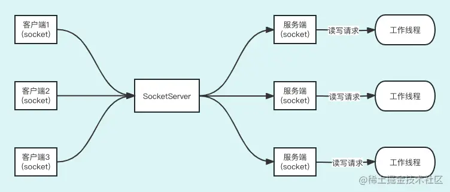

到这里，相信大家对传统的、面向流的、阻塞的 Java 传统 IO 比较熟悉了。同时，大家应该也知道 Java NIO 是为了应对 Java 对于海量网络请求而诞生的，而 Java BIO 在大家的印象里似乎不太适合海量网络请求。

那么，Java BIO 就真的不能应对海量网络请求吗？我们通过一些某方面的提升，比如多线程、功能解耦等方式难道真的不能应对海量请求吗？这节课我们就来求证一下！

## Java BIO 代码

这里我们实现一个常规的基于 Java IO 的 Server 端和 Client 端的程序。

首先，上 `Server 端`代码：

```ini
ini复制代码public class BioServer {

    public static void main(String[] args) throws Exception{
            //1. 作为服务端，首先创建一个ServerSocket。
            ServerSocket serverSocket = new ServerSocket(9000);
            //2. 接受客户端的连接，如果有客户端来连接，那么就通过三次握手来实现TCP连接。如果没                 //   有连接请求就阻塞
            Socket socket = serverSocket.accept();
            // 定义1kb的char[]数组。
            char[] buf = new char[1024];
            // 3.获取输入流。
            OutputStream out = socket.getOutputStream();
            InputStreamReader in = new InputStreamReader(socket.getInputStream());
            //4. 读数据，无数据就阻塞
            int len = in.read(buf);
            // 5.循环读取客户端的数据
            while(len != -1) {
                String request = new String(buf,0,len);
                System.out.println("服务端接收到了数据：" + request);
                //6.处理完客户端发送的数据后，向客户端发送数据
                out.write("收到了！！！".getBytes());
                // 重新定义一个char[]数组
                buf = new char[1024];
                // 读数据，无数据就阻塞
                len = in.read(buf);
            }
            //7.关闭
            out.close();
            in.close();
            in.close();
            socket.close();
            serverSocket.close();
    }
}
```

给大家讲解一下基本步骤，大家可以边看代码边看我的步骤讲解。

1. 首先，作为服务端需要启动服务，并对外暴露端口 9000，来接收外部的请求。
2. 接收外部的连接请求：serverSocket.accept()。在没有连接接进来的时候，**accept() 方法会阻塞**，直到有连接进来后会通过 TCP 三次握手来尝试连接，如果连接成功会返回一个 Socket 对象。
3. 根据得到的 Socket 对象输出流 OutputStream 对象，和输入流 InputStream 对象，OutputStream 用于发送数据，InputStream 用于接收数据。
4. 由于连接已经建立，那么我们调用输入流的方法 read(buf) 来把接收到的数据写入 char[] 数1组里，当然如果没有数据进来，**read() 方法会阻塞的**。
5. 循环读取客户端的数据，由于数据是不断通过 InputStream 流进来的，所以我们要循环读取。
6. 读到之后我们要把数据收到的通知发送客户端（**在发送的过程中 out.write("收到了！！！".getBytes()) 这段代码也是阻塞的**），同时还会调用 read() 方法来不断尝试读取。
7. 关闭所有的资源。

接下来，我们看看 `Client 端`代码：

```ini
ini复制代码public class BioClient {

    public static void main(String[] args) throws Exception{
        // 1.尝试连接
        Socket socket = new Socket("localhost",9000);
        OutputStream out = socket.getOutputStream();
        InputStream in = socket.getInputStream();
        InputStreamReader inReader = new InputStreamReader(in);
        for(int i=0;i<10;i++){
            // 2.发送数据
            out.write("你好".getBytes());
            // 接收数据
            char[] buf = new char[1024];
            //读数据，无数据就阻塞
            int len = inReader.read(buf);
            String request = new String(buf,0,len);
            System.out.println("客户端接收到了响应："+request);
            Thread.sleep(1000);
        }
        // 3.关闭资源
        inReader.close();
        in.close();
        out.close();
        socket.close();
    }
}
```

同样给大家讲解一下基本步骤，大家可以边看代码边看我的步骤讲解。

1. 尝试跟本地的端口 9000 进行连接，如果经过 TCP 三次握手连接成功了，跟 Server 端一样我们也会创建 Socket 对象输出流 OutputStream 对象和输入流 InputStream 对象。
2. 进入一个 10 次的循环，每次循环都会向服务端发送数据，同时会接收服务端的响应数据，每次循环间隔 1 秒钟。
3. 关闭数据。

Server-Client 的代码就给大家讲解完了，大家可以在自己的电脑上跑一下程序，能够加深对程序的印象。

> 好，现在我们想一个问题：如果在这个 Server-Client 交互的过程中，我们再打开一个 Client 端向 Server 端请求，这样可以处理吗？
>
> 答案是不可以的，大家可以试一试，为什么呢？
>
> 原因很简单，服务端是单线程的，它正在执行一个任务怎么可能再处理其他客户端的请求呢。只有一个连接彻底处理完了才能处理第二个连接。但是，在实际工作中，客户端只要不主动发出连接关闭的指令，除非网络连接出了问题，一般情况下连接会一直保持下去，并进行数据交换。而且，read() 方法是阻塞的，如果对应的 InputSteam 没数据， read() 方法就会阻塞等着现在的客户端发送数据，所以，服务端根本没资源处理其他客户端。一个服务端只能处理一个客户端。

如果是上述的这种情况，那么肯定是不合适的，因为在生产环境一个服务端承受的连接会很多，从成百上千到几十万都是可能的。那么，我们代码应该如何改造服务端代码以适应 N 个客户端连接的情况呢？

最容易想到的就是服务端采用多线程。

## 多线程 BIO 代码

于是我们改造服务端为`多线程`，多线程 Server 代码如下：

```java
java复制代码public class BioServer {

    public static void main(String[] args) throws Exception{
            //1. 作为服务端，首先创建一个ServerSocket。
            ServerSocket serverSocket = new ServerSocket(9000);
            //2. 只要有客户端连接进来就分配一个线程来处理这个连接。
            while (true) {
                Socket socket = serverSocket.accept();
                // 启动新的工作线程
                new Worker(socket).start();
            }
    }
   // 工作线程
    static class Worker extends Thread {
        Socket socket;
        public Worker(Socket socket){
            this.socket = socket;
        }

        @Override
        public void run()  {
            try {
                // 定义1kb的char[]数组。
                char[] buf = new char[1024];
                // 3.获取输入流。
                OutputStream out = socket.getOutputStream();
                InputStreamReader in = new InputStreamReader(socket.getInputStream());
                //读数据，无数据就阻塞
                int len = in.read(buf);
                // 4.循环读取客户端的数据
                while (len != -1) {
                    String request = new String(buf, 0, len);
                    System.out.println("["+Thread.currentThread().getName()+"] 服务端接收到了数据：" + request);
                    //5.处理完客户端发送的数据后，向客户端发送数据
                    out.write("收到了！！！".getBytes());
                    // 重新定义一个char[]数组
                    buf = new char[1024];
                    // 读数据，无数据就阻塞
                    len = in.read(buf);
                }
                //5.关闭
                out.close();
                in.close();
                in.close();
                socket.close();
            } catch (Exception ex){
                ex.printStackTrace();
            }
        }
    }
}
```

给大家讲解一下基本步骤，大家可以边看代码边看我的步骤讲解。

1. 首先，作为服务端需要启动服务，并对外暴露端口 9000，来接收外部的请求。
2. 收到一个客户端建立连接的请求后，如果建立成功了，就新建一个工作线程，用这个工作线程处理这个连接。 工作线程也就是 Worker 线程，工作跟改造前的功能一样，这里就不解释了。

也就是说，我们通过多线程实现了一个服务端可以同时处理多个客户端的目的。

接下来，我们再看看它的连接模式。

> 短连接和长连接
>
> 这个问题我们在学习 TCP 网络协议的时候给大家讲过，这里再根据实际代码给大家讲解一下。
>
> 我们看到类 BioClient 的最后一行代码是 socket.close()，意思是断开连接，就是说 BioClient 完成请求后就关闭连接，过一会儿如果 BioClient 还想发送数据连接无法重用，还要新建连接，这就是短连接。短连接对于网络性能是不友好的，频繁地建立和关闭连接对网络资源是一个消耗。
>
> 而决定是短连接还是长连接，由应用层决定，也就是说，上述代码都是属于应用层的。
>
> 而长连接是指客户端和服务端都要保持住 TCP 连接，不会主动关闭 TCP 连接，双方不断通过保持的 TCP 连接收发数据。

那么，我们如何做能让服务端和客户端保持长连接呢？

## 多线程长连接 BIO 代码

服务端代码 while 循环的最后一行是 `len = in.read(buf);` ，意思是如果输入流没有数据就一直阻塞，直到有数据，由于这里是一直阻塞的，那么如果没有异常代码不会走到 socket.close();serverSocket.close() ，服务端是保持长连接的。我们只需对客户端的代码改造就可以了。

Client 代码如下：

```ini
ini复制代码public class BioClientLongConnection {

    public static void main(String[] args) throws Exception{
        // 1.尝试连接
        Socket socket = new Socket("localhost",9000);
        OutputStream out = socket.getOutputStream();
        InputStream in = socket.getInputStream();
        InputStreamReader inReader = new InputStreamReader(in);

        while(true){
            try{
                // 2.发送数据
                out.write("你好".getBytes());
                // 3.接收数据
                char[] buf = new char[1024];
                //读数据，无数据就阻塞
                int len = inReader.read(buf);
                String request = new String(buf,0,len);
                System.out.println("客户端接收到了响应："+request);
                Thread.sleep(1000);
            } catch (Exception exception){
                // 4.关闭资源
                inReader.close();
                in.close();
                out.close();
                socket.close();// 四次挥手断开连接
            }
        }
    }
}
```

大家可以看到，关闭资源的代码放入了 Catch 代码段里了，同时上层用 `while(true)` 来不断地收发数据。这样，就能保证我们的连接是长连接了。

综上所述，我们通过多线程和长连接最大程度上提升了 BIO 应对高并发的能力。那么，我们的 BIO 程序还有什么问题呢？其实最大的问题就是服务端的多线程问题，每一个连接都要新开一个线程来应对，同时我们为了保证连接能复用还用了长连接，如果连接成千上万，显然我们的机器是无法承受的。BIO 的致命弱点是随着接入连接的增多，逐渐耗尽 CPU 的线程资源。

下面画了一个流程图来帮助大家理解：



大家可以看到，为了能同时处理多个客户端的数据读写，服务端要为每一个客户端开辟一个 socket，同时要为每一个客户端分配一个线程来处理服务端与客户端的读写。

一台 CPU 4 核、内存 8G 的机器如果开了4个线程，那么这台机器的CPU的实际利用率是最高的。如果1个 CPU 核运行了多个线程那么必然会涉及到线程调度的问题，线程调度会消耗大量的 CPU资源。而在互联网场景下，一个服务端支撑上千，上万，甚至几十万的客户端连接都是常有的事情。如果我们一个客户端就对应一个线程，那么过多的线程数一定会把 CPU 资源消耗完的。连接服务端的客户端有一百万个，服务端要分配一百万个线程来应对，显然这是不可能的。如果我们会用分布式海量机器去满足一百万个连接，一个机器应对 100 个连接，我们竟然需要 1 万台机器，而在互联网场景中百万连接是再正常不过的事情了，也就是说 Java BIO 根本无法满足互联网高并发的场景。

那么，我们如何不通过增加线程来应对互联网高并发的场景呢？于是，Java NIO 横空出世，通过多路复用的方式解决了阻塞的问题，同时一个线程可以处理多个客户端连接的读写数据操作。这个内容会在下节课给大家讲解。

## 总结

这节课给大家主要讲解了 Java BIO 持续优化的方法以及最后的结论。

- 首先，给大家讲了 Java BIO 最基本的代码及代码分析。
- 然后，通过多线程的方式让服务端有了同时应对多个客户端连接的能力。
- 随后进一步通过代码改造从短连接变成了长连接，实现了 TCP 连接的复用。
- 最后，我们分析了 Java BIO 的模型，并得出了结论：由于 Java BIO 是通过多线程的方式来应对高并发的，而线程资源又是有限的，所以 Java BIO 根本不适合互联网高并发场景。