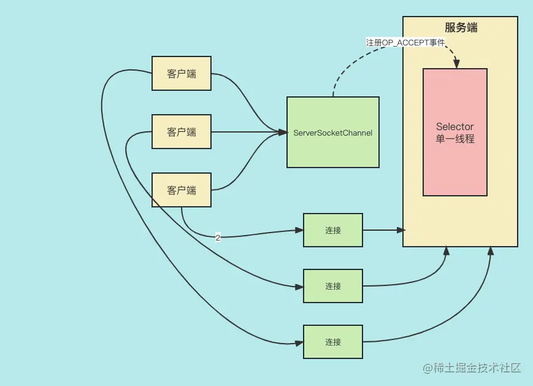
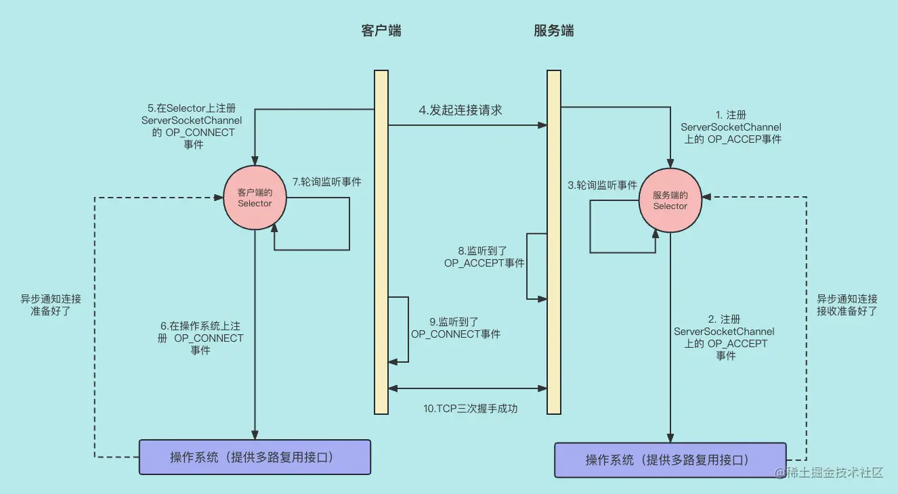

上节课，我给大家用 Java IO 写了一个有 Server 端和 Client 端的网络通信的例子，并通过不断的优化试图使它能够适应高并发、高吞吐的场景。但是，我们最终`止步于线程数过多`造成 CPU 资源消耗殆尽的问题。

今天，我们会用 Java NIO 解决这个问题。

## Java NIO 代码

我们还是通过一个有 Server 端和 Client 端的网络通信的例子来说明问题，不过这次是用 Java NIO 来实现。

### Server

首先，上 Server 端代码：

```scss
scss复制代码public class NioServer {

    private static ByteBuffer readBuffer;
    private static Selector selector;

    public static void main(String[] args)  throws Exception{
          // 服务端的初始化
          init();
          listen();
    }

    private static void init(){
        // 读取请求数据的 Buffer
        readBuffer = ByteBuffer.allocate(128);
        ServerSocketChannel serverSocketChannel;

        try{
            // 1.打开服务端
            serverSocketChannel = ServerSocketChannel.open();
            // 配置为非阻塞IO
            serverSocketChannel.configureBlocking(false);
            // 设置端口，
            serverSocketChannel.socket().bind(new InetSocketAddress(9000),100);
            // 打开 多路复用选择器
            selector = Selector.open();
            // 2.把 serverSocketChannel 注册到 selector 上。 监听 serverSocketChannel 的连接请求事件，与各个客户端建立连接请求
            serverSocketChannel.register(selector, SelectionKey.OP_ACCEPT);
        }catch (IOException e){
            e.printStackTrace();
        }
    }

    private static void listen(){
        while (true){
            try{
                // 3. selector查看是否有注册在 selector 上的 Channel 有网络事件发生。这个方法是阻塞的。
                selector.select();
                Iterator<SelectionKey> keysIterator = selector.selectedKeys().iterator();
                // 4. 轮询 SelectionKey 集合里的 SelectionKey，一个 SelectionKey 代表一个网络事件。
                while (keysIterator.hasNext()){
                    SelectionKey key = (SelectionKey) keysIterator.next();
                    keysIterator.remove();
                    handleKey(key);
                }
            }catch (Exception e){
                e.printStackTrace();
            }
        }
    }

    private static void handleKey(SelectionKey key){
        SocketChannel channel = null;
        // 5. 判断网络事件的类型并做出相应的处理
        try {
            // 如果是客户端要求连接的请求
            if(key.isAcceptable()){
                ServerSocketChannel serverSocketChannel = (ServerSocketChannel) key.channel();
                // 通过 TCP 三次握手，建立和获取获取客户端和服务器的连接SocketChannel
                channel = serverSocketChannel.accept();
                channel.configureBlocking(false);
                // 注册网络读事件
                channel.register(selector,SelectionKey.OP_READ);
                //如果是可以网络读的事件
            }else if(key.isReadable()){
                channel = (SocketChannel) key.channel();
                readBuffer.clear();// postion 变为0，limit = capacity,也就是复位操作，准备把数据写入Buffer了
                int count = channel.read(readBuffer); // 通过 Socket 来读取数据并把数据写入 Buffer 中。

                if(count > 0){
                    readBuffer.flip();// 开始从Buffer读数据。
                    String request = StandardCharsets.UTF_8.decode(readBuffer).toString();
                    System.out.println("Server receive the request: "+request);
                    String response = "Server accept request";
                    channel.write(ByteBuffer.wrap(response.getBytes()));
                }
            }
        }catch (Exception e){
            e.printStackTrace();
        }
    }
}
```

给大家讲解一下代码步骤。

1. 初始化。首先初始化一个 ServerSocketChannel 对象，然后调用它的 open() 方法，设置服务端服务的 TCP 端口号为 9000，代表服务端可以接收外部客户端的请求了。
2. 创建 selector，并把 serverSocketChannel 注册在 selector 内，并让 selector 监听serverSocketChannel 的`网络连接事件`。ServerSocketChannel 只有服务端会使用，是服务端与客户端建立连接用的，我再给大家画张图来讲解。



这里说明一下 ServerSocketChannel 的工作流程。

1. 首先，创建完一个 serverSocketChannel 对象后，我们要把 serverSocketChannel 注册到 selector上，并对这个 serverSocketChannel 的 `OP_ACCEPT 事件`进行监听，OP_ACCEPT 其实就是外部的客户端要连接服务端的请求连接的事件。
2. 当客户端发起请求后，Seletor 会监听到 `OP_ACCEPT 事件`，随后通过`三次握手`建立连接，这样客户端和服务端之间的连接就建立好了。 很明显，ServerSocketChannel 是为连接服务的，所有客户端要想与服务端建立连接都要通过 ServerSocketChannel 来建立连接。
3. 开始轮询 selector 上注册的事件。调用 selector.select() 方法来查看是否有网络事件，这个方法是阻塞方法，有网络事件时会返回事件的数量，代码在一个 while(true) 循环中，会不断地轮询执行 selector.select() 方法，所以只要有网络事件，事件就会得到处理。
4. 轮询 SelectionKey 集合里的 SelectionKey，一个 SelectionKey 代表一个网络事件。
5. 这里的网络事件主要有可连接事件和可读取事件:

- 如果是 key.isAcceptable() == true，意味着可以连接了，那么我们首先调用 serverSocketChannel.accept() 通过三次握手来实现 TCP 连接。
- 如果是 key.isReadable() == true，意味着可以读取了，我们通过创建一个 `ByteBuffer 类的对象`把数据写到 readBuffer，然后再从 `readBuffer 来读取数据`。读取客户端数据结束后，服务端会给客户端发送响应，调用 channel.write(）来实现，当然写数据也是通过与 ByteBuffer 配合来实现的。

好，我们用一副图来更好地展示服务端的代码流程：


### Client

然后，我们再看看 Client 端代码：

```java
java复制代码public class NioClient {
    public static void main(String[] args) throws Exception{
        // 启动十个线程，模拟十个客户端。
        for(int i=0;i<10;i++){
            new Worker().start();
        }
    }

    static class Worker extends Thread{

        @Override
        public void run() {
            SocketChannel channel = null;
            Selector selector = null;
            try{
                // 1.创建一个 SocketChannel,用来与服务端连接，并实现网络读写操作。
                channel = SocketChannel.open();
                channel.configureBlocking(false);
                // 指定网络地址，通过三次握手实现 TCP 连接
                channel.connect(new InetSocketAddress("localhost",9000));
                // 创建一个 selector 对象， 并把 SocketChannel 注册到 selector 上，并监听 请求连接事件 OP_CONNECT
                selector = Selector.open();
                channel.register(selector, SelectionKey.OP_CONNECT);
                // 2. 遍历网络事件
                while (true){
                    // 查找收到的网络事件
                    selector.select();
                    Iterator<SelectionKey> keyIterator = selector.selectedKeys().iterator();
                    while (keyIterator.hasNext()){
                        SelectionKey key = (SelectionKey) keyIterator.next();
                        keyIterator.remove();
                        // 3. 判断是否可以连接
                        if(key.isConnectable()){
                            // 如果连接成功了
                            if(channel.finishConnect()){
                                // 监听网络读事件
                                key.interestOps(SelectionKey.OP_READ);
                                // 向服务端发送数据
                                channel.write(ByteBuffer.wrap("hello,I'm client".getBytes()));
                            }else {
                                key.cancel();
                            }
                            // 4. 如果有数据需要读取
                        }else if(key.isReadable()){
                            ByteBuffer byteBuffer = ByteBuffer.allocate(128);
                            // 把数据写入 buffer
                            channel.read(byteBuffer);
                            byteBuffer.flip();
                            // 把数据读出来。
                            String response = StandardCharsets.UTF_8.decode(byteBuffer).toString();
                            System.out.println("["+Thread.currentThread().getName()+"] receive response:"+response);
                            Thread.sleep(5000);
                            // 向服务端发送数据
                            channel.write(ByteBuffer.wrap("hello".getBytes()));
                        }
                    }
                }
            }catch (Exception e){
                e.printStackTrace();
            }finally {
                if(channel != null){
                    try{
                        channel.close();
                    }catch (Exception e){
                        e.printStackTrace();
                    }
                }
            }
        }
    }
}
```

客户端代码通过多线程模拟了十个客户端同时向服务端发送请求，每一个线程的执行过程我给大家讲解一下。

1. 创建一个 SocketChannel 用来与服务端连接，这个 SocketChannel 是用来保持与客户端连接的 Channel，用来实现网络读写操作。其实，本质上还是通过三次握手来实现 TCP 连接。然后，把 `OP_CONNECT 事件`注册在新创建的 selector 上，作用跟服务端的 selector 是一样的，这里就不再解释了。
2. `无限循环轮询` SelectionKey 集合里的 SelectionKey。服务端轮询基本一致，这里也会有两个事件需要处理。

- 判断是否可以连接。如果 key.isConnectable() == true，那么就认为是可以连接的，但是可以连接并不意味着已经连接上了。如果 channel.finishConnect()==true，我们才认为连接成功建立了，这时就要把 `OP_READ 事件`也就是读事件也注册到 selector 上，这样我们就可以接收到服务端的数据了。然后，通过与 ByteBuffer 配合向服务端发送数据。
- 判断是否是可读。如果 key.isReadable() == true，那么就认为网络读事件来了，我们需要读取服务端给我们发送的数据，读取后再次向服务端发送数据。

服务端和客户端的代码运行起来后，会不断相互收发数据。我建议大家可以在 IDE 上运行一下服务端和客户端的代码，这样能够更好地理解 Java NIO 的机制。

## NIO 核心原理

上面给大家讲解了一个 NIO 的例子，并把相关代码给大家解释清楚了，下面我们再来看看 Java NIO 的核心原理是什么。

其实 Java NIO 的多路复用机制并不是 Java NIO 本身来实现的，而是通过操作系统实现的。**Java NIO 在调用操作系统的 API 来实现多路复用**。

### 服务端初始化过程

我们先看下服务端的初始化过程：

```scss
scss复制代码// 1.打开服务端
serverSocketChannel = ServerSocketChannel.open();
// 配置为非阻塞IO
serverSocketChannel.configureBlocking(false);
// 设置端口，
serverSocketChannel.socket().bind(new InetSocketAddress(9000),100);
// 打开 多路复用选择器
selector = Selector.open();
// 2.把 serverSocketChannel 注册到 selector 上。 监听 serverSocketChannel 的连接请求事件，与各个客户端建立连接请求
serverSocketChannel.register(selector, SelectionKey.OP_ACCEPT);
```

首先，第一步会创建一个 ServerSocketChannel 的实例，然后配置为非阻塞。下一步，调用 serverSocketChannel.socket()，大家可以看到这个调用的返回是与 ServerSocket，其实本质上就是与 ServerSocketChannel 相关联的 TCP 的 Socket，然后调用 bind() 方法，设置 Socket 的端口，这样就有了 Socket 的端口。

所以说， ServerSocketChannel 的作用是 TCP 协议下用来监听对 TCP 某个端口的连接请求。

好，服务端初始化过程基本给大家讲解完了，下面给大家讲解另一个重要的内容：Selector 是如何注册 Channel的。

### Selector 工作原理

Selector 也是基于底层操作系统来实现的，我们看一下 Selector.open() 这个方法就知道了。

```csharp
csharp复制代码public static Selector open() throws IOException {
    return SelectorProvider.provider().openSelector();
}
```

上面的代码就是打开一个 Selector，其实底层也是基于操作系统来实现的。操作系统实现了 select 机制，用 select 机制来监听注册到自己上面的 channel 有没有网络事件。当每次注册某个 Channel 的某个网络事件到 Selector 上的时候，都会为网络事件指定一个 SelectionKey。

`SelectionKey` 是一个枚举类型，有下面几种类型。

- `OP_CONNECT`：客户端的请求连接的事件。客户端的 SocketChannel 会向 Selector 注册这个事件，需要 Selector 监听服务端是否连接准备好了。
- `OP_ACCEPT`：服务端的接收连接的事件。服务端的 ServerSocketChannel 会向 Selector 注册这个事件，需要 Selector 监听接收到客户端的请求连接。
- `OP_READ`：服务端和客户端的网络读事件。服务端和客户端的 SocketChannel 都会向 Selector 注册这个事件。需要 Selector 监听是否接收到对方发送的数据了。
- `OP_WRITE`：服务端和客户端的网络写事件。服务端和客户端的 SocketChannel 都会向 Selector 注册这个事件。需要 Selector 监听是否可以向对方发送数据了。

也就是说，我们可以根据需要指定需要监控的网络事件。随着注册在 Selector 上的 Channel 越来越多，随之而来的注册在 Selector 上的网络事件越来越多，那么，Selector 就能够监听很多请求连接及读写的网络事件，这样我们通过多路复用来响应海量客户端，从而实现了高性能网络服务端的目的。

当然，当我们对某个网络事件不感兴趣了，我们也可以取消对网络事件的监听，比如当客户端已经连接到了服务端，就可以取消对 OP_CONNECT 事件的关注，好处是能够通过减少关注的事件数量减少 Selector 的负载，从而提升多路复用的效率。

## 多路复用的原理(建立连接过程)

我们应该都知道 Java NIO 采用了`多路复用`的思想。那么，`多路复用`的原理是什么呢？

我先给大家解释一下多路复用的原理，这里还是用一张图来引出**多路复用的原理**：



根据这幅图，我们只体现了`网络连接事件`（OP_ACCEPT 和 OP_CONNECT）,读写事件忽略，这样能让大家看的更简洁一些。

大家可以看到：客户端向服务器连接前，服务端会把接收连接的事件（OP_ACCEPT）注册到服务端的 `NIO Selector`,然后 NIO Selector 再把事件注册到`操作系统`上，也就是说操作系统才是能真正实现多路复用。然后，服务端通过不断循环来监听是否有客户端发送连接的请求。如果有，操作系统会通过修改某些 JAVA 的属性来`异步通知`给 JAVA 程序。 如果 NIO Selector `轮询`到某些属性变化了，比如 key.isAcceptable() == true,那么就可以执行相应的业务逻辑。

程序会使用组件 Selector 来创建和管理多个连接的网络事件，最重要的是 Selector 是在`一个线程`里工作，这样，服务端用一个线程就能`管理 N 个客户端的连接`。也就是说，Selecot 组件是 JAVA NIO 多路复用的灵魂。

#### Selector 的 select()方法：

如果说 Selector 是 JAVA NIO 多路复用的灵魂，那么 Selector 的 select 方法就是核心，这个方法负责收集监听到的网络事件，我们先看看这个方法有几种重载方式：

1. select(): `阻塞方法`，返回值int。只要监听到有注册在 Selector 上的事件准备好了，就会返回监听到的事件的数量，否则一直阻塞。 这个方法的优点是，`线程不会空转`，只有监听到了事件才会执行。缺点是线程阻塞，这个线程内的其它功能不能及时执行。
2. select(long timeout)：`限时阻塞方法`。在一个时间段内阻塞，如果在这个时间段内监听到准备好的网络事件就返回网络事件的数量，否则一直等到这个时间结束在返回。 这个方法的优点是，线程在一个时间段内不会空转，只有监听到了事件才会执行。缺点是还是会有线程阻塞，这个线程内的其它功能不能及时执行。
3. selectNow():`不会阻塞的方法`，只要执行到这里就返回，如果没有监听到事件就返回0。 这个方法的优点是：由于没有阻塞，线程内的逻辑都会及时执行，但是如果业务逻辑比较简单，而且网络事件出现的频率不高这个线程就会一直空转，浪费了 CPU 的资源。

现在大家看起来可能有些复杂，建议大家先把 demo 代码搞明白，然后再`对照上图`，相信大家会`理解的更透彻`。

## 总结

这节课，我们学习了 Java NIO 的核心知识点。

首先，第一部分，通过一个 Server-Client 的例子给大家演示了如何使用 Java NIO 实现通信，然后给大家分步骤讲解了代码。第二部分，给大家讲解了一些 Java NIO 的核心原理，包括连接是如何建立的，以及 Selector 工作原理。

有了这些知识作为基础，我们下节课就开始正式学习 Netty 的相关知识。