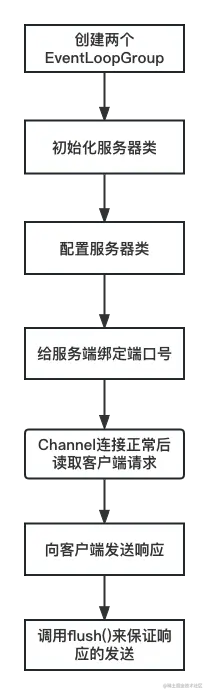

在前面的模块和章节中，我带领大家学习了网络协议和 NIO，这两块知识是我们学习 Netty 的基础。基础已备，接下来从这节课开始我们就来学习 Netty 框架。

本模块是我们关于 Netty 的讲解。主要包含有 `Netty 核心功能精讲`和 `Netty 底层原理与源码分析`。

## Java NIO VS Netty

但是，有的同学可能会问，`既然有了 Java NIO，而且 Netty 也是基于 Java NIO 实现，那么为什么不能直接用 Java NIO 来实现网络通信模块呢？` 接下来我就给大家解释一下原因。

如果我们用 Java NIO 来开发网络通信组件，势必会直接面对很多网络通信的问题。比如，网络连接异常如何处理、网络的闪断怎么处理、网络拥堵、拆包粘包等一大堆网络通信的问题。同时还会面临性能优化的问题，比如成熟的中间件为了提升通信性能，以及提升处理请求量，会设计成 reactor 模式。

所以，直接用 Java NIO 做通信模块，会有很多的生产环境的问题等待我们去处理，大部分经验并不是很资深的同学是很难实现的。

但对比下来，Netty 开发通信组件则有很多优势。

- 首先，Netty 简化了 Java NIO 的 API，封装了底层很多复杂的网络通细节，让我们开发程序变得很简单。
- 其次，Netty 还提供了很多的高级功能，易于二次扩展。
- 最重要的是，优秀的 Netty 设计实现了高性能、高并发、高吞吐、高可靠的网络通信。
- 最后，大量的商业项目都使用了 Netty 作为网络通信模块，比如，Dubbo、RocketMQ。经过很多生产环境的验证后，Netty 可以说是 Java 软件里最成熟、最流行的网络通信模块。

但是 Netty 也是有劣势的，Netty 为了更好地封装 Java NIO 创造了很多抽象的概念，这些抽象概念对于初学者来说难度并不小。

总体来说，**Netty 相对于 Java NIO 确实更加完善和健壮，但是也难于理解**。

为了让你更好地理解 Netty，下面我会带大家用 Netty 简单地实现`一个有服务端和客户端的网络通信 Demo`。

## Demo：Netty 入门程序

在这个 Demo 程序中，我会给大家详细解释程序中每步的意义，让大家更快地入门 Nettty 开发。

这里我会从`服务端`和`客户端`这两端分别讲起。

### 服务端代码

服务端代码包括服务端启动类和处理网络事件的 Handler 类。启动类主要是一些 Netty 核心类的初始化及端口的绑定；Handler 类是用来处理网络事件对应的业务逻辑。

首先，**服务端启动类 NettyServer** 代码如下：

```java
java复制代码public class NettyServer {

    public static void main(String[] args) {
        // 第一步，分别创建两个处理网络的EventLoopGroup。
        EventLoopGroup parentGroup = new NioEventLoopGroup();   //Acceptor线程组
        EventLoopGroup childGroup = new NioEventLoopGroup();    //Processor或Handler 线程组

        try{
            // 第二步，初始化服务器
            ServerBootstrap serverBootstrap = new ServerBootstrap(); //相当于Netty服务器
            // 第三步，给服务器做一系列的配置。
            serverBootstrap
                    .group(parentGroup, childGroup)
                    .channel(NioServerSocketChannel.class)//监听端口的ServerSocketChannel
                    .option(ChannelOption.SO_BACKLOG, 1024)
                    .childHandler(new ChannelInitializer<SocketChannel>() { //处理每个连接的 SocketChannel,SocketChannel代表每一个连接
                        @Override
                        protected void initChannel(SocketChannel socketChannel) throws Exception {
                            socketChannel.pipeline().addLast(new NettyServerHandler()); //针对网络请求的处理逻辑
                        }
                    });
            System.out.println("Server 启动了");
            // 第四步，绑定端口。
            ChannelFuture channelFuture =  serverBootstrap.bind(50099).sync(); //监听指定端口
            // 第五步，等待服务器关闭
            channelFuture.channel().closeFuture().sync();// 同步等待关闭启动服务器的结果
        }catch (Exception ex){
            ex.printStackTrace();
        }finally {
            parentGroup.shutdownGracefully();
            childGroup.shutdownGracefully();
        }

    }
}
```

- 第一步，需要创建两个 EventLoopGroup。EventLoopGroup 是来处理网络事件的，本质是个`线程组`，第一个 parentGroup 大家可以理解成 `Reactor 模式`里的 `Acceptor`，也就是接收网络事件的线程；但是 Acceptor 并不处理网络事件，会把网络事件交给 Processor 线程，在这里就是 childGroup 线程组。EventLoopGroup 是比较复杂的，本文后面部分会给大家详细介绍。
- 第二步，初始化服务器类 ServerBootstrap，也就是说 ServerBootstrap 代表服务器。
- 第三步，给服务器类 ServerBootstrap 做一些必要的配置，包括前面定义的两个线程组作为初始化的参数，然后选取服务端处理连接的 NioServerSocketChannel。最后，也是最重要的，配置处理网络事件的类，这里我们定义了 NettyServerHandler 作为处理 SocketChannel 上的网络事件的类。这里，大家还可以看到处理 SocketChannel 的类可以用链式调用，也就是这里的 `pipeline()`，这是一个很好的设计。
- 第四步，服务端需要一个端口来对外提供服务，这里绑定的端口是 50099。
- 第五步，等待服务器关闭。

我们接下来看看自定义的处理网络事件的类 NettyServerHandler 是怎么写的。

NettyServerHandler 这个类继承了 Netty 类库里提供的类 ChannelInboundHandlerAdapter 来实现业务操作。也就是说，Netty 已经把复杂的网络问题封装好了，我们只要关注数据处理就好了。**处理网络事件的类 NettyServerHandler** 代码如下：

```java
java复制代码 // 这个类很像 reactor 模式里的processor线程，负责读区请求然后返回响应
public class NettyServerHandler extends ChannelInboundHandlerAdapter {
    @Override
    public void channelRead(ChannelHandlerContext ctx, Object msg) throws Exception {
        // 第一步，获取客户端请求的内容
        ByteBuf buffer= (ByteBuf) msg;
        byte[] requestBytes = new byte[buffer.readableBytes()];
        buffer.readBytes(requestBytes);
        
        String request = new String(requestBytes,"UTF-8");
        System.out.println("收到请求"+request);
        //第二步，向客户端返回信息
        String response = "收到请求后返回响应";
        ByteBuf responseBuffer = Unpooled.copiedBuffer(response.getBytes());
        ctx.write(responseBuffer);
    }

    @Override
    // 
    public void channelReadComplete(ChannelHandlerContext ctx) throws Exception {
        // 真正的发送
        ctx.flush();
    }

    @Override
    public void exceptionCaught(ChannelHandlerContext ctx, Throwable cause) throws Exception {
        cause.printStackTrace();
        ctx.close();
    }

    @Override
    // 只要channel打通了，就会执行
    public void channelActive(ChannelHandlerContext ctx) throws Exception {
        System.out.println("Server is Active......");
    }
}
```

- 第一步，当有客户端向这个服务端发送请求时，服务端会发送网络读事件。这时会激发 channelRead() 的执行。首先初始化一个 byte 数组，然后从请求中读出二进制数据，最后转化成中文字符。
- 第二步，调用方法 ctx.write()，把响应数据发到客户端。

但是需要说明的是，调用 ctx.write() 时并不代表数据已经发送了，因为操作系统要根据自己的实际情况发送数据。这时如果我们对一致性要求很高，就可以重载 channelReadComplete() 方法，并调用 ctx.flush() 方法，这样数据就能同步发送出去了。

当然还有别的方法比如 channelActive()，这个方法表示有客户端连接并且连接成功后 Channel 也是可用的。

结合上面两个类，我给大家画张服务器端流程图：



好，服务端的程序就给大家介绍完了，接下来介绍客户端的程序。

### 客户端代码

与服务端程序一样，客户端程序也分为启动类和处理网络事件的 Handler 类。

**服务端启动类 NettyClient** 代码如下：

```java
java复制代码public class NettyClient {
    public static void main(String[] args) {
        // 第一步，定义一个EventLoopGroup
        EventLoopGroup parent = new NioEventLoopGroup();   //Acceptor线程组
        try{
            Bootstrap bootstrap= new Bootstrap();
            // 第二步，对客户端做各种配置
            bootstrap.group(parent)
                    .channel(NioSocketChannel.class)
                    .option(ChannelOption.TCP_NODELAY,true)
                    .handler(new ChannelInitializer<Channel>() {
                        @Override
                        protected void initChannel(Channel channel) throws Exception {
                            channel.pipeline().addLast(new NettyClintHandler());
                        }
                    });
            //第三步，向服务端连接
            ChannelFuture channelFuture= bootstrap.connect("127.0.0.1",50099).sync();
            channelFuture.channel().closeFuture().sync();
        }catch (Exception ex){
            ex.printStackTrace();
        }
    }
}
```

- 第一步，定义一个 EventLoopGroup，与服务端启动类不同的是，客户端启动类只定义了`一个 EventLoopGroup 对象`，而定义的这个对象就是分配连接事件的 `Acceptor 线程`。为什么是这样的设计？因为客户端的连接并不像服务端那样有成千上万的连接，网络事件少。所以，不需要 Acceptor 线程与 Processor 线程分开来分配不同的任务。
- 第二步，定义一个启动类 Bootstrap，并对 Bootstrap 进行参数配置，比如说 Channel 用的是 NioSocketChannel （和服务器端用的不一样），同时也需要自定义一个 NettyClintHandler 来处理网络事件。
- 第三步，向服务端请求连接。

接下来看看客户端处理网络事件的 Handler 类是如何写的。

**处理网络事件的类 NettyClientHandler** 代码如下：

```java
java复制代码public class NettyClintHandler extends ChannelInboundHandlerAdapter {
        // 第一步，定义要发送的内容
        private ByteBuf requestBuffer;
        
        public NettyClintHandler(){
            byte[] requestBytes = "发送请求".getBytes();
            requestBuffer = Unpooled.buffer(requestBytes.length);
            requestBuffer.writeBytes(requestBytes);
        }

    @Override
    public void channelActive(ChannelHandlerContext ctx) throws Exception {
            // 第二步，向服务端发送消息
            ctx.writeAndFlush(requestBuffer);
    }

    @Override
    public void channelRead(ChannelHandlerContext ctx, Object msg) throws Exception {
            // 第三步，读取服务端的响应
        ByteBuf responseBuffer = (ByteBuf) msg;
        byte[] responseBytes = new byte[responseBuffer.readableBytes()];
        responseBuffer.readBytes(responseBytes);

        String response = new String(responseBytes,"UTF-8");
        System.out.println("收到服务端的响应："+response);
    }

    @Override
    public void exceptionCaught(ChannelHandlerContext ctx, Throwable cause) throws Exception {
        cause.printStackTrace();
        ctx.close();
    }
}
```

- 第一步，定义客户端要向服务端发送的请求信息。
- 第二步，当客户端对服务端的连接请求成功后，同时 channel 连接正常时，就会激发方法 channelActive() 的执行，在这个方法中我们通过调用 ctx.writeAndFlush(requestBuffer) 来发送请求。
- 第三步，发送请求后，服务端会向客户端发送响应，这时会激发 channelRead() 方法的执行，我们可以读取响应。

到这里，用 Netty 实现服务端和客户端的代码就讲解完了，大家可以看到 **Netty 把底层的 Java NIO 全部屏蔽掉了**，我们只要关注配置参数，只关心业务实现类就可以了。

建议大家可以在本地尝试运行一下，这样理解地会更加深刻。

## 从代码中学习到的设计思想

1. 网络功能和业务逻辑功能分离

首先，大家可以看到，负责通信模块的启动类和负责处理网络事件的 Handler 类是分开的，这样的好处是 Handler 类的业务逻辑功能和启动类的通信功能分离。功能分类的好处是显而易见的，这样做可以`减少耦合`。

1. 责任链设计模式

根据上述代码，对于网络事件的处理可以用多个 Handler 类对象处理。Netty 采用了链式调用来让各个 Handler 类对象串联起来。其实，这种设计也是为了减少耦合，我们可以对网络事件的处理分成几个步骤，每一个步骤由一个 Handler 负责。这样一方面做到了解耦，代表不同功能的 Handler 类互不影响。另一方面，我们对于某个 Channel 可以`灵活地增加或减少处理它的 Hanlder`。这样就会更加灵活便捷。

1. 事件驱动

另外，事件驱动的思想也有很好的体现，在 Handler 类里有许多表示事件的方法，比如表示读事件的方法 channelRead()，表示 Channel 连接活跃的方法 channelActive()。事件驱动的好处是，`代码会有很好的可读性，同时比较容易理解`。

## 总结

这里我简单梳理和总结一下这节课的内容。

- 首先，说明了 Netty 的使用场景。
- 然后，讲述了 Java NIO 开发通信模块的一些问题，以及 Netty 开发通信模块的优势。
- 之后，重点讲解了用 Netty 实现服务端和客户端的代码，让你对 Netty 的使用有个初步的体会，同时也对 Netty 相关的一些组件进行了讲解。
- 最后，我们从代码例子中学到了一些很优秀的设计思想，比如，解耦、事件驱动。