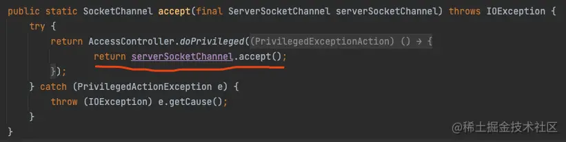
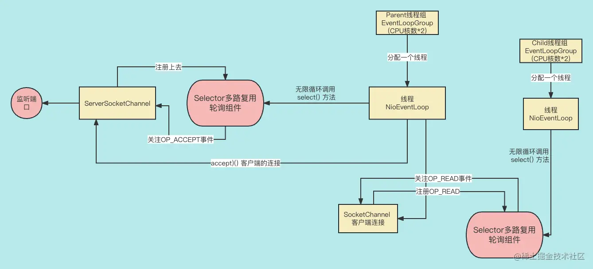

这节课，我们重点分析 Netty 中服务端是如何创建连接，这是网络通信的第一步。为了更深入地理解底层原理，我们会从源码分析中梳理服务端创建连接的过程。

## 为了接收连接请求， Netty 服务端应该做些什么事情？

根据前面 Java NIO 的学习，服务端在准备接收客户端连接之前做了下面几个工作，我们可以带着问题往下看。

- 服务端对连接请求是如何初始化的？
- 如何把用户定义的处理逻辑 childHandler 加入到 Netty 的处理流程里？
- 如何在 Socket 上绑定一个端口？
- 如何把请求连接的 OP_ACCEPT 事件（客户端请求连接的事件）注册到 Selector 上的？
- Netty 线程是如何轮询 ServerSocketChannel 的网络连接事件的？
- 对于客户端发来的连接请求，服务端是如何处理的？
- 连接成功建立后，如何读客户端发来的数据？

我们会根据 Netty 底层的源码来解析上面这几个部分是如何实现的，源码讲解时我们只讲解主线代码，只要能够理解 Netty 大体是如何实现上述功能就可以了，否则会影响大家的理解。具体旁支的代码大家有时间可以自己阅读。有问题可以在小册群里询问我。

## 服务端对连接请求是如何初始化的？

我们根据上节课 NettyServer 的代码讲起，首先我们先分析一下端口绑定的那行代码：


我们对 bind() 方法进行代码追踪，找到方法 doBind()：


initAndRegister() 功能是初始化 ServerSocketChannel，然后把对应的网络事件注册到 Selector 的方法，我们具体看看：

```scss
scss复制代码// 创建和初始化一个 ServerSocketChannel，并注册到 Selector 轮询复用组件上去。
final ChannelFuture initAndRegister() {
    Channel channel = null;
    try {
        // 通过工厂类获取 ServerSocketChannel
        channel = channelFactory.newChannel();
        // 初始化 ServerSocketChannel
        init(channel);
    } catch (Throwable t) {
        if (channel != null) {
            channel.unsafe().closeForcibly();
            return new DefaultChannelPromise(channel, GlobalEventExecutor.INSTANCE).setFailure(t);
        }

        return new DefaultChannelPromise(new FailedChannel(), GlobalEventExecutor.INSTANCE).setFailure(t);
    }
    // 拿出来之前创建的 EventLoopGroup, 然后把 Channel 注册到 EventLoopGroup上，目的是轮询各种 channel 上的网络事件，
    // 我们猜测是不是 让 EvetnLoopGroup 中的独立线程利用一个 Selector 来注册 Channel，并轮询网络事件。
    ChannelFuture regFuture = config().group().register(channel);
    if (regFuture.cause() != null) {
        if (channel.isRegistered()) {
            channel.close();
        } else {
            channel.unsafe().closeForcibly();
        }
    }
    return regFuture;
}
```

大家可以看到，通过 channelFactory.newChannel() 获得一个 Channel。这个 channelFactory 的实现类很多，这里用的是类 ReflectiveChannelFactory 来实现的，顾名思义是通过反射获得的 Channel。我们再验证下 ReflectiveChannelFactory 是如何给我们实例化 Channel 的。


可以看到果然是通过反射后得到的 ServerSocketChannel 的实例。

那么，工厂类是如何知道反射哪个 Channel 呢？这就要看我们上节课写的服务端的代码了。


大家可以看到，服务端用来接收请求的类是 NioServerSocketChannel。那么，这个类究竟有没有封装 ServerSocketChannel 呢？我们看 NioServerSocketChannel 的构造方法就可以了：


在这里，我们就真的找到了创建 ServerSocketChannel 实例的代码。也就是说，NioServerSocketChannel 是对 ServerSocketChannel 的封装。到这里，ServerSocketChannel 的实例化就成功了，接着我们看看对 ServerSocketChannel 做了哪些初始化的工作？


init(channel) 方法是对 ServerSocketChannel 的初始化。因为是服务端代码，对应的实现类就是 ServerBootstrap，再看它对 init(channel) 的具体实现：

```java
java复制代码void init(Channel channel) {
    // 对ServerSocketChannel 进行相关网络参数的指定。
    setChannelOptions(channel, newOptionsArray(), logger);
    // 初始化相关的一些属性
    setAttributes(channel, newAttributesArray());

    ChannelPipeline p = channel.pipeline();

    final EventLoopGroup currentChildGroup = childGroup;
    final ChannelHandler currentChildHandler = childHandler;
    final Entry<ChannelOption<?>, Object>[] currentChildOptions = newOptionsArray(childOptions);
    final Entry<AttributeKey<?>, Object>[] currentChildAttrs = newAttributesArray(childAttrs);

    // 第一个拦截器：对网络请求处理链路中加入一个自己内置的一个处理逻辑。初始化了网络请求的处理链路
    p.addLast(new ChannelInitializer<Channel>() {
        @Override
        public void initChannel(final Channel ch) {
            final ChannelPipeline pipeline = ch.pipeline();
            ChannelHandler handler = config.handler();
            if (handler != null) {
                // 第二个拦截器：
                pipeline.addLast(handler);
            }
            // 循环执行下面的任务
            ch.eventLoop().execute(new Runnable() {
                @Override
                public void run() {
                    // 第三个拦截器：加入设定的拦截器
                    pipeline.addLast(new ServerBootstrapAcceptor(
                            ch, currentChildGroup, currentChildHandler, currentChildOptions, currentChildAttrs));
                }
            });
        }
    });
}
```

大家可以看到，初始化了一些相关的网络参数，比如上节课 Netty Demo 中 Server 端代码的 SO_BACKLOG 属性。然后初始化一些相关属性。

最后一段重要的代码是在 Pipeline（拦截器链） 上加入第一个内置的拦截器；第二个拦截器是内部配置的拦截器；然后，通过 eventLoop() 循环处理连接请求，同时还实例化了第三个拦截器 ServerBootstrapAcceptor，然后把第三个拦截器放入拦截器链中，这个过程是启用了一个新的线程来完成的。ServerBootstrapAcceptor 的构造方法的参数包括用户设置的 channel（也就是 NioServerSocketChannel），以及用户设置的 childgroup 线程组，以及处理客户端连接的逻辑 childHandler，最后是一些配置和属性的参数。

初始化就结束了。

## 如何把用户定义的处理连接请求的逻辑加入到 Netty 里？

然后，进入了 ServerBootstrapAcceptor：


这里会看到第四个拦截器。其中，这**第四个拦截器才是真正的用户设置的拦截器**。随后还会有个监听器，用于拦截器链中所有的拦截器都执行完了以后，再做一些收尾工作。

这段逻辑包涵了 4 个拦截器的创建，比较复杂，给大家梳理一下：


现在，服务端连接的初始化已经完成了，但是还没有在 Selector 上注册相应的事件，接下来我们看看这个功能是如何实现的。

## 如何把请求连接的 OP_ACCEPT 事件（客户端请求连接的事件）注册到 Selector 上的？

我们看一下相应的源码：


注册网络接受连接请求的事件就在调用 register() 方法里了。


由于我们用的是线程组，这里的实现类是 MultithreadEventLoopGroup，其实这里面就是一组 EventLoop。EventLoop 本质上一个线程，每个 EventLoop 会对应一个 Selector。所以，EventLoop 是一个循序处理网络事件的线程。这里通过调用 next() 返回一个线程组里面的一个线程。

接着，我们追踪到 AbstractNioChannel 类中的 doRegister()方法中：


在这里，我们就能看到已经把 ServerSocketChannel 以及它对应的 OP_ACCEPT（OP_ACCEPT=0） 事件注册到 Selector 上了。

至此，我们已经把连接事件注册到了对应线程的 Selector 上。

## 给 ServerSocketChannel 绑定端口

我们回到上节课的 Demo，从 bind() 方法开始看：


这里就已经把端口绑定到 socket 上了，就不继续深究内部的代码了。

至此，服务端创建连接的准备工作都分析完了。

## Netty 线程是如何轮询 ServerSocketChannel 的网络连接事件的？

首先，我们看看 NioEventLoopGroup 的父类 MultithreadEventLoopGroup 的构造方法：

```scss
scss复制代码static {
    // 默认的线程数为 CPU 核数的两倍
    DEFAULT_EVENT_LOOP_THREADS = Math.max(1, SystemPropertyUtil.getInt(
            "io.netty.eventLoopThreads", NettyRuntime.availableProcessors() * 2));

    if (logger.isDebugEnabled()) {
        logger.debug("-Dio.netty.eventLoopThreads: {}", DEFAULT_EVENT_LOOP_THREADS);
    }
}

protected MultithreadEventLoopGroup(int nThreads, Executor executor, Object... args) {
    // 设定线程数
    super(nThreads == 0 ? DEFAULT_EVENT_LOOP_THREADS : nThreads, executor, args);
}
```

MultithreadEventLoopGroup 是一个多线程集合，如果你不设置线程数的话。默认线程数是 CPU 的核数*2。


当要增加一个线程时，调用的是 newChild() 方法，我们再看看里面做了什么：


我们可以看到，线程组里面的元素是 NioEventLoop 类。


很明显，这是一个单线程的线程池。

然后，我们代码跟踪，可以看到往 Selector 里注册网络事件。

```csharp
csharp复制代码private void register0(SelectableChannel ch, int interestOps, NioTask<?> task) {
    try {
        // 注册网络事件
        ch.register(unwrappedSelector, interestOps, task);
    } catch (Exception e) {
        throw new EventLoopException("failed to register a channel", e);
    }
}
```

这里注册的是 OP_ACCEPT 网络事件。

那么，这个线程是在哪里轮询网络事件的呢？这就要找到线程的 run() 方法了。

```csharp
csharp复制代码protected void run() {
    int selectCnt = 0;
    for (;;) {
        try {
            int strategy;
            try {
                strategy = selectStrategy.calculateStrategy(selectNowSupplier, hasTasks());
                switch (strategy) {
                case SelectStrategy.CONTINUE:
                    continue;

                case SelectStrategy.BUSY_WAIT:

                // 通过轮询的方式不断尝试监听新的网络事件
                case SelectStrategy.SELECT:
                    // 设定每次轮询的间隔时间
                    long curDeadlineNanos = nextScheduledTaskDeadlineNanos();
                    if (curDeadlineNanos == -1L) {
                        curDeadlineNanos = NONE; // nothing on the calendar
                    }
                    nextWakeupNanos.set(curDeadlineNanos);
                    try {
                        if (!hasTasks()) {
                            // 真正的尝试轮询新的网络事件
                            strategy = select(curDeadlineNanos);
                        }
                    } finally {
                        nextWakeupNanos.lazySet(AWAKE);
                    }
                    // fall through
                default:
                }
```

通过`for(;;)`死循环来不断尝试发现新的网络事件，如果有就返回。但有个轮询间隔时间来控制执行频率：

```csharp
csharp复制代码private int select(long deadlineNanos) throws IOException {
    if (deadlineNanos == NONE) {
        // 轮询网络事件
        return selector.select();
    }
    long timeoutMillis = deadlineToDelayNanos(deadlineNanos + 995000L) / 1000000L;
    return timeoutMillis <= 0 ? selector.selectNow() : selector.select(timeoutMillis);
}
```

这里是真正地使用 Java NIO 的 select() 来轮询网络事件。

至此，如果有客户端发起连接的请求，我们的服务端就可以创建连接了。

## 对于客户端发来的连接请求，服务端是如何处理的？

服务端收到客户端的连接请求后，会做些什么呢？我们还是回到 NioEventLoop 类中的 run() 方法，调用 select() 方法后，会调用下面的方法：


这个方法就是处理网络事件集合的：


轮询网络事件集合中所有的事件，并对事件进行处理，直到事件集合里的事件都轮询完了。好，我们看下对单一的事件是怎么处理的：

```scss
scss复制代码private void processSelectedKey(SelectionKey k, AbstractNioChannel ch) {
    final AbstractNioChannel.NioUnsafe unsafe = ch.unsafe();
    if (!k.isValid()) {
        final EventLoop eventLoop;
        try {
            eventLoop = ch.eventLoop();
        } catch (Throwable ignored) {
            return;
        }
        if (eventLoop == this) {
            // close the channel if the key is not valid anymore
            unsafe.close(unsafe.voidPromise());
        }
        return;
    }

    try {
        int readyOps = k.readyOps();

        if ((readyOps & SelectionKey.OP_CONNECT) != 0) {
            int ops = k.interestOps();
            ops &= ~SelectionKey.OP_CONNECT;
            k.interestOps(ops);

            unsafe.finishConnect();
        }

        if ((readyOps & SelectionKey.OP_WRITE) != 0) {
            // Call forceFlush which will also take care of clear the OP_WRITE once there is nothing left to write
           unsafe.forceFlush();
        }

        // 对连接的处理
        if ((readyOps & (SelectionKey.OP_READ | SelectionKey.OP_ACCEPT)) != 0 || readyOps == 0) {
            unsafe.read();
        }
    } catch (CancelledKeyException ignored) {
        unsafe.close(unsafe.voidPromise());
    }
}
```

这个方法用来处理所有的网络事件，我们只要关心最后的对连接的处理就可以了，用到的方法是 unsafe.read()，方法的实现类是 AbstractNioMessageChannel。


方法 doReadMessages() 的目的主要是把新建立的连接放入 List 集合里，这个方法如下：

```java
java复制代码protected int doReadMessages(List<Object> buf) throws Exception {
    // 跟客户端建立连接，获取到对应的 Channel
    SocketChannel ch = SocketUtils.accept(javaChannel());

    try {
        if (ch != null) {
            // 把创建好的连接放入一个 List 里面。
            buf.add(new NioSocketChannel(this, ch));
            return 1;
        }
    } catch (Throwable t) {
        logger.warn("Failed to create a new channel from an accepted socket.", t);

        try {
            ch.close();
        } catch (Throwable t2) {
            logger.warn("Failed to close a socket.", t2);
        }
    }

    return 0;
}
```

大家可以看到调用了底层的工具的方法：SocketUtils.accept(javaChannel())。目的就是建立连接。



大家可以看到调用了底层 NIO 的 serverSocketChannel 的 accept()方法，实现了连接的建立。

至此，连接就建立成功了。

但是，建立完连接就可以不用管了吗？不是的，因为连接建立成功后，我们要把新建立的 SocketChannel 的读事件注册到对应线程的 Selector 上，这样才能收到客户端的数据，这个工作是怎么做到的呢？

上节课在大家讲**第三个拦截器**的时候，涉及到了类 ServerBootstrapAcceptor，其实它的主要任务是把连接的网络读事件注册到 Selector 上：


大家可以看到，childGroup 是我们在 Demo 中设置的子线程组，专门负责读写事件的注册的。childGroup 首先会拿出一个线程给这个 channel 使用，然后通过 register 方法来把 channel 的读事件注册到这个线程对应的 Selector 上。

## 服务端创建连接的流程

下面用一个流程图来总结下，Netty 服务端连接的建立流程：



## 总结

这节课，给大家讲解了服务端是如何建立连接的。

首先，给大家讲解了连接的初始化，包括 ServerSocketChannel 的实例化和初始化。然后，给大家讲解了用户自定义的 Handler 是如何加到 Netty 里的，同时给大家介绍了四个拦截器。

接着，又给大家讲解了 ServerSocketChannel 是如何关注 OP_ACCEPT 事件的，以及对应的 Parent 线程是如何轮询 OP_ACCEPT 网络事件的。

最后，给大家讲解了连接是如何创建的，以及创建成功后是如何用 Child 线程关注 OP_READ 网络事件以及轮询网络读事件的。