上节课，我们已经分析完了服务端和客户端连接的建立过程。这节课，我们讲解连接完成后，客户端和服务端是如何相互读写数据的。

一般情况下，连接建立后，客户端首先会向服务端发送请求。

## 连接成功建立后，客户端是如何向服务端发送请求的？

由于内部源码的调用过于复杂，我们只分析有代表性的代码。在 AbstractChannel 类中我们可以看到：

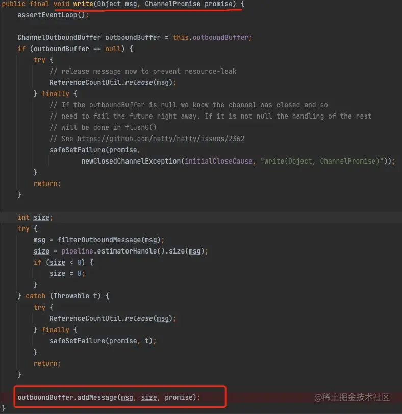

wirte() 方法最后会把发送的数据 msg 放入 addMessage() 方法中，这个方法是做什么的呢？

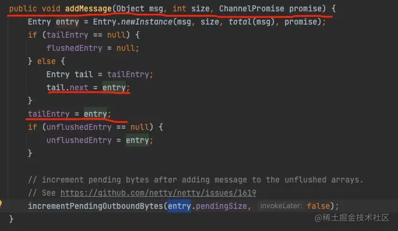

原来把要发送数据放入一个`缓冲链表`中，当要发送一个新的数据时，并不是直接把数据发送出去，而是会把这个数据放入一个叫做 unflushedEntry 缓冲链表的尾部，等待发送。

那么，真正发送时，肯定是要把发送数据从`缓冲链表中`拿出来的，我们再往下看。

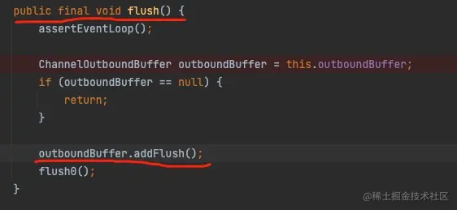

flush() 方法中的 outboundBuffer.addFlush() 才是从缓冲链表中读取数据请求的地方。

类 NioSocketChannel：

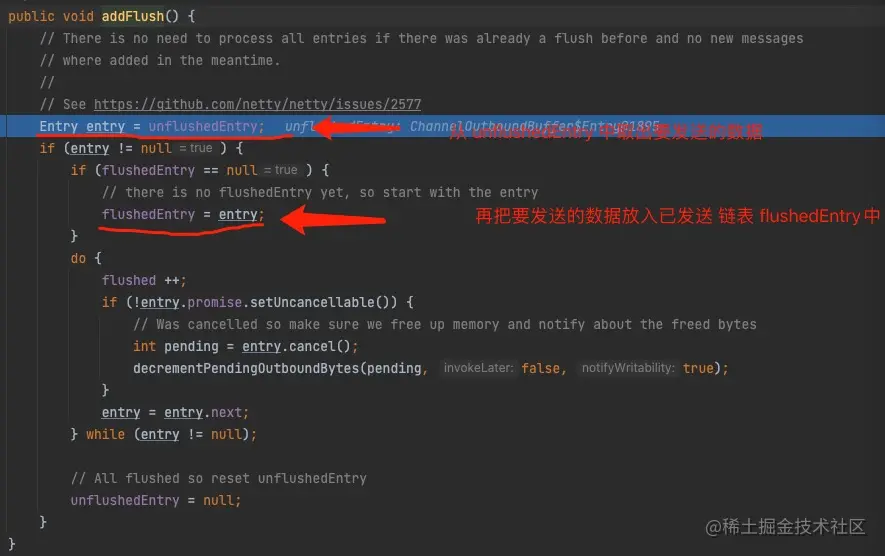

大家可以看到 addFlush() 方法会从 unflushedEntry 里面取出请求数据，然后再把请求数据放入 flushedEntry 缓冲链表里。也就是说，发送数据时需要`两个链表缓冲`来支撑。

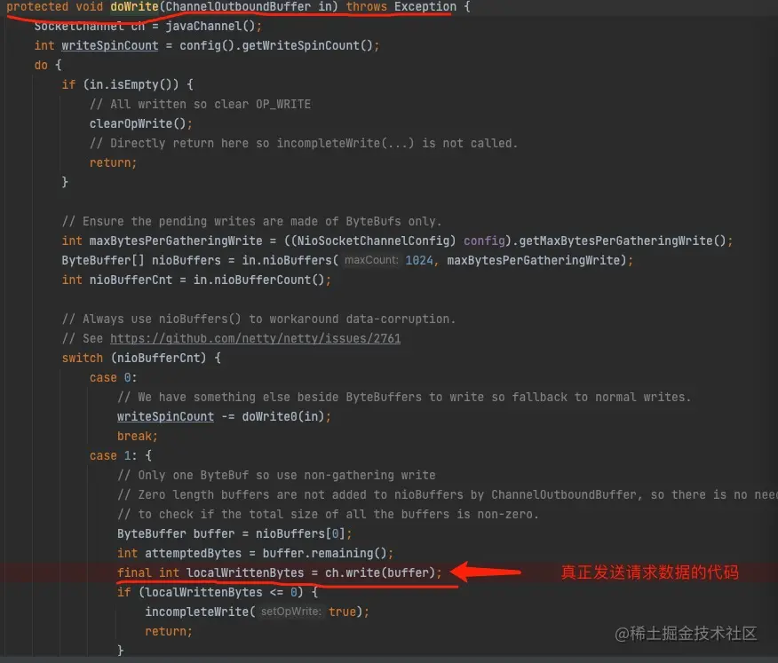

最后一步就简单了，其实就是调用 Java NIO 底层写数据的操作。

好了，我们通过流程图再回顾一下以上流程：

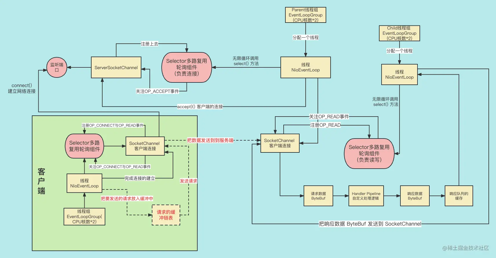

大家只看跟上述流程相关的左下脚的`红字和虚线`。客户端把要发送的请求数据放入一个缓冲链表，然后拿到缓冲列表的元素来做具体的数据发送。

## Netty 客户端是如何接收服务端发来的响应的

我们还是跟踪相关的代码：

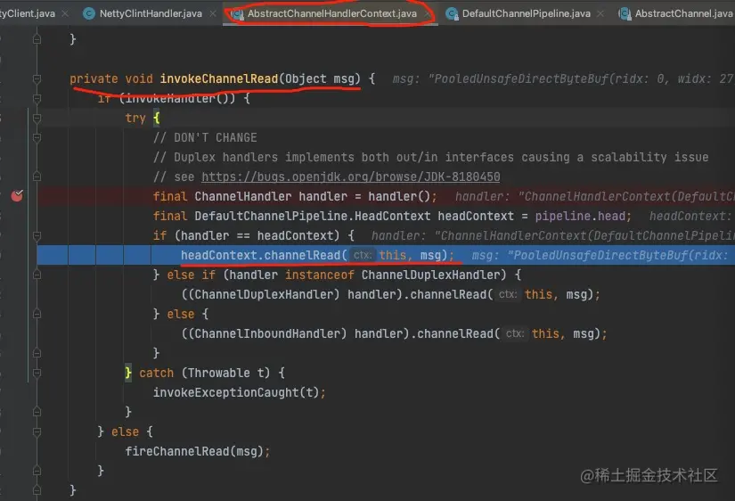

走到这步其实就是调用我们在 demo 中自己定义的处理读的逻辑，代码如下：

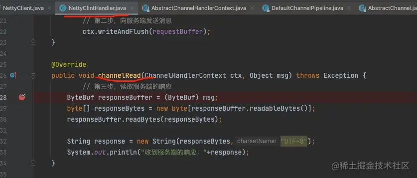

好了，我们通过流程图再回顾一下以上流程：

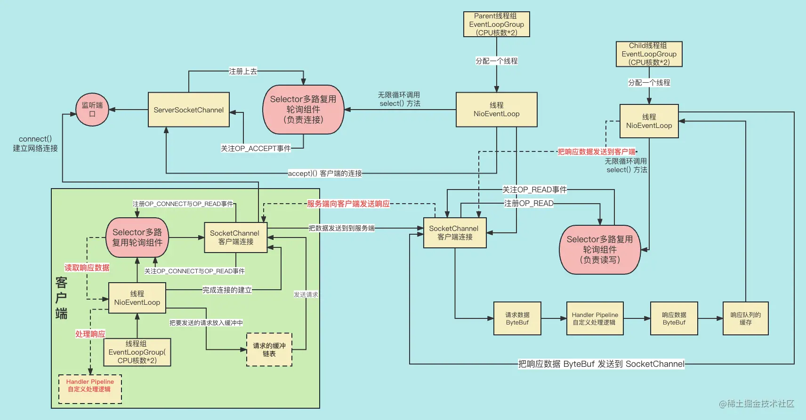

大家只看跟上述流程`相关红字和虚线`。首先，服务端通过线程 NioEventLoop 把响应数据放入 SocketChannel 中，并发送给客户端。客户端线程 NioEventLoop 对应的 Selector 监听到 OP_READ 事件后，客户端对应的 NioEventLoop 会把响应数据读出来，然后再调用用户自己定义好的处理逻辑来处理读出来的数据。

## Netty 工作流程及设计思想简介

Netty 的整个流程都给大家详细地介绍完了。接下来给大家介绍一下 Netty 的工作流程及设计思想。首先给大家讲解一下 Netty 工作流程。

### Netty 工作流程图

前面已经给大家详细地画了 Netty 处理网络事件的流程图。但是这些图比较详细复杂，不利于同学们理解 Netty 内部组件的工作机制。所以，给大家画了个能够更好体现的 Netty 工作机制的流程图，如下：

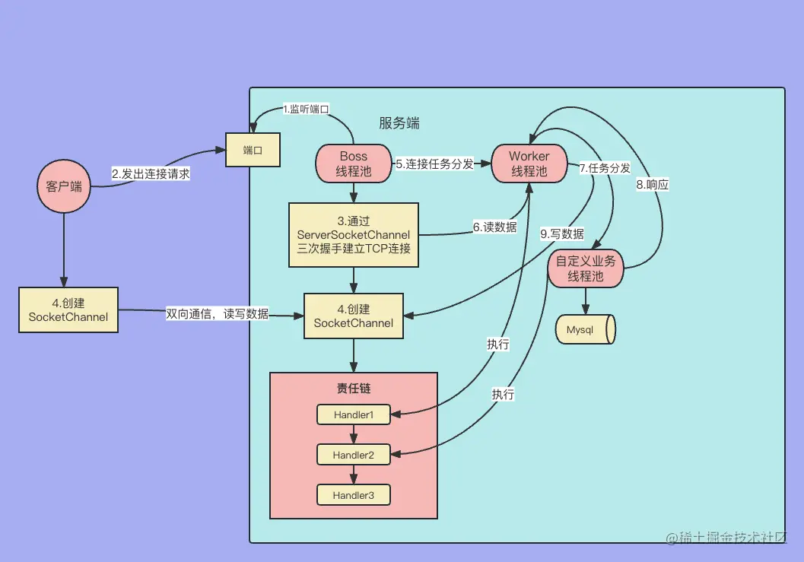

分为如下几步：

1. 服务端对外暴露端口，供客户端连接。
2. 客户端向服务端对应的接口发出连接的请求。
3. 服务端收到客户端的连接请求后，Boss 线程池会用一个线程去利用 ServerSocketChannel 完成三次握手，从而连接建立。
4. 建立完连接后再创建一个 SocketChannel 实例，这个 SocketChannel 实例就代表这个客户端和服务端的连接，以后所有的读写操作都会发生在这个 SocketChannel 实例里。
5. 连接建立后，把连接分配给 Worker 线程池中的一个线程，同时会把这个 SocketChannel 上的读事件注册到线程中的 Selector 上。
6. 当客户端向服务端发送数据后，Worker 线程中的 selector 会监听到读事件，然后 Worker 线程把数据读出来。
7. Worker 线程把读出来的数据交给自定义业务线程池中的一个线程处理业务逻辑。
8. 业务逻辑处理完后，业务线程把响应返还给 Worker 线程。
9. 最终，worker 线程把响应写入 SocketChannel 进而把响应发给客户端。

这里的 Boss 线程池和 Worker 线程池都是我们实例化的 EventLoopGroup，即`事件轮询组`。事件轮询组是来轮询处理网络事件的一组线程，不同的事件轮询组处理的网络事件有可能不同，比如 Boss 线程池专门用来`处理连接事件`的，而 worker 线程池是专门`处理读写事件`的。

也就是说，我们在 Netty 编程里，应该有三种线程。

- Boss 线程：`负责实现 TCP 三次握手`，实现客户端和服务端的连接，并把创建好的连接交给 worker 线程。
- Worker 线程：`监听读写事件`，并实现网络读写的线程，一个线程可以负责多个连接上的读写。
- 自定义业务线程：主要工作是`非网络 IO 的工作`，比如数据的编码、解码、业务逻辑处理、访问数据库，等等。

下面给大家讲解 Netty 编程时两个重要的参数 LogBack 和 KeepAlive，先看看这两参数是在哪里配置的：

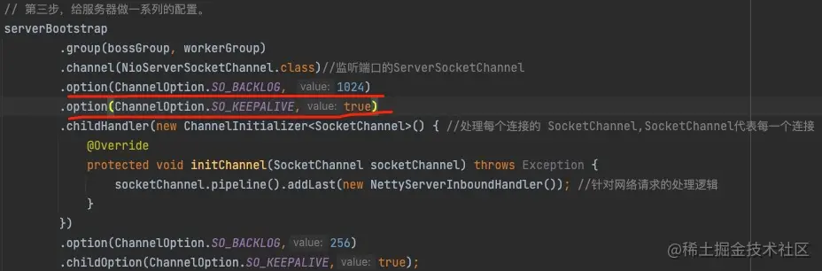

#### LogBack

要想讲清楚 LogBack 这个参数，我们需要重温 TCP 连接三次握手，如下图所示：

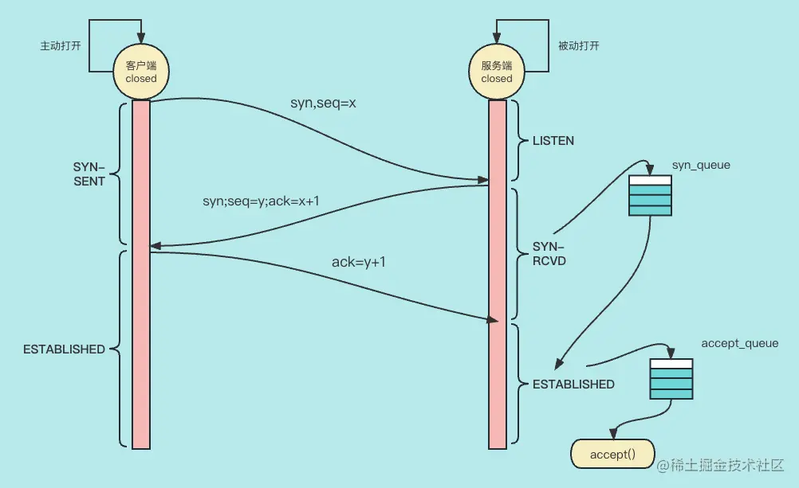

我给大家解释一下执行步骤：

1. 客户端初始状态为 Closed，这时客户端会给服务端发送 syn 请求来告知服务端有 TCP 连接请求，并把客户端的状态改为 SYN-SENT。
2. 服务端收到客户端发来的 syn 请求后，向客户端发送包含 syn 和 ack 的数据包，syn 表示服务端也要发起连接，ack 是确认已收到客户端发来的 syn 请求，并把服务端的状态改为 SYN-RCVD，服务端会认为这时是半连接，并把半连接放入 syn_queue 库中。
3. 客户端收到服务端的 ack 确认后，会把自己的状态改为 ESTABLISHED，然后向服务端发送 ack 确认数据包。
4. 服务端收到 ack 确认后，这时服务端任务连接建立成功了，于是把 `syn_queue` 库中对应的半连接拿出来放入 accept_queue 中，这时执行 accept() 方法，成功后把连接从 `accept_queue` 库中删除。

LogBack 这个参数会`影响到 accept_queue 里连接数量`，accept_queue 表示的是已经建立好但还没有被上层代码获取连接数。也就是说，这个连接数不能太多，太多了会影响性能。

#### KeepAlive 参数的解释

接下来，我们来看一下 KeepAlive 参数是用来做什么用的。

其实，这是个**保活参数**，当 TCP 的两端长期没有数据交互的时候，有可能对方已经挂了，于是活着的一端会向另一端尝试发送 KeepAlive 保活请求，如果有 ACK，那么我们认为连接正常；如果没有，我们就认为连接断了，并关闭还存活的这一端的 socket，这样能够节省系统的 TCP 连接资源。

但是，Netty 默认并没有打开 KeepAlive，这是为什么呢？主要有下面几个原因：

1. 有时候会出现短暂的连接故障，而`探活会把连接误杀`。
2. 如果一个设备有大量的 TCP 连接，但是不活跃的 TCP 连接特别多的话，探活请求就会`浪费大量的带宽`。

> `TCP 的 KeepAlive` 和 `HTTP 的 Keep-Alive` 是什么关系?
>
> 答案是`没有任何关系`。HTTP 的 Keep-Alive 设置为 true 后表示一个请求响应过后，HTTP 不会关闭 TCP 连接，这个 TCP 连接会被后面的请求响应复用。而 TCP 的 KeepAlive 则是前面说的 TCP 探活。

## 总结

这节课给大家讲解了连接成功建立后，客户端是如何向服务端发送请求的，以及 Netty 客户端是如何接收服务端发来的响应的。给大家讲解完流程后，又给大家简单介绍了 Netty 的设计思想，包括 Netty 流程图。最后，给大家讲解了两个 Netty 上重要的参数 LogBack 与 KeepAlive。