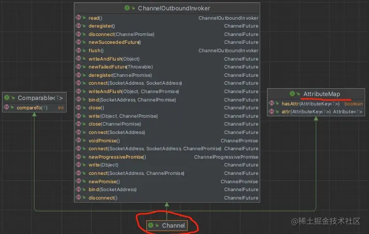
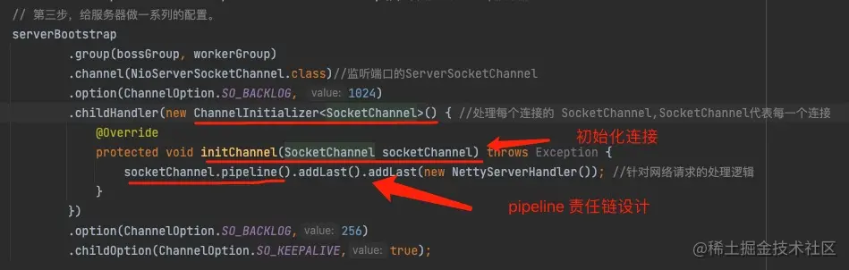
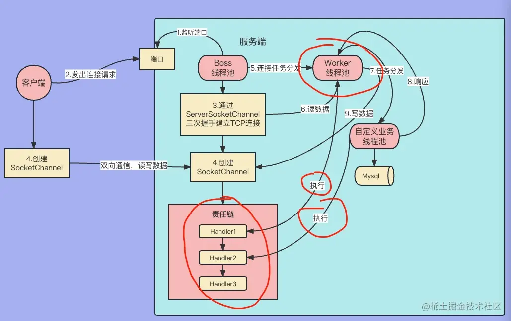
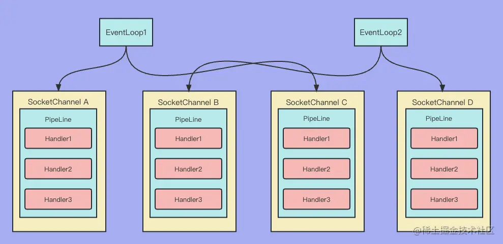
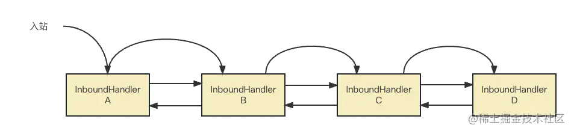
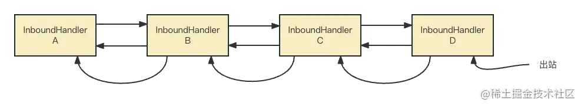
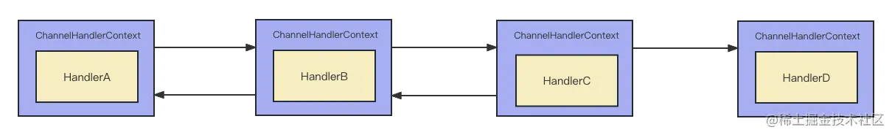
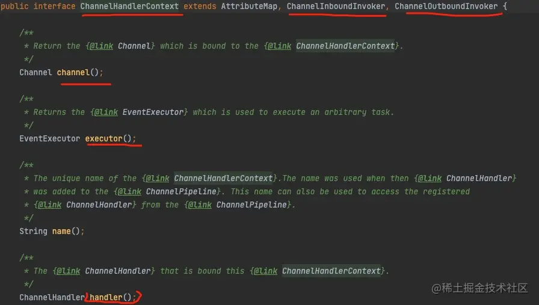
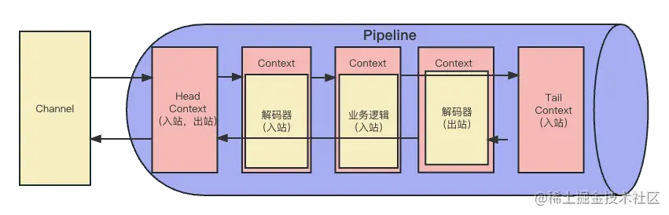

前面的几节课都涉及到了 Netty 自定义的 Channel 和 Netty 的处理事件的流水线 Pipeline。但是并没有给大家深入讲解，这节课，我重点讲解这两个部分。

首先，我们学习 Netty 自定义的 Channel。

## Netty 自定义 Channel

既然 NIO 已经有了 SocketChannel，那么为什么 Netty 还要自定义一个 Channel 接口呢？主要有下面几个原因：

1. NIO 对于 Channel 没有统一的接口，只有 SocketChannel 和 SeverSocketChannel 这两个类，因此用户无法把这两个类统一起来实现。
2. Netty 的 Pipeline、EventLoop 以及负责处理网络 IO 事件的功能都要整合到 Channel 里，显然 NIO 里的 Channel 无法满足。
3. 自定义 Channel 接口更加灵活。

现在我们看看 Channel 源码里都做了什么事情：



从上图我们可以看到，Channel 接口里主要封装了所有的网络事件，同时继承了 AttributeMap，这个接口主要是保存连接的一些属性。

Channel 的实现类里最重要的是抽象类 AbstractChannel。我们先看一下它的构造方法：

```ini
ini复制代码protected AbstractChannel(Channel parent) {
    this.parent = parent;
    id = newId();
    // 实际完成 网络IO 操作的对象
    unsafe = newUnsafe();
    // 新建一个 对应的 pipeline
    pipeline = newChannelPipeline();
}
```

大家可以看到，首先分配了一个 ChannelId，然后又创建了一个处理网络读写和网络连接的对象 unsafe，最后创建了一个 Pipeline，也就是说 unsafe 和 Pipeline 是 Channel 里的组件。同时，这类实现了接口 Channel 里的方法。

有了 Channel 就可以处理各种网络事件了，那么具体如何处理这些网络事件呢？Netty的设计是把这些网络事件交给 Handler 来处理。因此，接下来，我们再来讲一下另一个相关的组件 Handler。

## Hanlder

Handler 是用来处理网络事件的类，网络事件有多种，我们先看一下事件的执行顺序。为此，我写了一个例子，如下：

```java
java复制代码public class HandlerLifeCycle implements
        ChannelInboundHandler {

    @Override
    public void handlerAdded(ChannelHandlerContext ctx) throws Exception {
        System.out.println("调用：handlerAdd");
    }
    @Override
    public void channelRegistered(ChannelHandlerContext ctx) throws Exception {
        System.out.println("调用：channelRegistered");
    }

    @Override
    public void channelUnregistered(ChannelHandlerContext ctx) throws Exception {
        System.out.println("调用：channelUnregistered");
    }

    @Override
    public void channelActive(ChannelHandlerContext ctx) throws Exception {
        System.out.println("调用：channelActive");
    }

    @Override
    public void channelInactive(ChannelHandlerContext ctx) throws Exception {
        System.out.println("调用：channelInactive");
    }

    @Override
    public void channelRead(ChannelHandlerContext ctx, Object msg) throws Exception {
        System.out.println("调用：channelRead");
    }

    @Override
    public void channelReadComplete(ChannelHandlerContext ctx) throws Exception {
        System.out.println("调用：channelReadComplete");

    }

    @Override
    public void userEventTriggered(ChannelHandlerContext ctx, Object evt) throws Exception {
        System.out.println("调用：userEventTriggered");

    }

    @Override
    public void channelWritabilityChanged(ChannelHandlerContext ctx) throws Exception {
        System.out.println("调用：channelWritabilityChanged");
    }

    @Override
    public void exceptionCaught(ChannelHandlerContext ctx, Throwable cause) throws Exception {
        System.out.println("调用：exceptionCaught");
    }

    @Override
    public void handlerRemoved(ChannelHandlerContext ctx) throws Exception {
        System.out.println("调用：handlerRemoved");
    }
}
```

**执行顺序如下：**

- 调用：handlerAdd
- 调用：channelRegistered
- 调用：channelActive
- 调用：channelRead
- 调用：channelReadComplete
- 调用：channelInactive
- 调用：channelUnregistered
- 调用：handlerRemoved

我给大家按执行顺序介绍一下这每个方法的含义。

1. handlerAdd：这个方法在 Handler 对象加载到 Pipeline 的时候，这个方法就会被回调。
2. channelRegistered：把 Channel 对象注册到 EventLoop上时，这个方法就会被回调。
3. channelActive：通道被激活的时候，也就是 TCP 连接建立成功时，这个方法就会被回调。
4. channelRead：读到了对方发来的数据时，这个方法就会被回调。
5. channelReadComplete：读完对方发来的数据时，这个方法就会被回调。
6. channelInactive：当连接发生问题，比如连接的另一方挂了，这个方法就会被回调。
7. channelUnregisgtered：当 Channel 从 EventLoop 上被取消注册时，这个方法就会被回调。
8. handlerRemoved：当 Handler从 Pipeline 中删除，这个方法就会被回调。

## Pipeline

`责任链设计模式`是我们常用的一种设计模式，我们可以采用`链式调用`的方式实现一系列复杂的处理。我们对每个 Handler 定义为特定的功能，然后按一定顺序进行装配，使用的时候再按既定的顺序进行调用。有下列几个优势：

1. 解耦。比起把所有功能都放入一个逻辑里，每一个 Handler 只包含了一个特定功能会大大降低耦合性。
2. 灵活。在代码运行时，我们随时可以从责任链增加或减少 Handler，从而灵活度提升了。

Netty 也有对应的机制，Netty 通过 Pipeline 中一系列的 Handler 去处理网络事件，比如当服务端读到客户端发送的数据时，我们首先要解码，然后检验数据是否合法、在做业务处理等，如果都放到一个逻辑里面势必会造成各种耦合。因此，Netty 提供了一个 Pipeline 组件通过一个责任链把多个有各自功能的 Handler 串联在一起，执行的时候依次执行。

我们 Netty 程序的 demo 中就有体现了，如下图所示：



大家可以看到 childHanler 方法内 new 了一个对象，这个对象是 `ChannelInitializer<SocketChannel>`，这个对象是用来初始化一个建立好的连接（SocketChannel）。这个类里面需要重载一个方法 initChannel(SocketChannel socketChannel)，这个方法里面就用了责任链的设计。这个责任链的作用是对连接上可能出现的网络事件进行链式处理，具体实现是不断地向责任链装载用来处理网络事件的 Handler，可以装载多个 Handler，让这些 Handler 形成一个`有序的责任链`。当出现网络事件的时候，就会自动调用这个责任链来处理网络事件。

职责链中的 Handler 按事件类型分为两类。

1. inboundHandler `入站事件`：表示是`由底层 IO 事件激活`的然后进入到 Netty 责任链里，所以也就叫入站事件，主要包括读事件、读完成事件、注册事件、解除注册事件、活跃事件、非活跃事件等等。
2. outboundHandler `出站事件`：主要是用户自己主动激活的事件，因为是 Netty 责任链里代码`主动激活`的，也就是说从责任链里出去，所以叫出站事件，包括端口绑定事件、连接事件、写事件等这些写代码的程序员主动驱动的事件。

那么，是由什么线程执行责任链里的 Handler 呢？其实方式很多，如下图所示：



大家可以看到 Worker 线程池可以执行 Handler，`自定义的线程池`也可以执行 Handler。大家看看有多少重载的 addLast() 方法：

```scss
scss复制代码ChannelPipeline addLast(String name, ChannelHandler handler);

ChannelPipeline addLast(EventExecutorGroup group, String name, ChannelHandler handler);

ChannelPipeline addLast(ChannelHandler... handlers);

ChannelPipeline addLast(EventExecutorGroup group, ChannelHandler... handlers);
    
```

大家可以看到 addLast() 方法不仅可以直接添加 Handler，而且可以通过线程池参数 EventExecutorGroup `自定义的线程池`来异步跑 handler 逻辑。这样做的好处是`解耦`，避免某一个 Handler 由于长时间阻塞而拖延了整体 pipeline 的执行。

现在看一下 EventLoop、SocketChannel、PipeLine 的关系：



- 一个 EventLoop 可以`监听和管理多个连接`（SocketChannel）。
- 一个 SocketChannel 对应`一个 PineLine`。
- 一个 PineLine 里面有多个 Handler 来处理各种网络事件。

### PipeLine 内 Hander 的执行顺序

搞明白 Pipleline 中 Handler 的执行顺序是很重要的，我们先看一下 Pipeline 入站 Handler 的执行顺序是怎样的。

```scala
scala复制代码public class PipeLineOrder {

    public static void main(String[] args) {
        ChannelInitializer channelInitializer = new ChannelInitializer() {
            @Override
            protected void initChannel(Channel ch) throws Exception {
                ch.pipeline().addLast(new InboundHandlerA());
                ch.pipeline().addLast(new InboundHandlerB());
                ch.pipeline().addLast(new InboundHandlerC());
                ch.pipeline().addLast(new InboundHandlerD());
            }
        };

        EmbeddedChannel channel = new EmbeddedChannel(channelInitializer);
        ByteBuf byteBuf = Unpooled.buffer();
        byteBuf.writeInt(10);
        channel.writeInbound(byteBuf);
    }

    static class InboundHandlerA extends ChannelInboundHandlerAdapter{
        @Override
        public void channelRead(ChannelHandlerContext ctx, Object msg) throws Exception {
            System.out.println("回调：InboundHandlerA");
            super.channelRead(ctx, msg);
        }
    }

    static class InboundHandlerB extends ChannelInboundHandlerAdapter{
        @Override
        public void channelRead(ChannelHandlerContext ctx, Object msg) throws Exception {
            System.out.println("回调：InboundHandlerB");
            super.channelRead(ctx, msg);
        }
    }

    static class InboundHandlerC extends ChannelInboundHandlerAdapter{
        @Override
        public void channelRead(ChannelHandlerContext ctx, Object msg) throws Exception {
            System.out.println("回调：InboundHandlerC");
            super.channelRead(ctx, msg);
        }
    }

    static class InboundHandlerD extends ChannelInboundHandlerAdapter{
        @Override
        public void channelRead(ChannelHandlerContext ctx, Object msg) throws Exception {
            System.out.println("回调：InboundHandlerD");
            super.channelRead(ctx, msg);
        }
    }
}
```

**执行结果：**

- 回调：InboundHandlerA
- 回调：InboundHandlerB
- 回调：InboundHandlerC
- 回调：InboundHandlerD

我们可以看到，对于入站的 Handler 来说回调次序完全是按照 Handler 加入 Pipeline 的先后顺序进行的。



接下来，我们再看看出站的 Handler 在 Pipeline 中的调用顺序：

```scala
scala复制代码public class PipeLineOutboundOrder {

    public static void main(String[] args) {
        ChannelInitializer channelInitializer = new ChannelInitializer() {
            @Override
            protected void initChannel(Channel ch) throws Exception {
                ch.pipeline().addLast(new OutboundHandlerA());
                ch.pipeline().addLast(new OutboundHandlerB());
                ch.pipeline().addLast(new OutboundHandlerC());
                ch.pipeline().addLast(new OutboundHandlerD());
            }
        };

        EmbeddedChannel channel = new EmbeddedChannel(channelInitializer);
        ByteBuf byteBuf = Unpooled.buffer();
        byteBuf.writeInt(10);
        channel.writeOutbound(byteBuf);
    }

    static class OutboundHandlerA extends ChannelOutboundHandlerAdapter {
        @Override
        public void write(ChannelHandlerContext ctx, Object msg, ChannelPromise promise) throws Exception {
            System.out.println("回调：OutboundHandlerA");

            super.write(ctx, msg, promise);
        }
    }

    static class OutboundHandlerB extends ChannelOutboundHandlerAdapter{
        @Override
        public void write(ChannelHandlerContext ctx, Object msg, ChannelPromise promise) throws Exception {
            System.out.println("回调：OutboundHandlerB");

            super.write(ctx, msg, promise);
        }
    }

    static class OutboundHandlerC extends ChannelOutboundHandlerAdapter{
        @Override
        public void write(ChannelHandlerContext ctx, Object msg, ChannelPromise promise) throws Exception {
            System.out.println("回调：OutboundHandlerC");

            super.write(ctx, msg, promise);
        }
    }

    static class OutboundHandlerD extends ChannelOutboundHandlerAdapter{
        @Override
        public void write(ChannelHandlerContext ctx, Object msg, ChannelPromise promise) throws Exception {
            System.out.println("回调：OutboundHandlerD");

            super.write(ctx, msg, promise);
        }
    }
}
```

**运行结果：**

- 回调：OutboundHandlerD
- 回调：OutboundHandlerC
- 回调：OutboundHandlerB
- 回调：OutboundHandlerA

可见，执行顺序是从后往前执行的。



## ChannelHandlerContext

Handler 是无状态的，所以能够更好地和其他业务解耦。但是 Pipeline 整体是有状态的，组件 ChannelHandlerContext 实现了 Pipeline 的状态化，下图描述了 Handler、ChannelHandler 和 ChannelHandlerContext 的关系：



也就是说，Handler 加入 Pipeline 后，会被一个 ChannelHandlerContext 包裹使之有状态，但 Handler 本身是无状态的。那么，ChannelHandlerContext 有什么功能呢？

- 可以获取上下文的 Channnel、eventLoop，对应的 Pipeline 等组件资源。
- 可以调用出站入站的方法，用于事件在不同的 Handler 之间传播。

我们再来看一下 ChannelHandlerContext 的相关源码，这样会更直观些。



大家可以看到接口 ChannelHandlerContext 继承了入站调用器和出站调用器，里面分别定义了出站和入站的事件传播方法。

### HeadContext 和 TailContext

在 Channel 初始化的时候，Netty 会默认给我加上两个 Context，分别是 Head Context 和 Tail Context，这两个 Context 分别在 Pipeline 的头部和尾部。我们自定义的 Context 都在 Head Context 和 Tail Context 之间。无论出入站都会执行 Head Context，只是入站时第一个回调的就是 Head Context，出站时最后回调的一个才是 Head Context。而 Tail Context 只会在入站的最后一步才被回调。



### 事件在 Pipeline 是如何传播的？

在 Pipeline 中事件的传播方式可以从 DefaultChannelPipeline 中看出：

```kotlin
kotlin复制代码// 入站方法 read()
@Override
public final ChannelPipeline read() {
    // 从头部往尾部传
    tail.read();
    return this;
}

// 出站方法 write()
@Override
public final ChannelFuture write(Object msg) {
    // 从尾部往头部传
    return tail.write(msg);
}
    
```

从代码中我们可以看出，执行入站方法时，入站事件 read() 从 Pipeline 的头部往尾部传；执行出站方法时，出站事件 write() 从 Pipeline 的尾部往头部传。

无论是入站 Handler，还是出站 Handler，要想执行下一个必须要调用相应的事件传播方法，事件传播方法都在接口 ChannelHandlerContext 里。

- 对于入站 Hander 来说，如果要实现事件的传播，需要调用 `fireIN\_EVT()`，就是由远程端控制的方法，也就是不由我们程序员主动激活的方法，如：请求连接，读方法等。
- 对于出站 Hander 来说，如果需要事件的传播，调用 `fireOUT\_EVT()`，也就是由我们程序员主动激活的方法，如：写，关闭连接等。入站 Handler 传播方法在 ChannelInboundInvoker 里定义：

```csharp
csharp复制代码                // 把 channel 注册到 eventloop上
                ChannelHandlerContext#fireChannelRegistered()}
                // 连接成功
                ChannelHandlerContext#fireChannelActive()}
                // 网络读
                ChannelHandlerContext#fireChannelRead(Object)}
                // 网络读结束
                ChannelHandlerContext#fireChannelReadComplete()}
                // 异常捕获
                ChannelHandlerContext#fireExceptionCaught(Throwable)
                // Channel 上收到一个用户定义的 Event 
                ChannelHandlerContext#fireUserEventTriggered(Object)}
                ChannelHandlerContext#fireChannelWritabilityChanged()}
                ChannelHandlerContext#fireChannelInactive()}
                // 在 Evenloop上取消注册某个 Channel。
                ChannelHandlerContext#fireChannelUnregistered()}
```

出站 Handler 传播方法在 ChannelOutboundInvoker 里定义：

```arduino
arduino复制代码
            // 绑定端口
            ChannelHandlerContext#bind(SocketAddress, ChannelPromise)
            // 连接
            ChannelHandlerContext#connect(SocketAddress, SocketAddress, ChannelPromise)
            // 网络写
            ChannelHandlerContext#write(Object, ChannelPromise)
            // 刷新 channel 内的数据
            ChannelHandlerContext#flush()
            // 网络读
            ChannelHandlerContext#read()
            // 关闭连接
            ChannelHandlerContext#disconnect(ChannelPromise)
            // 关闭 Channel
            ChannelHandlerContext#close(ChannelPromise)

            ChannelHandlerContext#deregister(ChannelPromise)
```

每一个 Channel 都会对应一个 Pipeline，每个 Pipeline 里都有 N 个 ChannelHandlerContext 对象形成双向链表，而每个 ChannelHandlerContext 对象里都包裹一个 Handler 实例。

同时还定义了 Channel、handler 和计算资源 executor。

### Pipeline 的截断

事件在 Pipeline 传播的过程中也需要截断，比如由于数据不符合业务要求就不应该再交给下游的 Handler 处理，这时就需要截断。对于入站流程来说，只要把相应的 channelXXX() 方法注释掉就可以了。

例如，我们把前面的代码改一下：

```scala
scala复制代码static class InboundHandlerB extends ChannelInboundHandlerAdapter{
    @Override
    public void channelRead(ChannelHandlerContext ctx, Object msg) throws Exception {
        System.out.println("回调：InboundHandlerB");
        // super.channelRead(ctx, msg);
    }
}
```

注释掉 super.channelRead() 方法后，后面的 Handler 都不会被回调了，执行后的结果是：

- 入站
- 回调：InboundHandlerA
- 回调：InboundHandlerB

## 总结

这节课，我们学习了 Netty 自定义的 Channel，它提升了原 Java NIO Channel 的功能和灵活性，而且与 Netty 更加的适合。

然后，我们又学习了 Handler，Handler 是 Netty 处理事件的最小单位，有利于逻辑上的解耦，而且会更加的灵活。

最后，我们学习了 Pipeline，通过责任链的模式在 Netty 处理事件的过程中实现了链式调用。