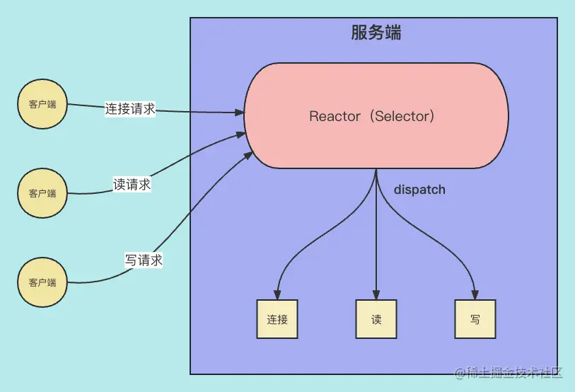
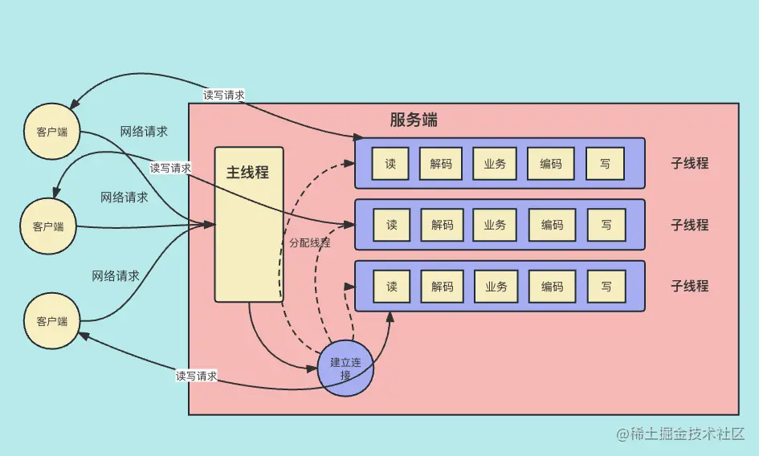
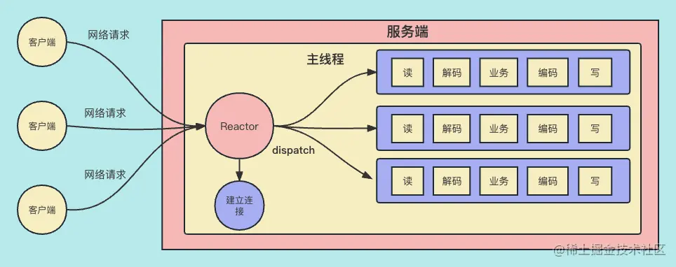
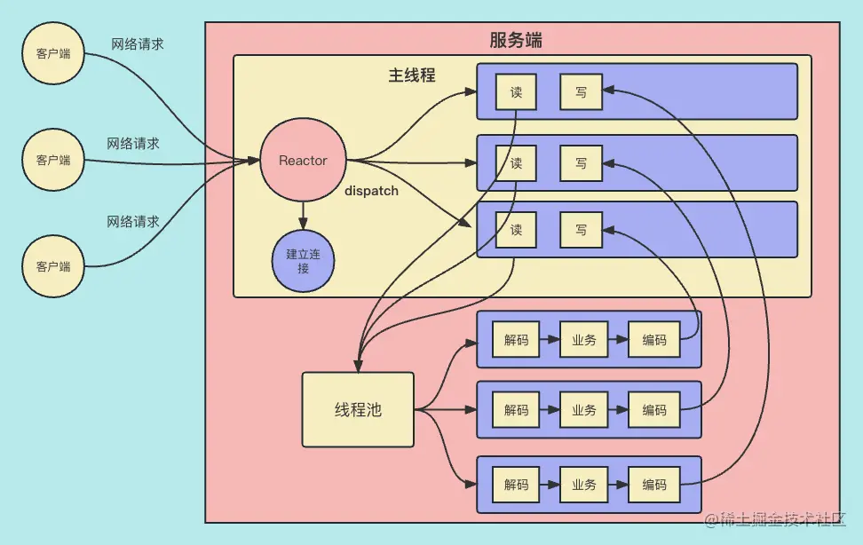
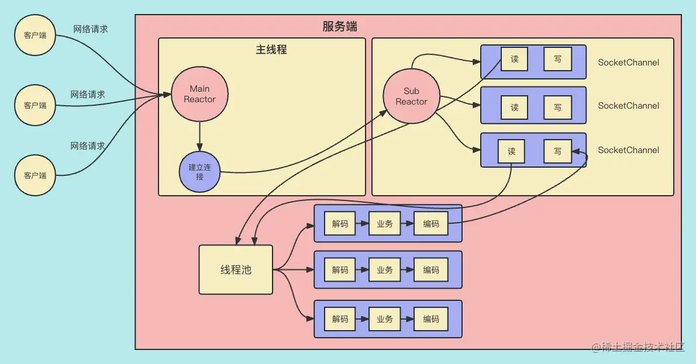
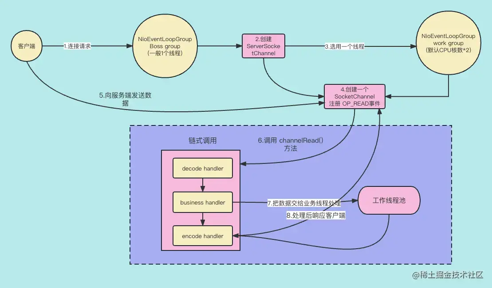

经过前面两节课，大家对 Netty 如何处理网络事件的流程已经有了比较深入的了解了，特别是对 EventLoop 和 EventLoopGroup 这两个代表线程和线程组的组件有了比较直观的了解，而这两个组件是体现 Netty 线程模型的关键组件。

在 Netty 的设计中线程模型的设计很优秀，而 `Reactor 设计模式`则是 Netty 线程模型设计的基石，这节课我们就来讨论一下 Reactor 设计模式。

## Netty 线程模型概述

Netty 主要的线程模型就是 I/O 线程，线程模型设计的好坏，决定了系统的吞吐量、并发性和安全性等架构质量属性。

当我们讨论 Netty 线程模型的时候，一般首先会想到的是经典的 Reactor 设计模式，尽管不同的 NIO 框架对于 Reactor 模式的实现存在差异，但本质上还是遵循了 Reactor 线程模型。

下面让我们一起回顾经典的 Reactor 线程模型设计原理。

Reactor 设计模式是一种基于`事件驱动的响应式设计模型`，其实 Reactor 线程模型在 Java NIO 上就有具体的体现了：通过 selector 来充当 Reactor 来监听各种网络事件，然后再根据不同的网络事件来做针对性的逻辑处理，从而实现了一个线程管理 N 个连接。



上图其实就是 Java NIO 的线程模型，服务端的所有工作都在一个线程里。这里的 Selector 作为 Reactor 也就是反应器来监听事件，并根据不同的事件来派发和执行不同的连接，读写处理逻辑。

但是，对于 Reactor 设计模式来说也是有多个版本的，不同的并发量和业务复杂度对应着不同的 Reactor 设计模式的版本，**并发的客户端请求越多那么要求的版本就会越高，设计也会越复杂**。接下来，我会从低版本到高版本给大家依次介绍 Reactor 设计模式。

## Java BIO 线程模型

首先，我们先回顾一下 Java BIO 的线程设计模式。



大家可以从上图看到：在服务端里，主线程负责连接请求，连接成功后`主线程`会`分配一个子线程`来负责与客户端之间的读写数据。这样做虽然可以充分地利用机器的 CPU 资源，但是一个连接就要占用一个线程，这样做的原因是无论是读还是写都是阻塞的，因为我们不知道某一个客户端什么时候给服务端发送数据，只能通过`阻塞来感知`是否有数据来了。

如下面的 Java BIO 代码：

```ini
ini复制代码InputStreamReader in = new InputStreamReader(socket.getInputStream());
//读数据，无数据就阻塞
int len = in.read(buf);
```

其实，客户端连接事件也是一样的，必须由主线程通过`阻塞来感知`客户端连接事件是否来了，如下面的代码所示：

```ini
ini
复制代码Socket socket = serverSocket.accept();
```


这样做会大大加大 CPU 切换频率，还会占用大量的内存资源。所以，这样的设计显然是不适合互联网海量客户端并发请求的场景。

**优点**：

- Java BIO 代码实现简单。
- 利用多线程最大化利用 CPU 资源。

**缺点：**

- 随着连接的客户端增多，线程数量也随之增多，线程过多会造成机器资源快速消耗殆尽。
- 如果客户端和服务端之间有些连接数据交换不频繁，而通过`阻塞感知`就会造成对应的线程处于阻塞状态，从而造成线程资源的浪费。

接下来，我们看看 Reactor 单线程模型是如何改善上述问题的。

## Reactor 单线程模型

Reactor 单线程模型，是指服务端所有的网络事件的处理及业务逻辑的实现都在`同一个线程`上面完成。Reactor 单线程模型如下图所示：



可以看到，其**设计特点**如下：

- 总体`只有一个线程`，这个线程会有一个反应器 Reator，用来监听网络 IO 事件。
- 这个线程用来建立连接，监听网络 IO 事件，并根据事件调用不同的处理逻辑。
- 不仅要处理 IO 事件，其他的任务包括编解码，业务逻辑都需要在这个线程完成。

这样设计的**优点**：无论有多少个连接，Reactor 只要通过监听网络事件，就可以根据不同的网络事件来采取不同逻辑来处理。这样做的好处是大大减少了线程的数量，因为我们再也不用一个连接对应一个线程了。

**缺点**：

- 如果业务逻辑很复杂，造成处理业务逻辑的时间过长，而`唯一的线程长期阻塞`，就会造成响应变慢。
- 如果这时有客户端的连接请求，而服务端的主线程还在处理前一个批次的网络请求的解码、业务、编码等事情，就会造成客户端连接超时，进而造成`超时连接重试`，进一步加重服务端的负载问题。

为了解决这些问题，演进出了“单 Reactor + 多工作线程”模型。

## 单 Reactor + 工作线程池模型

单 Reactor + 多线程模型其实就是一个主线程负责所有的网络事件的处理，包括建立连接、网络读和网络写。而工作线程池是来处理编解码和业务处理等非网络 IO 相关的工作的。



可以看到，单 Reactor + 工作线程池模型的特点如下：

- 服务端的主线程负责建立连接，监听网络读写事件，分派读写逻辑。读出数据后会把数据交给线程池处理。
- 线程池完成编解码以及业务处理后，再把处理后的数据交给主线程，主线程再把处理过后的数据发送给客户端。

**优点：**

- 主线程只负责网络事件的处理，如连接的建立，网络读和网络写，以及把网络事件分派给对应的处理逻辑，然后把非网络 IO 的工作交给工作线程池去做。
- 工作线程池负责编解码和业务处理。这样实现了网络 IO 处理和其他非网络 IO 功能的分离，彼此不会受影响，不会因为业务处理过慢而造成新的网络事件得不到及时的处理。

**缺点：**

在绝大多数场景下，Reactor 多线程模型可以满足性能需求。但是，在有些场景中由一个线程同时负责连接建立、网络读和网络写是不可行的。比如：

- 在 HTTPS 协议中，建立连接的同时要做 SSL 验证，这样会消耗不少时间，而这时如果会出现`大量的网络读写事件`，甚至会出现`新的客户端连接请求`，这样就会造成网络事件处理不及时的情况发生。
- 有时候，会出现一批量比较多的网络事件，单线程在短时间内无法处理完（也就是 Selector.select() 出现了`大事件集合`），如果这时出现`新的客户端连接请求`，就会造成客户端连接超时重试的问题。

因此，为了解决上述问题，我接下来给大家介绍主从 Reactor + 多工作线程模型。

## 主从 Reactor + 工作线程池模型



主从 Reactor + 工作线程池模型的特点是：

- 这个模型与“单 Reactor + 工作线程池模型”的区别是，Reactor 由一类线程变为两类线程，分别为`主 Reactor 线程`和`子 Reactor 线程`，也对应着两种反应器也就是`主反应器`和`子反应器`。
- 主反应器用来处理`与客户端建立连接`，子反应器用来处理`连接建立后的读写事件`。
- 所谓两种线程就是说每种线程有可能是单线程，也可能是多线程，甚至是线程池，都是有可能的。
- 非网络 IO 事件的处理，包括编解码，业务逻辑的实现都是由工作线程池来完成的。实现了网络 IO 任务与非网络 IO 任务的分离。

**优点：**

- 即使短时间内有大量的读写网络事件处理，也不会影响新的客户端连接的建立，因为连接的建立和读写事件的处理分别由两种线程处理，做到了`线程分离`。
- 同样地，即使短时间内有大量的网络连接请求的出现，也不会影响网络读写事件的处理。
- 主从反应器都可以是多线程甚至线程池，这样可以根据并发量的不同来进行调整。

总之，利用主从 Reactor + 工作线程池模型，可以完美解决网络 IO 事件的响应式编程场景的性能问题。因此，**在 Netty 的官方 demo 中，推荐使用该线程模型**。

## Netty 服务端工作流程图

最后，结合上两节课的知识，我们来回顾一下 Netty 服务端工作流程图，为下节课给大家讲解 Netty 线程模型打下基础。



这里我就按步骤给大家解释一下，同时希望大家结合前面章节关于 Netty 组件的讲解一起理解。

1. 客户端向服务端发送连接请求。
2. 在服务端收到客户端要建立 TCP 连接的请求后，Boss group 的 NioEventLoopGroup 线程池里的线程（也就是主 Reactor 线程，后面简称 boss NioEventLoop）会创建一个 ServerSocketChannel，如果创建和初始化成功，标志着服务端和客户端的连接建立成功了。
3. 连接建立成功后，boss NioEventLoop 会创建一个 SocketChannel 代表服务端和客户端的连接，同时从 Work group 的 NioEventGroup 线程池中选取一个线程（后面简称为 work NioEventLoop）。
4. 然后把这个 SocketChannel 的网络读事件（也就是 OP_READ）注册到 Seletor 上。
5. 这时，客户端在建立成功的连接上向服务端发送数据。
6. work NioEventLoop 里的 selector 监听到网络事件后会调用 Handler 中的 channelRead() 方法，这时链式调用开始了。
7. 其中，business Handler 把业务处理放入一个工作线程池中，这个线程池是专门处理业务逻辑的。我们可以把这个 Handler 设计成异步的，这样就不会因为业务逻辑的执行而阻塞住执行整个链式调用的线程。
8. 工作线程池处理完业务逻辑后，把相应的结果再传给下一个 handler，最终把相应的响应数据发送给客户端。

Netty 的工作流程基本给大家介绍完了，下节课继续给大家讲解 Netty 的线程模型。

## 总结

这节课，我们主要学习了 Reactor 设计模型。

首先，我们探讨了 BIO 的线程设计模式，我们发现它最大的问题是`一个连接就要对应一个线程`，造成大量线程资源的浪费。

然后，我们又分析了 Reactor 单线程模型，解决了线程过多的问题，但是一个线程负责所有事情会`造成响应不及时`，进而拖慢网络事件的响应速度。而单 Reactor + 多工作线程通过把非 IO 任务分给工作多线程，让 Reactor 线程只关心网络 IO 事件的处理，但是会造成高并发场景下一个 Reactor 处理大量网络事件会延迟，进而`无法及时响应网络连接`。最终，**主从 Reactor + 工作线程池模型**，解决了这个问题，主 Reactor 只负责与客户端建立连接，从 Reactor 负责响应已经建立好的连接上的网络读写事件，这样就不会产生对客户端连接请求的不及时的问题。