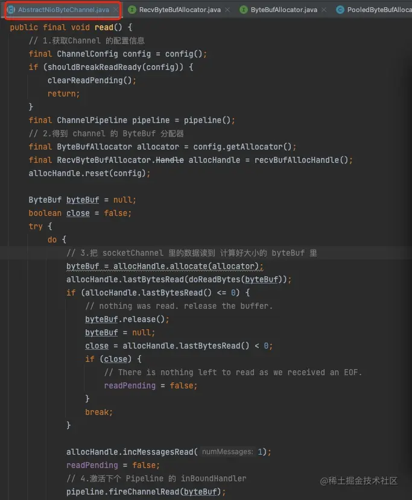

这节课我们重点讨论 Netty 为什么能够单机支持上万高并发连接。这涉及到 Netty 的很多方面，包括 Netty 的`网络通信模型`、`缓冲区管理机制`、`零拷贝`，以及一些`配置参数`，等等。

## Netty 线程模型

首先，我们讨论 Netty 的网络通信模型。

这里我给大家画了一张 `Netty 网络通信模型`的流程图：


我给大家简单介绍一下这个图的流程：

- 在服务端，主要有两组线程池，其中一个是`BossGroup 线程池`，这个线程池的功能是负责客户端的连接请求，一般情况下仅仅设置为一个线程，当然如果频繁地出现客户端的连接请求可以设置多个线程。每一个线程都是 EventLoop，EventLoop 的本质是 IO 线程。服务端在启动的时候，BossGroup 线程组内的每个 EventLoop 都会创建一个 NioServerSocketChannel，这个对象用来监听服务端的端口用判断是否收到客户端连接请求，具体是通过把 NioServerSocketChannel 注册到 EventLoop 中去。同时 会有一个 Selector 绑定在 EventLoop 上，Selector 会循环监听注册在 EventLoop 中的 IO 事件。
- 当收到客户端的连接请求后开始建立连接，然后创建一个新的 Channel，同时会初始化这个 Channel 对应的 ChannelPipe，每个 Channel 都会对应一个 PipeLine，每个 PipeLine 是由多个 Handler 组成的。
- 新的 SocketChannel 对象被创建出来后，会把它注册到另一个叫 `WorkerGroup 的线程池`里的一个 EventLoop，同时会有相应的 IO 线程和 Selector 与之绑定，准确地说是把新建的 SocketChannel 注册到绑定在 EventLoop 上的 Selector。一个绑定在 EventLoop 上的 Selector 可以`注册多个 SocketChannel`，也就是说一个 EventLoop 可以监听多个 SocketChannel 上的事件。当监听到读写事件时，就可以做相应的处理了。
- 当客户端向服务端发送请求的时候，服务端收到后会激发 PipleLine 的链条，PipeLine 中的入站 Handler 会按顺序执行。

客户端的流程和服务端很相似，就是缺少了 BossGroup 线程池，这也很好理解，因为客户端不用接收请求连接，而是发出连接请求。

总之，Netty 高并发在线程方面的优势本质上还是通过 **NIO 多路复用**实现的，只是在 NIO 的基础上做了下面两个方面的改造：

- 服务端根据处理网络事件的类型分为两个线程池：`Boss 线程池`负责建立连接， `Worker 线程池`负责连接建立后的读写事件。这样做的好处是，如果所有的事件都放在一个线程池里处理，可能会造成读写事件太多处理不完而影响到客户端连接请求延迟，进而造成客户端连接请求的重试。
- 通过线程池的机制可以水平扩展 WorkerGroup 处理 IO 读写事件的能力。

## 缓冲区管理

Netty 在`内存管理`上有了相当大的优化，**通过提升对内存的利用效率来提升整体的 Netty 性能**。我们知道 Java NIO 对与读写数据都要放到一个缓冲里，也就是 ByteBuffer。

首先，我们分析一下 NIO 原生的 ByteBuffer 有什么问题。

### 原生 NIO ByteBuffer 的问题

- NIO 的 ByteBuffer 在创建的时候就设定了长度，而且在使用过程中`无法扩容`。
- API 的使用过于复杂，当我们向 ByteBuffer 写完数据后要读数据了，那么我们必须调用 flip() 方法来改变 index 到写的起始位置才能读取数据，当读转换为写时也是一样的，需要调用 rewind() 方法。这样的 API 设计会`增加复杂度`。

我们接下来看看 Netty 的 ByteBuf 是如何设计的。

### Netty 的 ByteBuf 设计原理

首先，我们还是先上图来描述 ByteBuf 的基本结构和工作模式：


ByteBuf 的结构主要有下面几个特点。

1. ByteBuf 是一个 `Byte 容器`，用于操作和管理缓冲区。
2. readerIndex 表示读操作执行的位置，writerIndex 表示写操作执行的位置，capacity 表示 ByteBuf 最大的位置。readerIndex 只能增加到与 writerIndex 相等。类似地，writerIndex 也只能增加到与 capacity 相等。
3. readerIndex 与 writerIndex 之间是可读的部分，writerIndex 与 capacity 之间是可写的部分。
4. ByteBuf 分为三个部分：已抛弃 Bytes，可读 Byte，可写 Bytes。
   - 已抛弃 Bytes：这个部分表示已经执行完读操作的的 Byte，这部分大小会随着 readerIndex 的增加而增大。因为这部分读写都完成了，所以被称为已抛弃 Bytes，这部分等待着被回收。

ByteBuf 按分配位置可分为三种缓冲区模式。

- 堆缓冲：在 JVM 堆内申请缓冲。
- 直接缓冲区：JVM 堆外申请堆内存。
- 复合缓冲区：由请求头和请求体组成，一个 ByteBuf 专门放请求头，另一个专门放请求体。

我们写个 Demo 看看 ByteBuf 是如何使用的：

```arduino
arduino复制代码public class ByteBufTest {
    public static void main(String[] args) {
             ByteBuf byteBuf =  init();
             getByteBuf(byteBuf);
             System.out.println("Buffer不改变读索引"+ byteBuf);
             readByteBuf(byteBuf);
             System.out.println("Buffer不改变读索引"+ byteBuf);
    }
    
    private static ByteBuf init(){
        // 初始容量为9，最大容量为100 的缓冲区
        ByteBuf buffer = ByteBufAllocator.DEFAULT.buffer(9,100);
        System.out.println("Buffer的初始化:"+ buffer);
        buffer.writeBytes(new byte[]{1,2,3,4});
        System.out.println("Buffer写入操作:"+ buffer);
        return buffer;
    }

    // 读字节，不改变指针
    private static void getByteBuf(ByteBuf buffer){
        for(int i=0;i<buffer.readableBytes();i++){
            System.out.println("读"+i+"个字节："+buffer.getByte(i));
        }
    }

    // 读字节，改变指针
    private static void readByteBuf(ByteBuf buffer){
        while (buffer.isReadable()){
            System.out.println("取第一个字节："+ buffer.readByte());
        }
    }
}
```

运行结果：


大家可以看到这三个索引因为调用方法而发生的变化：当初始化的时候，读索引和写索引都是 0。当放入 4 个 byte 数据的时候，读索引还是 0，写索引为 4。当调用不会改变指针的读方法 getByteBuf() 的时候，所有索引都没变。最后，调用能够改变索引的读操作的时候，读索引增加到 4。

### ByteBuf 中引用计数的使用

前面给大家讲了 ByteBuf 字节容器会把缓冲分配到 JVM 堆上，也会分配到直接内存上。分配在 JVM 堆上的缓冲可以通过 JVM GC 回收，但是直接内存不受 JVM GC 的管理，如何回收呢？

为了解决这个问题，Netty 模仿了 JVM GC 的引用计数的原理，实现了用引用计数器来标记缓冲是否可达。这样做有两个好处：

- 实现对直接内存上的不再使用的缓冲进行回收，防止内存泄露；
- Netty ByteBuf 有池化模式，为了提升池化的重用效率也需要引用计数器来支持。

> ByteBuf 的池化（Pooled ByteBuf）
>
> ByteBuf 的池化就是初始化多个 ByteBuf 对象，并把这些 ByteBuf 对象保存在一个容器中，这个容器就是 ByteBuf 池。当有 ByteBuf 需要的时候就释放一个 ByteBuf 对象出来，使用完了再放回 ByteBuf 池中，这样能够避免 ByteBuf 对象被频繁地创建和销毁，而 ByteBuf 对象的创建和销毁是很消耗系统资源的，ByteBuf 池提升了资源的利用率。

ByteBuf 中`引用计数的规则`大体如下：

当 ByteBuf 初始化的时候，它的引用计数器就为 1，当调用方法 retain() 时，引用计数器加 1，当调用方法 release() 的时候，引用计数器减 1。当引用计数器为 0 的时候，这个 ByteBuf 对象就要被回收了。

我们再看一个关于引用计数的 demo：

```csharp
csharp复制代码public class PooledByteBufReferenceCounted {

    public static void main(String[] args) {
        ByteBuf byteBuf = ByteBufAllocator.DEFAULT.buffer();
        System.out.println("初始化后引用计数器："+byteBuf.refCnt());

        // 增加一次引用计数
        byteBuf.retain();
        System.out.println("调用retain()后引用计数器："+byteBuf.refCnt());
        
        // 减少一次引用计数
        byteBuf.release();
        System.out.println("调用 release() 后引用计数器："+byteBuf.refCnt());

        // 减少一次引用计数
        byteBuf.release();
        System.out.println("调用 release() 后引用计数器："+byteBuf.refCnt());

        // 报错，byteBuf.refCnt()=0 后就不能再使用byteBuf了
        byteBuf.retain();
        System.out.println("调用retain()后引用计数器："+byteBuf.refCnt());

    }
}
```


首先看一下 ByteBuf 对象是怎么创建的，创建 ByteBuf 是通过 ByteBufAllocator.DEFAULT.buffer() 来获得的。

我们看一下 ByteBufAllocator.DEFAULT 是怎么来的：


大家可以看到默认只要不是安卓设备用的都是 ByteBuf 池里分配出来的，所以代码里创建的 ByteBuf 对象一定是从 ByteBuf 池里出来的。

大家可以看到最后一步由于引用计数为 0，造成 byteBuf 对象不可用。

但是这里有一个问题，不知道大家有没有想到，就是：分配了 ByteBuf 对象后，引用计数是 1，但是在后面的程序中没有使用这个 ByteBuf 对象，会怎么样呢？

其实，在 PipeLine 中的默认 tailHandler 会 release 掉这个 ByteBuf 的引用计数。

> 接下来我们再来简单讨论一下，ByteBuf 分配在直接内存有对性能有什么样的影响。
>
> 如果 ByteBuf 分配在直接内存，那么就避免了数据在 JVM 堆内与 Native 之间的拷贝，而且读写要比在 JVM 堆内存上快，但是在 Native 上分配和销毁对象的速度比 JVM 堆上慢。所以，使用直接内存最好的方式就是把直接内存上的 ByteBuf 对象池化，这样就避免了 ByteBuf 对象的频繁创建和销毁。

### Channel 里的数据是如何写到 ByteBuf 里的

我们先找到从 Channel 里读数据的方法，源码如下：



主要分四个步骤：

1. 获取 channel 的相关数据。
2. 得到 channel 对应的 ByteBuf 分配器，分配器是实现配置好的。
3. 把 channel 里的数据读到计算好大小的 ByteBuf 对象里。
4. 把 ByteBuf 对象传递到 PipleLine 的下一个 inBoundHandler 里。

通过上面的四个步骤就把网络数据读到 ByteBuf 对象里了，同时传递到了下一个 inBoundHandler 里继续进行处理，直到传递到最后一个 Handler，即 TailContext handler 里，这里会将 ByteBuf 对象释放掉。

> 在具体编程的时候，有可能我们在写 inboundHandler 的时候会漏写 ctx.fireXXX() 这样的方法，这样会造成 TailContext handler 无法释放 ByteBuf 对象，当然我们也可以手动调用前面介绍的 release() 释放。总之，大家一定要注意释放缓冲的问题，特别是我们把 ByteBuf 分配到直接内存的时候，因为如果我们不释放，JVM GC 是不会帮我们释放的。

### ByteBuf 浅层复制

我们在编程的过程中需要对数据进行操作，比如数据的变形、数据的裁剪、数据的复制等，在这个过程中势必会消耗大量的内存。对 ByteBuf 的操作也是一样的，**Netty 的浅层复制技术针对这个问题，最小程度地减少了对内存的占用**。

所谓的浅层复制是相对于深层复制的。深层复制是把数据源完全复制到新的内存空间，新的内存空间和源内存空间彼此不会有影响。而浅层复制是指不会创建新的内存空间，而是把一些引用和属性拷贝过去，就可以做一些操作了,同时会对原来的底层数据产生影响。

ByteBuf 的浅层复制分为两种：`Slice 切片复制`和 `Duplicate() 复制`。

**1. Slice 切片复制**

对一部分原 ByteBuf 的数据进行浅层复制，比如只访问索引为 0 到 2 的数据，下面是例子：

```arduino
arduino复制代码public class SliceDemo {
    public static void main(String[] args) {
        ByteBuf buffer = ByteBufAllocator.DEFAULT.buffer(9,100);
        buffer.writeBytes(new byte[]{1,2,3,4});
        // 获取可读部分的切片
        ByteBuf sliceA = buffer.slice();
        // 设定切片的起始位置和切片长度
        ByteBuf sliceB = buffer.slice(0,2);
        System.out.println(sliceA.getByte(0));
        System.out.println(buffer.getByte(0));
        // 修改切片后，源 byteBuf 也会随之改变
        sliceA.setByte(0,9);
        System.out.println(sliceA.getByte(0));
        System.out.println(buffer.getByte(0));
    }
}
```

**运行结果：** 1 1 9 9 大家可以看到，slice 修改数据后，原 ByteBuf 的数据也随之改变了，说明 slice 的底层数据还是 ByteBuf 的。 有两种获取切片的方法：一个是 slice()，只返回原 ByteBuf 的只读部分；另一个是 slice(m,n)，返回从起始位置 m、取 n 个 Byte 的切片。

**2. Duplicate() 复制**

与 slice 不同，Duplicate 是做`整体 ByteBuf 的浅层复制`，其他和 Slice 就都一样了，这里就不再赘述了。