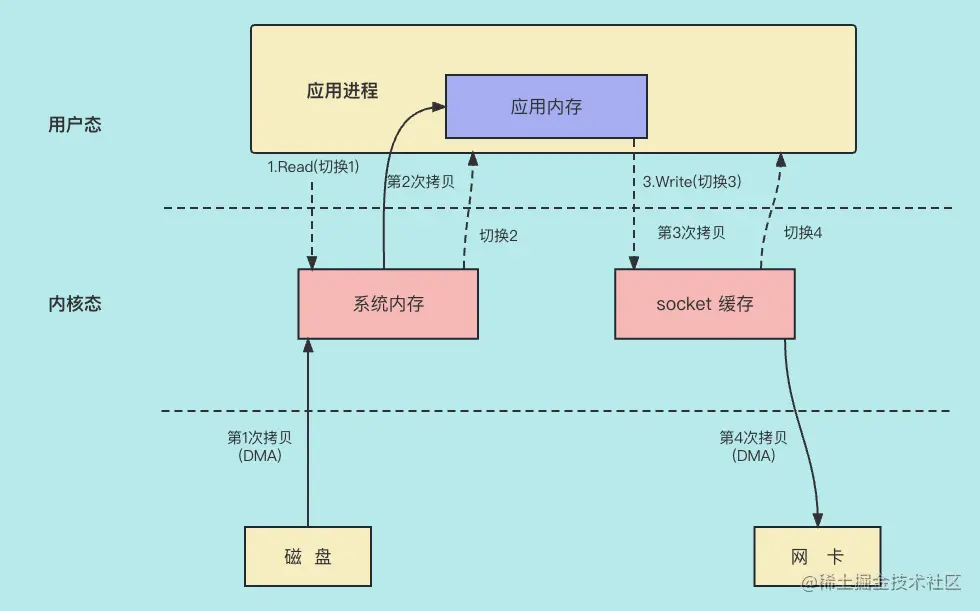
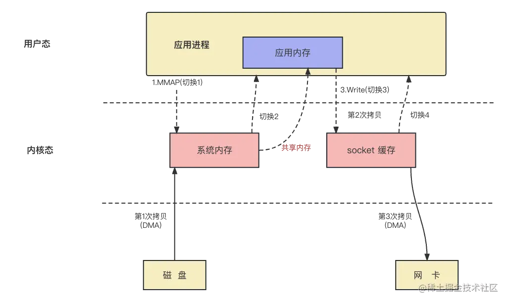
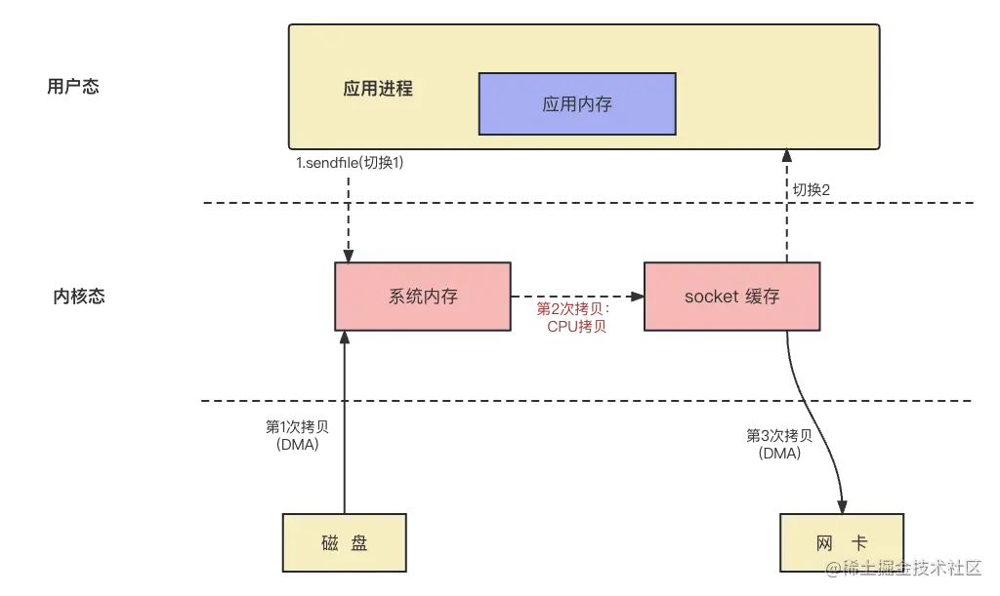
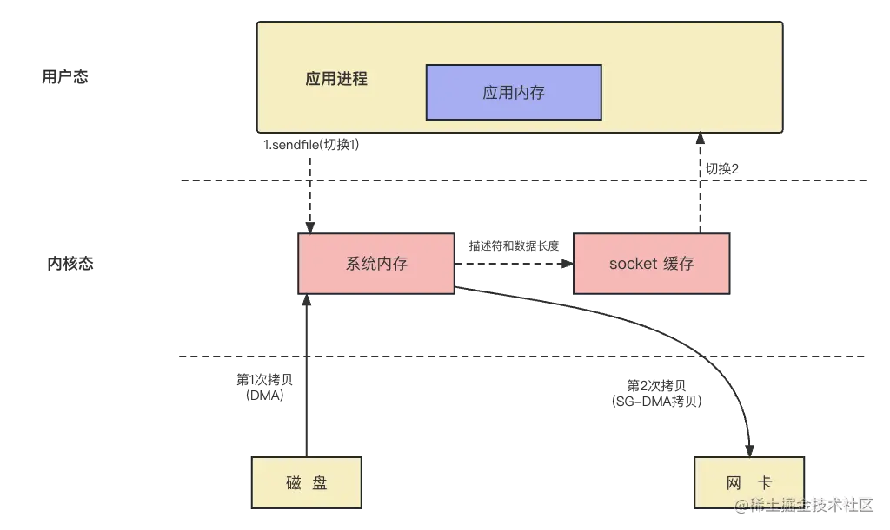
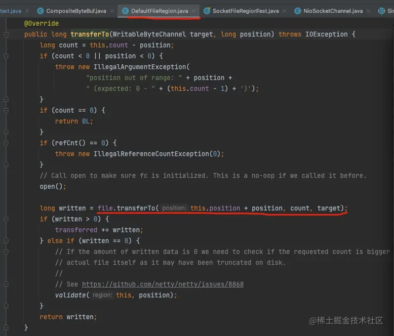
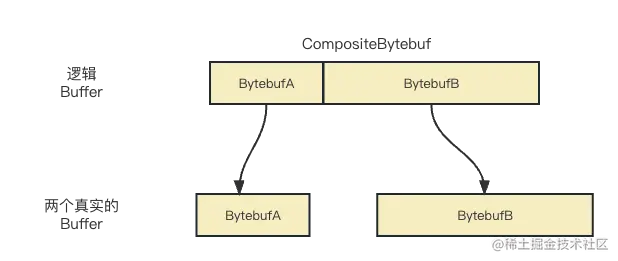
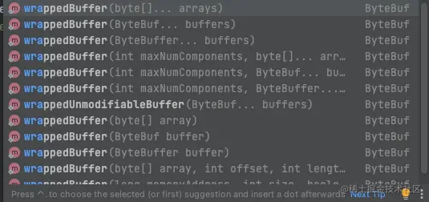

这节课给大家讲解 Netty 单机支持上万连接原理的下篇，零拷贝和 Netty 在减少数据拷贝都做了哪些设计。

## 零拷贝

`零拷贝`我相信大家都听说过，Netty 也用到了零拷贝来大幅提升网络吞吐量，但是大多数人对零拷贝中的原理和过程却很难讲清楚，接下来我会给大家详细讲解这方面的内容。

首先，我们看看，没有零拷贝的时候，应用程序是如何从服务器的磁盘读数据并通过网卡发送到网络的。

### 无零拷贝时，数据的发送流程



大家可以通过上图看到，应用程序把磁盘数据发送到网络的过程中会发生`4 次用户态和内核态之间的切换`，同时会有`4 次数据拷贝`。过程如下：

1. 应用进程向系统申请读磁盘的数据，这时候程序从用户态切换成内核态。
2. 系统也就是 linux 系统得知要读数据会通知 DMA 模块要读数据，这时 DMA 从磁盘拉取数据写到系统内存中。
3. 系统收到 DMA 拷贝的数据后把数据拷贝到应用内存中，同时把程序从内核态变为用户态。
4. 应用内存拿到数据后，会把数据拷贝到系统的 Socket 缓存，然后程序从用户态切换为内核态。
5. 系统再次调用 DMA 模块，DMA 模块把 Socket 缓存的数据拷贝到网卡，从而完成数据的发送，最后程序从内核态切换为用户态。

### 如何提升文件传输的效率？

我们程序的目的是把磁盘数据发送到网络中，所以数据在用户内存和系统内存直接的拷贝根本没有意义，与数据拷贝同时进行的用户态和内核态之间的切换也没有意义。而上述常规方法出现了 4 次用户态和内核态之间的切换，以及 4 次数据拷贝。我们优化的方向无非就是`减少用户态和内核态之间的切换次数`，以及`减少数据拷贝的次数`。

> 为什么要在用户态和内核态之间做切换？
>
> 因为用户态的进程没有访问磁盘上数据的权限，也没有把数据从网卡发送到网络的权限。只有内核态也就是操作系统才有操作硬件的权限，所以需要系统向用户进程提供相应的接口函数来实现数据的读写。
>
> 这里涉及了两个系统接口调用分别是：
>
> - read(file, tmp_buf, len);
> - write(socket, tmp_buf, len);

于是，零拷贝技术应运而生，系统为我们上层应用提供的零拷贝方法有下列两种：

- mmap + write
- sendfile

### MMAP + write

这个方法主要是用 MMAP 替换了 read。

对应的系统方法为：

- buf = mmap(file,length)
- write(socket,buf,length)

所谓的 MMAP，其实就是系统内存某段空间和用户内存某段空间保持一致，也就是说应用程序能通过访问用户内存访问系统内存。所以，读取数据的时候，不用通过把系统内存的数据拷贝到用户内存中再读取，而是直接从用户内存读出，这样就减少了一次拷贝。

我们还是先看图：



给大家简述一下步骤：

1. 应用进程通过接口调用系统接口 MMAP，并且进程从用户态切换为内核态。
2. 系统收到 MMAP 的调用后用 DMA 把数据从磁盘拷贝到系统内存，这时是第 1 次数据拷贝。由于这段数据在系统内存和应用内存是共享的，数据自然就到了应用内存中，这时程序从内核态切换为用户态。
3. 程序从应用内存得到数据后，会调用 write 系统接口，这时第 2 次拷贝开始，具体是把数据拷贝到 Socket 缓存，而且用户态切换为内核态。
4. 系统通过 DMA 把数据从 Socket 缓存拷贝到网卡。
5. 最后，进程从内核态切换为用户态。

这样做到收益是`减少了一次拷贝`，`但是用户态和内核态仍然是 4 次切换`。

### sendfile

这个系统方法可以实现系统内部不同设备之间的拷贝。具体逻辑我们还是先上图：



大家可以看到，使用 sendfile 主要的收益是避免了数据在应用内存和系统内存或 socket 缓存直接的拷贝，同时这样会避免用户态和内核态之间的切换。

基本原理分为下面几步：

1. 应用进程调用系统接口 sendfile，进程从用户态切换完内核态。
2. 系统接收到 sendfile 指令后，通过 DMA 从磁盘把数据拷贝到系统内存。
3. 数据到了系统内存后，CPU 会把数据从系统内存拷贝到 socket 缓存中。
4. 通过 DMA 拷贝到网卡中。
5. 最后，进程从内核态切换为用户态。

但是，这还不是零拷贝，所谓的零拷贝不会在内存层面去拷贝数据，也就是系统内存拷贝到 socket 缓存，下面给大家介绍一下真正的零拷贝。

### 真正的零拷贝

真正的零拷贝是基于 sendfile，当网卡支持 SG-DMA 时，系统内存的数据可以直接拷贝到网卡。如果这样实现的话，执行流程就会更简单，如下图所示：



基本原理分为下面几步：

1. 应用进程调用系统接口 sendfile，进程从用户态切换完内核态。
2. 系统接收到 sendfile 指令后，通过 DMA 从磁盘把数据拷贝到系统内存。
3. 数据到了系统内存后，CPU 会把文件描述符和数据长度返回到 socket 缓存中（注意这里没有拷贝数据）。
4. 通过 SG-DMA 把数据从系统内存拷贝到网卡中。
5. 最后，进程从内核态切换为用户态。

`零拷贝在用户态和内核态之间的切换是 2 次，拷贝是 2 次`，大大减少了切换次数和拷贝次数，而且全程没有 CPU 参与数据的拷贝。

### 零拷贝的重要帮手 PageCache

大家知道，从缓存中读取数据的速度一定要比从磁盘中读取数据的速度要快得多。那么，有没有一种技术能让我们从内存中读取磁盘的数据呢？

PageCache 的目的就是让磁盘的数据缓存化到系统内存。那么，PageCache 会选取哪些磁盘数据作为缓存呢？具体步骤是这样的：

- 首先，当用户进程要求方法哪些磁盘数据时，DMA 会把这部分磁盘数据缓存到系统内存里，那么问题又来了，磁盘空间明显比内存空间大得多，不可能不限制地把磁盘的数据拷贝到系统内存中，所以必须要有一个淘汰机制来把访问概率低的内存数据删除掉。
- 那么，用什么方法淘汰内存的数据呢？答案是 LRU (Least Recently Used)，最近最少使用。认为最近很少使用的数据，以后使用到的概率也会很低。

那么，这样就够了吗？我们设想一个场景，我们在操作数据的时候有没有顺序读写的场景？比如说消息队列的顺序读取，我们消费了 id 为 1 的 message 后，也会消费 id 为 2 的 message。而消息队列的文件一般是顺序存储的，如果我们事先把 id 为 2 的 message 读出到系统内存中，那么就会大大加快用户进程读取数据的速度。

这样的功能在现代操作系统中叫预读，也就是说如果你读了某个文件的 32 KB 的字节，虽然你这次读取的仅仅是 0 ～ 32 KB 的字节，但系统内核会自动把其后面的 32～64 KB 也读取到 PageCache，如果在 32～64 KB 淘汰出 PageCache 前，用户进程读取到它了，那么就会大大加快数据的读取速度，因为我们是直接在缓存上读出的数据，而不是从磁盘中读取。

## 零拷贝在 Netty 的应用

好，我们讨论完零拷贝的原理了，我们再来看看零拷贝在 Netty 上是怎么应用的。

### file.tranferTo



我们可以看到在 DefaultFileRegion 类的 transferTo() 方法里用到了 tranferTo 方法，这个方法其实就是调用系统的 sendfile 方法完成零拷贝。

其实，Netty 还有其他的一些特性与上面说的零拷贝关系不大，但还有很多是在应用层面的零拷贝，主要有以下几个方面。

### 虚拟拼接器 CompositeByteBuf

假如我们有两段 ByteBuf，而我们又想把这两段 ByteBuf 拼接到一起，最容易想到的方法就是把这两个 ByteBuf 拷贝到一个 ByteBuf 里，具体可以看下面的图：



本质是多个 Bytebuf 的引用，本身并没有开辟新的空间拷贝数据，所以不会产生拷贝的动作，从而节省了 CPU 和 内存的资源。

下面给大家写了一个 demo：

```ini
ini复制代码public class CompositeByteBufDemo {
    public static void main(String[] args) {
        ByteBuf byteBufA = Unpooled.buffer();
        byteBufA.writeBytes("a".getBytes());
        for(int i=0;i<byteBufA.readableBytes();i++){
            System.out.println("byteBufA 的值："+(char)byteBufA.getByte(i));
        }

        ByteBuf byteBufB = Unpooled.buffer();
        byteBufB.writeBytes("b".getBytes());
        for(int i=0;i<byteBufB.readableBytes();i++){
            System.out.println("byteBufB 的值："+(char)byteBufB.getByte(i));
        }
        // 创建 compositeByteBuf
        CompositeByteBuf compositeByteBuf = Unpooled.compositeBuffer();
        // 拼接两个 byteBuf
        compositeByteBuf.addComponents(true,byteBufA,byteBufB);

        printBuf(compositeByteBuf);
    }


    static void printBuf(ByteBuf byteBuf){
        StringBuilder stringBuilder = new StringBuilder();
        for (int i = 0; i< byteBuf.writerIndex();i++) {
            stringBuilder.append((char)byteBuf.getByte(i));
        }
        System.out.println("compositeByteBuf 的值为："+stringBuilder);
    }
}
```

大家可以在 IDE 中运行一下上述代码，CompositeByteBuf 对象确实把多个 ByteBuf 放在一起，并且不用拷贝。

### wrap

在 Netty 编程中，我们想把一段 byte 数组转为 Bytebuf，同时不想发送拷贝该怎么做呢？可以通过 wrap 系列方法实现，如下面的代码：

```java
public class WrapDemo {

    public static void main(String[] args) {
        String message= "hello";
        byte[] bytes = message.getBytes();

        ByteBuf byteBufWrap = Unpooled.wrappedBuffer(bytes);
        for(int i=0;i<byteBufWrap.readableBytes();i++){
            System.out.println("byteBufWrap 的值："+(char)byteBufWrap.getByte(i));
        }
    }
}
```

wrappedXXX 相关的方法很多，包括把多个 byte[] 整合在一起，或把多个 ByteBuffer 整合在一起，大家可以根据自己的场景来选择，但是前提是不会拷贝这些内存数据，而是通过引用来间接地整合和操作。



### Slice

Slice 也是一个避免数据拷贝的类，因为在上节课讲解过，这里就不做过多的讲解了。

总之，Netty 为了减少内存拷贝的次数，除了用到零拷贝减少内存直接的数据拷贝外，还提供了很多类来减少 Java 程序层面的数据拷贝，这样做除了减少拷贝次数外，也增加了内存的使用效率。

## 总结

这节课主要给大家讲解了零拷贝以及 Netty 在减少数据拷贝的一些特点。首先，给大家讲解了零拷贝的进化过程以及零拷贝的流程图，然后给大家讲解了 PageCache 的原理及应用场景。最后，还给大家介绍了 Netty 在哪里用到了零拷贝，以及 Netty 其他降低拷贝次数的设计和功能。