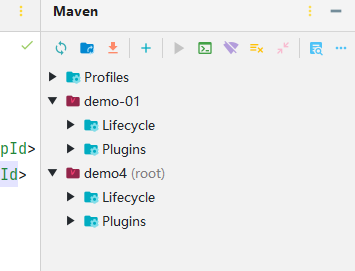
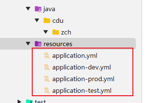
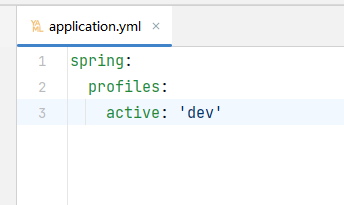

# Maven

## 1. Maven是什么？

Maven 是 Apache 软件基金会组织维护的一款专门为 Java 项目提供构建和依赖管理支持的工具。

一个 Maven 工程有约定的目录结构，约定的目录结构对于 Maven 实现自动化构建而言是必不可少的一环，就拿自动编译来说，Maven 必须 能找到 Java 源文件，下一步才能编译，而编译之后也必须有一个准确的位置保持编译得到的字节码文件。 我们在开发中如果需要让第三方工具或框架知道我们自己创建的资源在哪，那么基本上就是两种方式：

通过配置的形式明确告诉它
基于第三方工具或框架的约定 Maven 对工程目录结构的要求

### 1.1构建

Java项目开发过程中，构建指的是使用【原材料生产产品】的过程。


构建主要包含以下几个环节：


### 1.2依赖

Maven 中最关键的部分，我们使用 Maven 最主要的就是使用它的依赖管理功能。当 A jar 包用到了 B jar 包中的某些类时，A 就对 B 产生了依赖，那么我们就可以说 A 依赖 B。

依赖管理中要解决的具体问题：

- jar 包的下载：使用 Maven 之后，jar 包会从规范的远程仓库下载到本地
- jar 包之间的依赖：通过依赖的传递性自动完成
- jar 包之间的冲突：通过对依赖的配置进行调整，让某些 jar 包不会被导入

## 2.Maven开发环境配置

### 2.1下载安装：

官网：[download](https://maven.apache.org/download.cgi)


这里选择其他版本：


下载之后解压到**没有中文**的目录！


### 2.2指定本地仓库

本地仓库默认值：用户家目录/.m2/repository。由于本地仓库的默认位置是在用户的家目录下，而家目录往往是在 C 盘，也就是系统盘。将来 Maven 仓库中 jar 包越来越多，仓库体积越来越大，可能会拖慢 C 盘运行速度，影响系统性能。所以建议将 Maven 的本地仓库放在其他盘符下。配置方式如下：

```xml
<!-- localRepository
| The path to the local repository maven will use to store artifacts.
|
| Default: ${user.home}/.m2/repository
<localRepository>/path/to/local/repo</localRepository>
-->
<localRepository>D:\CodeSoftware\Maven\maven-repository</localRepository>
```

这个仓库的目录，只需要是空的就行，最好不要有中文。如下：


### 2.3配置阿里云提供的镜像仓库

Maven 下载 jar 包默认访问境外的中央仓库，而国外网站速度很慢。改成阿里云提供的镜像仓库，**访问国内网站**，可以让 Maven 下载 jar 包的时候速度更快。配置的方式是：

1. 注释掉原来的配置：

```xml
<!-- <mirror>
  <id>maven-default-http-blocker</id>
  <mirrorOf>external:http:*</mirrorOf>
  <name>Pseudo repository to mirror external repositories initially using HTTP.</name>
  <url>http://0.0.0.0/</url>
  <blocked>true</blocked>
</mirror> -->
```

2. 增加自己的配置：

```xml
<mirror>
	<id>nexus-aliyun</id>
	<mirrorOf>central</mirrorOf>
	<name>Nexus aliyun</name>
	<url>http://maven.aliyun.com/nexus/content/groups/public</url>
</mirror>
```

### 2.4配置基础JDK版本

如果按照默认配置运行，Java 工程使用的默认 JDK 版本是 1.4，而我们熟悉和常用的是 JDK 1.8 版本。修改配置的方式是：将 `profile` 标签整个复制到 `settings.xml` 文件的 `profiles` 标签内。

```xml
<profile>
    <id>jdk-1.8</id>
    <activation>
        <activeByDefault>true</activeByDefault>
        <jdk>1.8</jdk>
    </activation>
    <properties>
        <maven.compiler.source>1.8</maven.compiler.source>
        <maven.compiler.target>1.8</maven.compiler.target>
       <maven.compiler.compilerVersion>1.8</maven.compiler.compilerVersion>
    </properties>
</profile>
```

### 2.5配置环境变量

maven使用Java语言开发，所以需要有JDK的配置，按照如下配置即可：


命令行使用 `mvn -v` 验证是否配置成功：


## 3.Maven的使用

### 3.1核心概念：坐标

**数学中的坐标**使用 x、y、z 三个『**向量**』作为空间的坐标系，可以在『**空间**』中唯一的定位到一个『**点**』。


Maven中的坐标使用三个『向量』在『Maven的仓库』中唯一的定位到一个『jar』包。

- **groupId**：公司或组织的 id，即公司或组织域名的倒序，通常也会加上项目名称

  例如：groupId：com.javatv.maven

- **artifactId**：一个项目或者是项目中的一个模块的 id，即模块的名称，将来作为 Maven 工程的工程名

  例如：artifactId：auth

- **version**：版本号

  例如：version：1.0.0

### 3.2pom.xml

POM：`Project Object Model`，项目对象模型。和 POM 类似的是：DOM（Document Object Model），文档对象模型。它们都是模型化思想的具体体现。

POM 表示将工程抽象为一个模型，再用程序中的对象来描述这个模型。这样我们就可以用程序来管理项目了。我们在开发过程中，最基本的做法就是将现实生活中的事物抽象为模型，然后封装模型相关的数据作为一个对象，这样就可以在程序中计算与现实事物相关的数据。

POM 理念集中体现在 Maven 工程根目录下 pom.xml 这个配置文件中。所以这个 pom.xml 配置文件就是 Maven 工程的核心配置文件。其实学习 Maven 就是学这个文件怎么配置，各个配置有什么用。

```xml
<!-- 当前Maven工程的坐标 -->
<groupId>com.example</groupId>
<artifactId>demo</artifactId>
<version>0.0.1-SNAPSHOT</version>
<name>demo</name>
<description>Demo project for Spring Boot</description>
<!-- 当前Maven工程的打包方式，可选值有下面三种： -->
<!-- jar：表示这个工程是一个Java工程  -->
<!-- war：表示这个工程是一个Web工程 -->
<!-- pom：表示这个工程是“管理其他工程”的工程 -->
<packaging>jar</packaging>
<properties>
    <!-- 工程构建过程中读取源码时使用的字符集 -->
    <project.build.sourceEncoding>UTF-8</project.build.sourceEncoding>
</properties>
<!-- 当前工程所依赖的jar包 -->
<dependencies>
    <!-- 使用dependency配置一个具体的依赖 -->
    <dependency>
        <!-- 在dependency标签内使用具体的坐标依赖我们需要的一个jar包 -->
        <groupId>junit</groupId>
        <artifactId>junit</artifactId>
        <version>4.12</version>
        <!-- scope标签配置依赖的范围 -->
        <scope>test</scope>
    </dependency>
</dependencies>
```

### 3.3依赖

上面说到我们使用 Maven 最主要的就是使用它的依赖管理功能，引入依赖存在一个范围，maven的依赖范围包括： compile，provide，runtime，test，system。

- **compile**：表示编译范围，指 A 在编译时依赖 B，该范围为默认依赖范围。编译范围的依赖会用在编译，测试，运行，由于运行时需要，所以编译范围的依赖会被打包。
- **provided**：provied 依赖只有当 jdk 或者一个容器已提供该依赖之后才使用。provide 依赖在编译和测试时需要，在运行时不需要。例如：servlet api被Tomcat容器提供了。
- **runtime**：runtime 依赖在运行和测试系统时需要，但在编译时不需要。例如：jdbc 的驱动包。由于运行时需要，所以 runtime 范围的依赖会被打包。
- **test**：test 范围依赖在编译和运行时都不需要，只在测试编译和测试运行时需要。例如：Junit。由于运行时不需要，所以 test 范围依赖不会被打包。
- **system**：system 范围依赖与 provide 类似，但是必须显示的提供一个对于本地系统中 jar 文件的路径。一般不推荐使用。

| 依赖范围 | 编译 | 测试 | 运行时 | 是否会被打入jar包 |
| -------- | ---- | ---- | ------ | ----------------- |
| compile  | √    | √    | √      | √                 |
| provided | √    | √    | ×      | ×                 |
| runtime  | ×    | √    | √      | √                 |
| test     | ×    | √    | ×      | ×                 |
| system   | √    | √    | ×      | √                 |

而在实际开发中，我们常用的就是 `compile`、`test`、`provided` 。

### 3.4依赖的传递

A 依赖 B，B 依赖 C，那么在 A 没有配置对 C 的依赖的情况下，A 里面能不能直接使用 C？

再以上的前提下，C 是否能够传递到 A，取决于 B 依赖 C 时使用的依赖范围。

- B 依赖 C 时使用 compile 范围：可以传递
- B 依赖 C 时使用 test 或 provided 范围：不能传递，所以需要这样的 jar 包时，就必须在需要的地方明确配置依赖才可以。

### 3.5依赖的排除

当 A 依赖 B，B 依赖 C 而且 C 可以传递到 A 的时候，A 不想要 C，需要在 A 里面把 C 排除掉。而往往这种情况都是为了避免 jar 包之间的冲突。


所以配置依赖的排除其实就是阻止某些 jar 包的传递。因为这样的 jar 包传递过来会和其他 jar 包冲突。

一般通过使用`excludes`标签配置依赖的排除：

```xml
<dependency>
	<groupId>net.javatv.maven</groupId>
	<artifactId>auth</artifactId>
	<version>1.0.0</version>
	<scope>compile</scope>
    
	<!-- 使用excludes标签配置依赖的排除	-->
	<exclusions>
		<!-- 在exclude标签中配置一个具体的排除 -->
		<exclusion>
			<!-- 指定要排除的依赖的坐标（不需要写version） -->
			<groupId>commons-logging</groupId>
			<artifactId>commons-logging</artifactId>
		</exclusion>
	</exclusions>
</dependency>
```

### 3.6继承

#### 3.6.1概念

Maven工程之间，A 工程继承 B 工程

- B 工程：父工程
- A 工程：子工程

本质上是 A 工程的 pom.xml 中的配置继承了 B 工程中 pom.xml 的配置。

#### 3.6.2作用

在父工程中统一管理项目中的依赖信息，具体来说是管理依赖信息的版本。

它的背景是：

- 对一个比较大型的项目进行了模块拆分。
- 一个 project 下面，创建了很多个 module。
- 每一个 module 都需要配置自己的依赖信息。

它背后的需求是：

- 在每一个 module 中各自维护各自的依赖信息很容易发生出入，不易统一管理。
- 使用同一个框架内的不同 jar 包，它们应该是同一个版本，所以整个项目中使用的框架版本需要统一。
- 使用框架时所需要的 jar 包组合（或者说依赖信息组合）需要经过长期摸索和反复调试，最终确定一个可用组合。这个耗费很大精力总结出来的方案不应该在新的项目中重新摸索。

通过在父工程中为整个项目维护依赖信息的组合既保证了整个项目使用规范、准确的 jar 包；又能够将以往的经验沉淀下来，节约时间和精力。

#### 3.6.3例子

##### ①创建父工程


更改打包方式为 `pom` ：

```xml
<packaging>pom</packaging>
```

只有打包方式为 pom 的 Maven 工程能够管理其他 Maven 工程。打包方式为 pom 的 Maven 工程中不写业务代码，它是专门管理其他 Maven 工程的工程，所以可以将生成的 `src` 目录删除。

##### ②创建模块工程


在父工程中可以看到子module：


在子工程中看到：


##### ③在父工程中配置依赖的统一管理

使用 `dependencyManagement`标签配置对依赖的管理，如下：

```xml
<?xml version="1.0" encoding="UTF-8"?>
<project xmlns="http://maven.apache.org/POM/4.0.0"
         xmlns:xsi="http://www.w3.org/2001/XMLSchema-instance"
         xsi:schemaLocation="http://maven.apache.org/POM/4.0.0 http://maven.apache.org/xsd/maven-4.0.0.xsd">
    <modelVersion>4.0.0</modelVersion>

    <groupId>cdu.zch</groupId>
    <artifactId>demo4</artifactId>
    <version>1.0-SNAPSHOT</version>
    <packaging>pom</packaging>
    <modules>
        <module>demo-01</module>
    </modules>

    <properties>
        <maven.compiler.source>17</maven.compiler.source>
        <maven.compiler.target>17</maven.compiler.target>
        <project.build.sourceEncoding>UTF-8</project.build.sourceEncoding>
    </properties>

    <dependencyManagement>
        <dependencies>
            <dependency>
                <groupId>org.springframework</groupId>
                <artifactId>spring-beans</artifactId>
                <version>5.3.19</version>
            </dependency>
            <dependency>
                <groupId>org.springframework</groupId>
                <artifactId>spring-core</artifactId>
                <version>5.3.19</version>
            </dependency>
            <dependency>
                <groupId>org.springframework</groupId>
                <artifactId>spring-context</artifactId>
                <version>5.3.19</version>
            </dependency>
            <dependency>
                <groupId>org.springframework</groupId>
                <artifactId>spring-aop</artifactId>
                <version>5.3.19</version>
            </dependency>
        </dependencies>
    </dependencyManagement>

</project>
```

而实际上 **被管理的依赖并没有真正被引入到工程**



##### ④子工程中引用那些被父工程管理的依赖

**关键点：省略版本号**

子工程引用父工程中的依赖信息时，可以把版本号去掉。把版本号去掉就表示子工程中这个依赖的版本由父工程决定，具体来说是由父工程的dependencyManagement来决定。

子工程 pom 如下：

```xml
<?xml version="1.0" encoding="UTF-8"?>
<project xmlns="http://maven.apache.org/POM/4.0.0"
         xmlns:xsi="http://www.w3.org/2001/XMLSchema-instance"
         xsi:schemaLocation="http://maven.apache.org/POM/4.0.0 http://maven.apache.org/xsd/maven-4.0.0.xsd">
    <modelVersion>4.0.0</modelVersion>
    <!--指定父工程-->
    <parent>
        <groupId>cdu.zch</groupId>
        <artifactId>demo4</artifactId>
        <version>1.0-SNAPSHOT</version>
    </parent>

    <!--子工程的坐标-->
    <artifactId>demo-01</artifactId>

    <properties>
        <maven.compiler.source>17</maven.compiler.source>
        <maven.compiler.target>17</maven.compiler.target>
        <project.build.sourceEncoding>UTF-8</project.build.sourceEncoding>
    </properties>

    <dependencies>
        <dependency>
            <groupId>org.springframework</groupId>
            <artifactId>spring-beans</artifactId>
        </dependency>
        <dependency>
            <groupId>org.springframework</groupId>
            <artifactId>spring-core</artifactId>
        </dependency>
        <dependency>
            <groupId>org.springframework</groupId>
            <artifactId>spring-context</artifactId>
        </dependency>
        <dependency>
            <groupId>org.springframework</groupId>
            <artifactId>spring-aop</artifactId>
        </dependency>
    </dependencies>

</project>
```

可以看到，这是才真正将依赖导入：


##### ⑤修改父工程依赖信息的版本

只需要在父工程中修改版本信息然后刷新即可。

##### ⑥父工程中声明自定义属性

对同一个框架的一组 jar 包最好使用相同的版本，为了方便升级框架，可以将 jar 包的版本信息统一提取出来，统一声明版本号 ：

```xml
<properties>
        <spring.version>5.3.19</spring.version>
</properties>
```

在需要的地方使用 `${}` 即可引用自定义属性，真正体现一处修改，处处生效


编写一套符合要求、开发各种功能都能正常工作的依赖组合并不容易。如果公司里已经有人总结了成熟的组合方案，那么再开发新项目时，如果不使用原有的积累，而是重新摸索，会浪费大量的时间。为了提高效率，我们可以使用工程继承的机制，让成熟的依赖组合方案能够保留下来。如下：


### 3.7聚合

聚合，值分散的聚集到一起，即部分组成整体。

#### 3.7.1Maven中的聚合

使用一个总工程将各个模块汇集起来，作为一个整体对应完整的项目，实际就是 `module` 标签

- 项目：整体
- 模块：部分

#### 3.7.2 继承和聚合的对应关系

从继承关系角度来看：

- 父工程
- 子工程

从聚合关系角度来看：

- 总工程
- 模块工程

#### 3.7.3 聚合的配置

在总工程中配置 modules 即可：

```xml
<modules>
    <module>demo-module</module>
</modules>
```

3.7.4 依赖循环问题
如果 A 工程依赖 B 工程，B 工程依赖 C 工程，C 工程又反过来依赖 A 工程，那么在执行构建操作时会报下面的错误：

```
DANGER

[ERROR] [ERROR] The projects in the reactor contain a cyclic reference:
这个错误的含义是：循环引用。
```

## 4.build标签

在实际使用 Maven 的过程中，我们会发现 build 标签有时候有，有时候没，这是怎么回事呢？其实通过有效 POM 我们能够看到，build 标签的相关配置其实一直都在，只是在我们需要定制构建过程的时候才会通过配置 build 标签覆盖默认值或补充配置。这一点我们可以通过打印有效 POM 来看到。

> 打印有效 pom
>
> mvn help:effective-pom

当默认配置无法满足需求的定制构建的时候，就需要使用 build 标签。

### 4.1 build 标签的组成

build 标签的子标签大致包含三个主体部分：


#### 4.1.1 定义约定的目录结构

```xml
<sourceDirectory>D:\product\maven-demo-parent\demo-module\src\main\java</sourceDirectory>
<scriptSourceDirectory>D:\product\maven-demo-parent\demo-module\src\main\scripts</scriptSourceDirectory>
<testSourceDirectory>D:\product\maven-demo-parent\demo-module\src\test\java</testSourceDirectory>
<outputDirectory>D:\product\maven-demo-parent\demo-module\target\classes</outputDirectory>
<testOutputDirectory>D:\product\maven-demo-parent\demo-module\target\test-classes</testOutputDirectory>
<resources>
    <resource>
        <directory>D:\product\maven-demo-parent\demo-module\src\main\resources</directory>
    </resource>
</resources>
<testResources>
    <testResource>
        <directory>D:\product\maven-demo-parent\demo-module\src\test\resources</directory>
    </testResource>
</testResources>
<directory>D:\product\maven-demo-parent\demo-module\target</directory>
<finalName>demo-module-1.0-SNAPSHOT</finalName>

```

各个目录的作用如下：

| 目录名                  | 作用                       |
| ----------------------- | -------------------------- |
| `sourceDirectory`       | 主体源程序存放目录         |
| `scriptSourceDirectory` | 脚本源程序存放目录         |
| `testSourceDirectory`   | 测试源程序存放目录         |
| `outputDirectory`       | 主体源程序编译结果输出目录 |
| `testOutputDirectory`   | 测试源程序编译结果输出目录 |
| `resources`             | 主体资源文件存放目录       |
| `testResources`         | 测试资源文件存放目录       |
| `directory`             | 构建结果输出目录           |

#### 4.1.2 备用插件管理

`pluginManagement` 标签存放着几个极少用到的插件：

- `maven-antrun-plugin`
- `maven-assembly-plugin`
- `maven-dependency-plugin`
- `maven-release-plugin`

通过 `pluginManagement` 标签管理起来的插件就像 `dependencyManagement` 一样，子工程使用时可以省略版本号，起到在父工程中统一管理版本的效果。

#### 4.1.3 生命周期插件

`plugins` 标签存放的是默认生命周期中实际会用到的插件，这些插件想必大家都不陌生，所以抛开插件本身不谈，`plugin` 标签的结构如下：

```xml
<plugin>
    <artifactId>maven-compiler-plugin</artifactId>
    <version>3.1</version>
    <executions>
        <execution>
            <id>default-compile</id>
            <phase>compile</phase>
            <goals>
                <goal>compile</goal>
            </goals>
        </execution>
        <execution>
            <id>default-testCompile</id>
            <phase>test-compile</phase>
            <goals>
                <goal>testCompile</goal>
            </goals>
        </execution>
    </executions>
</plugin>

```

① 坐标部分

`artifactId` 和 `version` 标签定义了插件的坐标，作为 Maven 的自带插件这里省略了 groupId。

② 执行部分

`executions` 标签内可以配置多个 `execution` 标签，`execution` 标签内：

- id：指定唯一标识

- phase：关联的生命周期阶段

- goals/goal：关联指定生命周期的目标

  goals 标签中可以配置多个 goal 标签，表示一个生命周期环节可以对应当前插件的多个目标。

### 4.2 典型应用：指定 JDK 版本

前面我们在 `settings.xml` 中配置了 JDK 版本，那么将来把 Maven 工程部署都服务器上，脱离了 `settings.xml` 配置，如何保证程序正常运行呢？思路就是我们直接把 JDK 版本信息告诉负责编译操作的 `maven-compiler-plugin` 插件，让它在构建过程中，按照我们指定的信息工作。如下：

```xml
<!-- build 标签：意思是告诉 Maven，你的构建行为，我要开始定制了！ -->
<build>
    <!-- plugins 标签：Maven 你给我听好了，你给我构建的时候要用到这些插件！ -->
    <plugins>
        <!-- plugin 标签：这是我要指定的一个具体的插件 -->
        <plugin>
            <!-- 插件的坐标。此处引用的 maven-compiler-plugin 插件不是第三方的，是一个 Maven 自带的插件。 -->
            <groupId>org.apache.maven.plugins</groupId>
            <artifactId>maven-compiler-plugin</artifactId>
            <version>3.1</version>
            
            <!-- configuration 标签：配置 maven-compiler-plugin 插件 -->
            <configuration>
                <!-- 具体配置信息会因为插件不同、需求不同而有所差异 -->
                <source>1.8</source>
                <target>1.8</target>
                <encoding>UTF-8</encoding>
            </configuration>
        </plugin>
    </plugins>
</build>

```

- settings.xml 中配置：仅在本地生效，如果脱离当前 settings.xml 能够覆盖的范围，则无法生效。
- 在当前 Maven 工程 pom.xml 中配置：无论在哪个环境执行编译等构建操作都有效。

### 4.3 典型应用：SpringBoot 定制化打包

很显然 spring-boot-maven-plugin 并不是 Maven 自带的插件，而是 SpringBoot 提供的，用来改变 Maven 默认的构建行为。具体来说是改变打包的行为。默认情况下 Maven 调用 maven-jar-plugin 插件的 jar 目标，生成普通的 jar 包。

普通 jar 包没法使用 java -jar xxx.jar 这样的命令来启动、运行，但是 SpringBoot 的设计理念就是每一个『微服务』导出为一个 jar 包，这个 jar 包可以使用 java -jar xxx.jar 这样的命令直接启动运行。

这样一来，打包的方式肯定要进行调整。所以 SpringBoot 提供了 spring-boot-maven-plugin 这个插件来定制打包行为。

```xml
<build>
	<plugins>
		<plugin>
			<groupId>org.springframework.boot</groupId>
			<artifactId>spring-boot-maven-plugin</artifactId>
			<version>2.5.5</version>
		</plugin>
	</plugins>
</build>

```

## 5. 依赖配置补充

管理依赖最基本的办法是继承父工程，但是和 Java 类一样，Maven 也是单继承的。如果不同体系的依赖信息封装在不同 POM 中了，没办法继承多个父工程怎么办？这时就可以使用 import 依赖范围。

### 5.1 import

典型案例当然是在项目中引入 `SpringBoot`、`SpringCloud` 依赖：

```xml
<dependencyManagement>
    <dependencies>
        <!-- SpringCloud 微服务 -->
        <dependency>
            <groupId>org.springframework.cloud</groupId>
            <artifactId>spring-cloud-dependencies</artifactId>
            <version>${spring-cloud.version}</version>
            <type>pom</type>
            <scope>import</scope>
        </dependency>
        
        <!-- SpringCloud Alibaba 微服务 -->
        <dependency>
            <groupId>com.alibaba.cloud</groupId>
            <artifactId>spring-cloud-alibaba-dependencies</artifactId>
            <version>${spring-cloud-alibaba.version}</version>
            <type>pom</type>
            <scope>import</scope>
        </dependency>
    </dependencies>
</dependencyManagement>

```

import 依赖范围使用要求：

- 打包类型必须是 pom
- 必须放在 dependencyManagement 中

5.2 system
以 Windows 系统环境下开发为例，假设现在 D:\product\maven-demo-parent\demo-module\target\demo-module-1.0-SNAPSHOT.jar 想要引入到我们的项目中，此时我们就可以将依赖配置为 system 范围：

```xml
<dependency>
    <groupId>net.javatv.maven</groupId>
    <artifactId>demo-module</artifactId>
    <version>1.0-SNAPSHOT</version>
    <systemPath>D:\product\maven-demo-parent\demo-module\target\demo-module-1.0-SNAPSHOT.jar</systemPath>
    <scope>system</scope>
</dependency>
```

但是很明显：这样引入依赖完全不具有可移植性，所以不要使用。

### 5.3 runtime

专门用于编译时不需要，但是运行时需要的 jar 包。比如：编译时我们根据接口调用方法，但是实际运行时需要的是接口的实现类。典型案例是：

```xml
<!--热部署 -->
<dependency>
    <groupId>org.springframework.boot</groupId>
    <artifactId>spring-boot-devtools</artifactId>
    <scope>runtime</scope>
    <optional>true</optional>
</dependency>
```

## 6.profile

### 6.1 profile 概述

这里我们可以对接 profile 这个单词中『侧面』这个含义：项目的每一个运行环境，相当于是项目整体的一个侧面。


通常情况下，我们项目至少有三种运行环境：

- 开发环境：供不同开发工程师开发的各个模块之间互相调用、访问；内部使用
- 测试环境：供测试工程师对项目的各个模块进行功能测试；内部使用
- 生产环境：供最终用户访问——所以这是正式的运行环境，对外提供服务


而我们这里的『环境』仍然只是一个笼统的说法，实际工作中一整套运行环境会包含很多种不同服务器：

- MySQL
- Redis
- ElasticSearch
- RabbitMQ
- FastDFS
- Nginx
- Tomcat
- ……

就拿其中的 MySQL 来说，不同环境下的访问参数肯定完全不同，可是代码只有一套。如果在 jdbc.properties 里面来回改，那就太麻烦了，而且很容易遗漏或写错，增加调试的难度和工作量。所以最好的办法就是把适用于各种不同环境的配置信息分别准备好，部署哪个环境就激活哪个配置。

在 Maven 中，使用 profile 机制来管理不同环境下的配置信息。但是解决同类问题的类似机制在其他框架中也有，而且从模块划分的角度来说，持久化层的信息放在构建工具中配置也违反了『高内聚，低耦合』的原则。

实际上，即使我们在 pom.xml 中不配置 profile 标签，也已经用到 profile了。为什么呢？因为根标签 project 下所有标签相当于都是在设定默认的 profile。这样一来我们也就很容易理解下面这句话：project 标签下除了 modelVersion 和坐标标签之外，其它标签都可以配置到 profile 中。

### 6.2 profile 配置

#### 6.2.1 外部视角：配置文件

从外部视角来看，profile 可以在下面两种配置文件中配置：

- settings.xml：全局生效。其中我们最熟悉的就是配置 JDK 1.8。
- pom.xml：当前 POM 生效

#### 6.2.2 内部实现：具体标签

从内部视角来看，配置 profile 有如下语法要求：

##### ① profiles/profile 标签

- 由于 profile 天然代表众多可选配置中的一个所以由复数形式的 profiles 标签统一管理。
- 由于 profile 标签覆盖了 pom.xml 中的默认配置，所以 profiles 标签通常是 pom.xml 中的最后一个标签。

**② id 标签**

每个 profile 都必须有一个 id 标签，指定该 profile 的唯一标识。这个 id 标签的值会在命令行调用 profile 时被用到。这个命令格式是：

```sh
-D<profile id>
```

③ 其它允许出现的标签

一个 profile 可以覆盖项目的最终名称、项目依赖、插件配置等各个方面以影响构建行为。

- build
  - defaultGoal
  - finalName
  - resources
  - testResources
  - plugins

- reporting
- modules
- dependencies
- dependencyManagement
- repositories
- pluginRepositories
- properties

### 6.3 激活 profile

**① 默认配置默认被激活**

前面提到了，POM 中没有在 profile 标签里的就是默认的 profile，当然默认被激活。

**② 基于环境信息激活**

环境信息包含：JDK 版本、操作系统参数、文件、属性等各个方面。一个 profile 一旦被激活，那么它定义的所有配置都会覆盖原来 POM 中对应层次的元素。可参考下面的标签结构：

```xml
<profile>
	<id>dev</id>
    <activation>
        <!-- 配置是否默认激活 -->
    	<activeByDefault>false</activeByDefault>
        <jdk>1.5</jdk>
        <os>
        	<name>Windows XP</name>
            <family>Windows</family>
            <arch>x86</arch>
            <version>5.1.2600</version>
        </os>
        <property>
        	<name>mavenVersion</name>
            <value>2.0.5</value>
        </property>
        <file>
        	<exists>file2.properties</exists>
            <missing>file1.properties</missing>
        </file>
    </activation>
</profile>

```

这里有个问题是：多个激活条件之间是什么关系呢？

- Maven **3.2.2 之前**：遇到第一个满足的条件即可激活——**或**的关系。
- Maven **3.2.2 开始**：各条件均需满足——**且**的关系。

下面我们来看一个具体例子。假设有如下 profile 配置，在 JDK 版本为 1.6 时被激活：

```xml
<profiles>
	<profile>
    	<id>JDK1.6</id>
        <activation>
            <!-- 指定激活条件为：JDK 1.6 -->
        	<jdk>1.6</jdk>
        </activation>
        ……
    </profile>
</profiles>

```

这里需要指出的是：Maven 会自动检测当前环境安装的 JDK 版本，只要 JDK 版本是以 1.6 开头都算符合条件。下面几个例子都符合：

- 1.6.0_03
- 1.6.0_02
- ……

### 6.4 Maven profile 多环境管理

在开发过程中，我们的软件会面对不同的运行环境，比如开发环境、测试环境、生产环境，而我们的软件在不同的环境中，有的配置可能会不一样，比如数据源配置、日志文件配置、以及一些软件运行过程中的基本配置，那每次我们将软件部署到不同的环境时，都需要修改相应的配置文件，这样来回修改，很容易出错，而且浪费劳动力。

因此我们可以利用 Maven 的 profile 来进行定义多个 profile，然后每个profile对应不同的激活条件和配置信息，从而达到不同环境使用不同配置信息的效果。

```xml
<build>
    <!-- profile对资源的操作 -->
    <resources>
        <resource>
            <directory>src/main/resources</directory>
            <!-- 先排除所有环境相关的配置文件 -->
            <excludes>
                <exclude>application*.yml</exclude>
            </excludes>
        </resource>
        <resource>
            <directory>src/main/resources</directory>
            <!-- 是否替换 @xx@ 表示的maven properties属性值 -->
            <!--通过开启 filtering，maven 会将文件中的 @xx@ 替换 profile 中定义的 xx 变量/属性-->
            <filtering>true</filtering>
            <includes>
                <include>application.yml</include>
                <include>application-${profileActive}.yml</include>
            </includes>
        </resource>
    </resources>
</build>


<!--多环境文件配置-->
<profiles>
    <!--开发环境-->
    <profile>
        <id>dev</id>
        <activation>
            <!--默认激活-->
            <activeByDefault>true</activeByDefault>
        </activation>
        <properties>
            <profileActive>dev</profileActive>
        </properties>
    </profile>
    <!--测试环境-->
    <profile>
        <id>test</id>
        <properties>
            <profileActive>test</profileActive>
        </properties>
    </profile>
    <!--正式环境-->
    <profile>
        <id>prod</id>
        <properties>
            <profileActive>prod</profileActive>
        </properties>
    </profile>
</profiles>
```

在IDEA中可以看到：


同时，SpringBoot 天然支持多环境配置，一般来说，`application.yml`存放公共的配置，`application-dev.yml`、`application-test.yml`、`application.prod.yml`分别存放三个环境的配置。如下：



`application.yml` 中配置`spring.profiles.active=prod`（或者dev、test）指定使用的配置文件，如下：



同时我们再在 resource 标签下看到 includes 和 excludes 标签。它们的作用是：

- includes：指定执行 resource 阶段时要包含到目标位置的资源
- excludes：指定执行 resource 阶段时要排除的资源

## 7.搭建私服

很多公司都是搭建自己的 Maven 私有仓库，主要用于项目的公共模块的迭代更新等。


暂时略...

## 8.jar 包冲突问题

先给结论：编订依赖列表的程序员。初次设定一组依赖，因为尚未经过验证，所以确实有可能存在各种问题，需要做有针对性的调整。那么谁来做这件事呢？我们最不希望看到的就是：团队中每个程序员都需要自己去找依赖，即使是做同一个项目，每个模块也各加各的依赖，没有统一管理。那前人踩过的坑，后人还要再踩一遍。而且大家用的依赖有很多细节都不一样，版本更是五花八门，这就让事情变得更加复杂。

所以虽然初期需要根据项目开发和实际运行情况对依赖配置不断调整，最终确定一个各方面都 OK 的版本。但是一旦确定下来，放在父工程中做依赖管理，各个子模块各取所需，这样基本上就能很好的避免问题的扩散。

即使开发中遇到了新问题，也可以回到源头检查、调整 dependencyManagement 配置的列表——而不是每个模块都要改。

### 8.1 表现形式

由于实际开发时我们往往都会整合使用很多大型框架，所以一个项目中哪怕只是一个模块也会涉及到大量 jar 包。数以百计的 jar 包要彼此协调、精密配合才能保证程序正常运行。而规模如此庞大的 jar 包组合在一起难免会有磕磕碰碰。最关键的是由于 jar 包冲突所导致的问题非常诡异，这里我们只能罗列较为典型的问题，而没法保证穷举。

但是我们仍然能够指出一点：一般来说，由于我们自己编写代码、配置文件写错所导致的问题通常能够在异常信息中看到我们自己类的全类名或配置文件的所在路径。如果整个错误信息中完全没有我们负责的部分，全部是框架、第三方工具包里面的类报错，这往往就是 jar 包的问题所引起的。

而具体的表现形式中，主要体现为找不到类或找不到方法。

#### 8.1.1 抛异常：找不到类

此时抛出的常见的异常类型：

- java.lang.ClassNotFoundException：编译过程中找不到类
- java.lang.NoClassDefFoundError：运行过程中找不到类
- java.lang.LinkageError：不同类加载器分别加载的多个类有相同的全限定名

我们来举个例子：

```xml
<dependency>
    <groupId>org.apache.httpcomponents</groupId>
    <artifactId>httpclient</artifactId>
    <version>4.x.x</version>
</dependency>

```

httpclient 这个 jar 包中有一个类：org.apache.http.conn.ssl.NoopHostnameVerifier。这个类在较低版本中没有，但在较高版本存在。比如：


那当我们确实需要用到 NoopHostnameVerifier 这个类，我们看到 Maven 通过依赖传递机制引入了这个 jar 包，所以没有明确地显式声明对这个 jar 包的依赖。可是 Maven 传递过来的 jar 包是 4.3.6 版本，里面没有包含我们需要的类，就会抛出异常。

而『冲突』体现在：4.3.6 和 4.4 这两个版本的 jar 包都被框架所依赖的 jar 包给传递进来了，但是假设 Maven 根据**『版本仲裁』**规则实际采纳的是 4.3.6。

> 版本仲裁
>
> Maven 的版本仲裁机制只是在没有人为干预的情况下，自主决定 jar 包版本的一个办法。而实际上我们要使用具体的哪一个版本，还要取决于项目中的实际情况。所以在项目正常运行的情况下，jar 包版本可以由 Maven 仲裁，不必我们操心；而发生冲突时 Maven 仲裁决定的版本无法满足要求，此时就应该由程序员明确指定 jar 包版本。


#### 8.1.2 抛异常：找不到方法

程序找不到符合预期的方法。这种情况多见于通过反射调用方法，所以经常会导致：java.lang.NoSuchMethodError。

#### 8.1.3 没报错但结果不对

发生这种情况比较典型的原因是：两个 jar 包中的类分别实现了同一个接口，这本来是很正常的。但是问题在于：由于没有注意命名规范，两个不同实现类恰巧是同一个名字。


具体例子是实际工作中遇到过：项目中部分模块使用 log4j 打印日志；其它模块使用 logback，编译运行都不会冲突，但是会引起日志服务降级，让你的 log 配置文件失效。比如：你指定了 error 级别输出，但是冲突就会导致 info、debug 都在输出。

### 8.2 本质

以上表现形式归根到底是**两种基本情况**导致的：

- **同一 jar 包的不同版本**


- 不同 jar 包中包含同名类


这里我们拿 netty 来举个例子，netty 是一个类似 Tomcat 的 Servlet 容器。通常我们不会直接依赖它，所以基本上都是框架传递进来的。那么当我们用到的框架很多时，就会有不同的框架用不同的坐标导入 netty。可以参照下表对比一下两组坐标：


但是偏偏这两个『**不同的包**』里面又有很多『**全限定名相同**』的类。例如：

```
org.jboss.netty.channel.socket.ServerSocketChannelConfig.class
org.jboss.netty.channel.socket.nio.NioSocketChannelConfig.class
org.jboss.netty.util.internal.jzlib.Deflate.class
org.jboss.netty.handler.codec.serialization.ObjectDecoder.class
org.jboss.netty.util.internal.ConcurrentHashMap$HashIterator.class
org.jboss.netty.util.internal.jzlib.Tree.class
org.jboss.netty.util.internal.ConcurrentIdentityWeakKeyHashMap$Segment.class
org.jboss.netty.handler.logging.LoggingHandler.class
org.jboss.netty.channel.ChannelHandlerLifeCycleException.class
org.jboss.netty.util.internal.ConcurrentIdentityHashMap$ValueIterator.class
org.jboss.netty.util.internal.ConcurrentIdentityWeakKeyHashMap$Values.class
org.jboss.netty.util.internal.UnterminatableExecutor.class
org.jboss.netty.handler.codec.compression.ZlibDecoder.class
org.jboss.netty.handler.codec.rtsp.RtspHeaders$Values.class
org.jboss.netty.handler.codec.replay.ReplayError.class
org.jboss.netty.buffer.HeapChannelBufferFactory.class

……

```

8.3 解决办法
很多情况下常用框架之间的整合容易出现的冲突问题都有人总结过了，拿抛出的异常搜索一下基本上就可以直接找到对应的 jar 包。我们接下来要说的是通用方法。

不管具体使用的是什么工具，基本思路无非是这么两步：

- 第一步：把彼此冲突的 jar 包找到
- 第二步：在冲突的 jar 包中选定一个。具体做法无非是通过 exclusions 排除依赖，或是明确声明依赖。

#### 8.3.1 IDEA 的 Maven Helper 插件

这个插件是 IDEA 中安装的插件，不是 Maven 插件。它能够给我们罗列出来同一个 jar 包的不同版本，以及它们的来源。但是对不同 jar 包中同名的类没有办法。

#### 8.3.2 Maven 的 enforcer 插件

使用 Maven 的 enforcer 插件既可以检测同一个 jar 包的不同版本，又可以检测不同 jar 包中同名的类。

配置 enforcer 插件：

```xml
<build>
    <pluginManagement>
        <plugins>
            <plugin>
                <groupId>org.apache.maven.plugins</groupId>
                <artifactId>maven-enforcer-plugin</artifactId>
                <version>1.4.1</version>
                <executions>
                    <execution>
                        <id>enforce-dependencies</id>
                        <phase>validate</phase>
                        <goals>
                            <goal>display-info</goal>
                            <goal>enforce</goal>
                        </goals>
                    </execution>
                </executions>
                <dependencies>
                    <dependency>
                        <groupId>org.codehaus.mojo</groupId>
                        <artifactId>extra-enforcer-rules</artifactId>
                        <version>1.0-beta-4</version>
                    </dependency>
                </dependencies>
                <configuration>
                    <rules>
                        <banDuplicateClasses>
                            <findAllDuplicates>true</findAllDuplicates>
                        </banDuplicateClasses>
                    </rules>
                </configuration>
            </plugin>
        </plugins>
    </pluginManagement>
</build>

```

执行如下 Maven 命令：

```
mvn clean package enforcer:enforce
```

